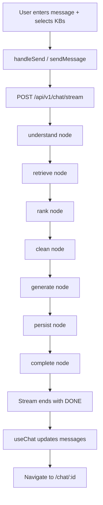
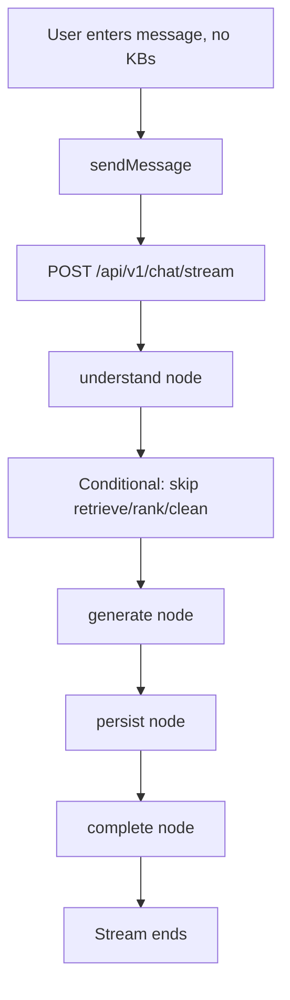

# Chat Message Routing Chain — Spec Flow Analysis

**Date**: 2026-03-12
**Source**: `docs/brainstorms/2026-03-12-chat-message-routing-chain-brainstorm.md`
**Analyzer**: spec-flow-analyzer

---

## User Flow Overview

### Flow 1: Happy Path — New Chat with RAG (knowledge_base_ids present)

User sends message → backend runs full pipeline (understand → retrieve → rank → clean → generate → persist → complete) → SSE stream emits `start`, `text-start`, `text-delta`, `text-end`, `data-citation`, `data-thinking`, `data-citation-enhanced`, `finish`, `[DONE]` → frontend `useChat` parses and updates `messages` → user sees streaming response with citations and thinking steps → URL updates to `/chat/:conversationId`.

### Flow 2: Happy Path — New Chat without RAG (no knowledge_base_ids)

Same as Flow 1 but `retrieve`, `rank`, `clean` nodes are skipped. No `data-citation` or `data-citation-enhanced` events.

### Flow 3: Continue Existing Conversation

User navigates to `/chat/:conversationId` or sends a message in an existing conversation. Backend loads `history_messages` from DB (last 10), prepends to prompt. Same pipeline as Flow 1 or 2 depending on `knowledge_base_ids`. `conversation_id` in request prevents creating new conversation.

### Flow 4: Conversation Restore (Page Load / Direct URL)

User opens `/chat/123` directly. Frontend:
1. `routeConvId` from URL → `conversationApi.get(123)`
2. Load conversation + messages
3. Convert `ChatMessage[]` → `UIMessage[]` (or `initialMessages` format)
4. Pass to `useChat({ chatId: '123', initialMessages: restored })`
5. Render restored messages; user can continue chatting

### Flow 5: User Aborts Stream (Stop Button)

User clicks Stop during streaming. `useChat.stop()` → AbortController aborts fetch → backend receives cancellation → stream terminates. Frontend shows partial response, no error.

### Flow 6: Error During Stream (Backend Exception)

Backend node throws (e.g., LLM timeout, RAG failure). Backend catches, emits `error` Part `{"type":"error","errorText":"..."}`. Frontend `useChat` sets `error` state. User sees error UI (toast or inline). Spec says "useChat error state automatically handles" — exact UX (retry button, inline message, toast) not specified.

### Flow 7: Network Failure / Connection Drop

Fetch fails or stream breaks mid-response. No `[DONE]` received. Spec defers "Resumable Streams" to Phase 2. Current behavior: stream hangs or throws; user gets generic error. No reconnect logic in Phase 1.

### Flow 8: Empty / Invalid Input

User submits empty message or whitespace-only. Backend `ChatStreamRequest.message` has `min_length=1`. Frontend: ChatInput may or may not prevent submit. If submitted, backend returns 422. `useChat` error handling for non-2xx not specified.

---

## Flow Permutations Matrix

| Flow | User State | Context | knowledge_base_ids | Expected Behavior |
|------|------------|---------|--------------------|-------------------|
| 1 | Any | New chat | Non-empty | Full RAG pipeline, citations, thinking |
| 2 | Any | New chat | Empty/undefined | Direct LLM, no citations |
| 3 | Any | Existing conv | From conv or override | History loaded, same pipeline |
| 4 | Any | Direct URL | From conv | Restore messages, ready to continue |
| 5 | Any | Streaming | Any | Abort, partial response |
| 6 | Any | Any | Any | Error Part, useChat error |
| 7 | Any | Any | Any | No reconnect (Phase 1) |
| 8 | Any | Submit | N/A | Validation error |

**Additional dimensions not fully specified:**
- **Tool mode** (qa, citation_lookup, review_outline, gap_analysis): Affects system prompt; no flow-specific behavior change in spec
- **Model override** (`request.model`): Passed but not described in pipeline
- **First-time vs returning user**: Same flows; restore is Flow 4
- **Concurrent actions**: User sends message while another streams — race condition; spec does not address

---

## Missing Elements & Gaps

### Category: Error Handling

| Gap | Description | Impact | Current Ambiguity |
|-----|-------------|--------|-------------------|
| **E-1** | `error` Part schema not defined | Frontend cannot reliably parse error | Is it `{"type":"error","errorText":"..."}` or `{"type":"error","code":"...","message":"..."}`? Current backend uses `{"code":"stream_error","message":"..."}`. |
| **E-2** | Partial failure in RAG (one KB fails) | User gets incomplete citations or full failure? | Current `_stream_chat` uses `return_exceptions=True` and continues; spec does not say if LangGraph nodes should do same. |
| **E-3** | LLM timeout / rate limit | No specific handling | Current `_clean_excerpt` has 10s timeout; main `chat_stream` has none. What timeout for generate node? |
| **E-4** | DB failure in persist node | Conversation/messages not saved | Should stream still complete with `finish`? Or emit `error`? User may see response but refresh loses it. |
| **E-5** | Non-2xx HTTP (422, 500) before stream starts | `useChat` behavior | Does `useChat` surface `response.ok === false` as `error`? Or does fetch throw? |
| **E-6** | Malformed SSE (invalid JSON in data) | Parser behavior | Current `streamChat` yields `{ raw: currentData }` on parse error. Data Stream Protocol: does useChat handle malformed lines? |

### Category: Protocol & Integration

| Gap | Description | Impact | Current Ambiguity |
|-----|-------------|--------|-------------------|
| **P-1** | Current backend uses `event: X\ndata: Y`; Data Stream Protocol uses `data: {"type":"X",...}` only | Breaking change | No `event:` line in new format. All info in JSON. Frontend must not expect `event:` prefix. |
| **P-2** | `text_delta` → `text-start` + `text-delta` + `text-end` mapping | Delta format change | Current: `{"delta":"x"}`. New: `{"type":"text-delta","id":"text_xxx","delta":"x"}`. Need `id` for correlation. |
| **P-3** | `message_start` → `start` with `messageId` | Field name change | Current: `message_id`. New: `messageId` (camelCase). |
| **P-4** | `message_end` → `finish` with `conversation_id` | Where does conversation_id go? | Data Stream Protocol `finish` may not include custom fields. Spec says backend yields `finish` — need to confirm `conversation_id` is in same Part or separate `data-*` Part. |
| **P-5** | Header `x-vercel-ai-ui-message-stream: v1` | Required for useChat | Backend must add this. Current backend does not send it. |
| **P-6** | `[DONE]` vs `data: [DONE]` | Termination format | Spec says `data: [DONE]\n\n`. Confirm exact string. |

### Category: Frontend State & UX

| Gap | Description | Impact | Current Ambiguity |
|-----|-------------|--------|-------------------|
| **F-1** | `LocalMessage` → `UIMessage` + `parts` migration | MessageBubble, ChatInput, etc. | MessageBubble expects `content`, `citations`, `thinkingSteps`, `a2uiMessages` as props. UIMessage has `parts`. Need adapter: `parts.filter(p => p.type === 'text')` → content, `parts.filter(p => p.type === 'data-citation')` → citations. |
| **F-2** | `loadingStage` derivation | MessageBubble uses `loadingStage` for UI | Current: 'searching' | 'citations' | 'generating' | 'complete'. UIMessage has no such field. Derive from `data-thinking` parts? Or add custom Part? |
| **F-3** | `initialMessages` format | Conversation restore | `ChatMessage[]` from API has `id`, `role`, `content`, `citations`. UIMessage has `id`, `role`, `parts`. Conversion logic not specified. |
| **F-4** | `chatId` type | useChat expects string? | Route has `conversationId` as number. useChat `chatId` may need string. |
| **F-5** | Tool mode, selectedKBs in useChat | useChat sends body | Need to pass `knowledge_base_ids`, `tool_mode`, `conversation_id` in request body. useChat's `body` or `sendMessage` options? |
| **F-6** | Navigation after stream end | Current: `navigate(/chat/${cid})` on message_end | useChat does not know conversation_id. Need `onFinish` or similar to get `conversation_id` from stream and navigate. |
| **F-7** | 80ms debounce removal | Current: manual debounce for text_delta | useChat handles streaming internally. No debounce needed. But does useChat batch updates? May affect perceived performance. |

### Category: Backend Pipeline

| Gap | Description | Impact | Current Ambiguity |
|-----|-------------|--------|-------------------|
| **B-1** | ChatState TypedDict | New state for chat graph | PipelineState exists for search/upload. Chat pipeline needs different state: `request`, `llm`, `rag`, `citations`, `messages`, etc. Not defined. |
| **B-2** | DB session / request context | Nodes need db | Current `_stream_chat` receives `db: AsyncSession`. LangGraph nodes receive `state`. How does `persist` node get db? Inject via config or context? |
| **B-3** | `get_stream_writer()` in async generator | LangGraph streams to caller | `graph.astream(..., stream_mode=["updates","custom"])` yields chunks. Caller (FastAPI endpoint) must consume and re-emit as SSE. Bridge code shown in spec but not full request lifecycle. |
| **B-4** | LLM streaming inside generate node | `writer()` in loop | `async for token in llm.chat_stream(...)`: call `writer({"type":"text-delta",...})` each token. Confirmed in spec. |
| **B-5** | Conditional edge: skip retrieve when no KB | Graph structure | `add_conditional_edges("understand", _route, {"retrieve": "retrieve", "generate": "generate"})`. Need `_route(state)` returning next node. |
| **B-6** | Conversation creation timing | New conv vs existing | Current: create conv before persist if `not conversation_id`. persist node must create conv + messages. |
| **B-7** | RAG `return_exceptions` | One KB fails | Keep current behavior (continue with partial results) or fail entire pipeline? |

### Category: Backward Compatibility & Migration

| Gap | Description | Impact | Current Ambiguity |
|-----|-------------|--------|-------------------|
| **M-1** | Rewrite API (`/api/v1/chat/rewrite`) | Uses same SSE format | `rewrite-api.ts` uses `event:` + `data:` format. Not migrated in spec. Stays on old format or migrate too? |
| **M-2** | RAG streaming (`/api/v1/rag/...`) | Another SSE endpoint | `rag.py` has `_sse()`. Out of scope? |
| **M-3** | Index pipeline SSE | `api.ts` IndexSSEEvent | Different event types. Unaffected. |
| **M-4** | E2E / tests | test_chat.py asserts `event: message_start` | Backend format change breaks tests. Must update to Data Stream Protocol assertions. |
| **M-5** | Feature flags / gradual rollout | None | Big bang migration. No way to run old and new in parallel. |

### Category: Testing

| Gap | Description | Impact | Current Ambiguity |
|-----|-------------|--------|-------------------|
| **T-1** | Backend: LangGraph node unit tests | Each node testable | No plan for mocking `get_stream_writer()`, db, RAG. |
| **T-2** | Backend: Stream format tests | Assert correct SSE | test_chat.py checks `event: message_start`. Need tests for `data: {"type":"start",...}`, `[DONE]`, etc. |
| **T-3** | Frontend: useChat integration | Mock fetch, assert state | No tests for PlaygroundPage today. Adding useChat: how to mock transport? |
| **T-4** | E2E: Full flow | Playwright | Current e2e fixtures use mock SSE. Need real backend or new mock format. |
| **T-5** | Error path tests | 500, timeout, abort | No tests for error Part, abort behavior. |

### Category: Security & Validation

| Gap | Description | Impact | Current Ambiguity |
|-----|-------------|--------|-------------------|
| **S-1** | knowledge_base_ids authorization | User can only query own KBs | Current backend does not check. Spec does not mention. |
| **S-2** | conversation_id authorization | User can only continue own conv | Same. |
| **S-3** | Rate limiting | Stream endpoint | Long-running, no rate limit specified. |
| **S-4** | Input sanitization | Message content | Passed to LLM. XSS in citations? Rendered in Markdown. |

### Category: Accessibility & i18n

| Gap | Description | Impact | Current Ambiguity |
|-----|-------------|--------|-------------------|
| **A-1** | Error messages | useChat error | May be raw backend message. Need i18n? |
| **A-2** | Loading/streaming announcements | Screen readers | useChat status. Does it expose `status` for aria-live? |

---

## Critical Questions Requiring Clarification

### Critical (blocks implementation or creates risks)

1. **Q1: `finish` Part and `conversation_id`**
   - **Question**: Where does `conversation_id` go in the Data Stream Protocol? The standard `finish` Part may not include custom fields. Does useChat support a custom `data-conversation-id` Part, or do we extend the `finish` payload?
   - **Why it matters**: Frontend needs `conversation_id` to navigate to `/chat/:id` and set `chatId` for subsequent messages.
   - **Assumption if unanswered**: Emit a separate `data-conversation-id` Part immediately before `finish`, and handle it in a custom `onMessage` or stream callback.
   - **Example**: `data: {"type":"data-conversation-id","conversationId":123}\n\n` then `data: {"type":"finish"}\n\n`.

2. **Q2: `error` Part schema**
   - **Question**: What is the exact JSON schema for the `error` Part that useChat expects? Is it `{"type":"error","errorText":"..."}` or does it support `code` and `message`?
   - **Why it matters**: Backend currently sends `{"code":"stream_error","message":"..."}`. Mismatch may cause useChat to not display the error.
   - **Assumption**: Use AI SDK's documented `error` Part format; adapt backend to match.
   - **Example**: Check [AI SDK Data Stream Protocol](https://sdk.vercel.ai/docs/ai-sdk-ui/stream-protocol) for exact schema.

3. **Q3: DB session injection into LangGraph**
   - **Question**: How does the `persist` node (and any node needing DB) get the `AsyncSession`? Via `configurable` in `astream()`, or a context variable?
   - **Why it matters**: LangGraph nodes are stateless; db is request-scoped.
   - **Assumption**: Pass `{"db": db}` in `configurable` when calling `graph.astream()`, and have nodes read `state` or a separate context.
   - **Example**: `await graph.astream(input_state, config={"configurable": {"db": db}})`

4. **Q4: ChatState definition**
   - **Question**: What fields does the Chat LangGraph state have? At minimum: `request`, `llm`, `rag`, `all_sources`, `all_contexts`, `citations`, `history_messages`, `messages`, `full_response`, `conversation_id`.
   - **Why it matters**: Nodes read/write state. Undefined state blocks implementation.
   - **Assumption**: Define `ChatState(TypedDict, total=False)` mirroring `_stream_chat` variables.

### Important (significantly affects UX or maintainability)

5. **Q5: MessageBubble migration strategy**
   - **Question**: Should MessageBubble be refactored to accept `UIMessage` (or `parts`) directly, or should PlaygroundPage adapt `UIMessage` to the current props (`content`, `citations`, `thinkingSteps`, etc.)?
   - **Why it matters**: Affects component reuse and testability.
   - **Assumption**: Create adapter in PlaygroundPage: `messageToBubbleProps(message: UIMessage)` to avoid changing MessageBubble initially.

6. **Q6: `initialMessages` conversion**
   - **Question**: What is the exact mapping from `ChatMessage` (API) to `UIMessage`/`initialMessages`? `ChatMessage` has `content`, `citations`; UIMessage has `parts`.
   - **Why it matters**: Conversation restore must show history correctly.
   - **Assumption**: Build `parts`: `[{type:'text', text: m.content}, ...(m.citations?.map(c => ({type:'data-citation', data: c})) ?? [])]`.

7. **Q7: RAG partial failure behavior**
   - **Question**: When one of N knowledge bases fails (exception in `rag.query`), should the pipeline continue with results from the others, or fail entirely?
   - **Why it matters**: Current behavior continues; spec does not state.
   - **Assumption**: Continue (match current behavior). Emit `data-thinking` with status "partial" or "warning" if desired.

8. **Q8: Persist node failure**
   - **Question**: If DB commit fails in `persist`, should we emit `error` and not send `finish`, or send `finish` (user saw response) and log the failure?
   - **Why it matters**: User may see response but lose it on refresh.
   - **Assumption**: Emit `error` Part, do not send `finish`. User sees error; response not persisted.

### Nice-to-have (improves clarity)

9. **Q9: Rewrite API migration**
   - **Question**: Is `/api/v1/chat/rewrite` in scope for this refactor, or does it stay on the old SSE format?
   - **Assumption**: Out of scope; rewrite stays as-is.

10. **Q10: Tool mode in useChat body**
    - **Question**: How does useChat send `tool_mode`, `knowledge_base_ids`, `conversation_id`? Via `body` in transport options?
    - **Assumption**: `DefaultChatTransport` or custom transport accepts `body` merge. Verify AI SDK 5.0 API.

---

## Recommended Next Steps

1. **Resolve Critical Questions (Q1–Q4)**
   - Check AI SDK 5.0 Data Stream Protocol docs for `finish`, `error`, and custom `data-*` Parts.
   - Define `ChatState` and db injection approach.
   - Document in brainstorm or a short ADR.

2. **Define Protocol Contract**
   - Create a shared spec (or TypeScript + Python types) for:
     - All Part types (`start`, `text-start`, `text-delta`, `text-end`, `finish`, `error`, `data-citation`, `data-thinking`, `data-citation-enhanced`, `data-a2ui`, `data-conversation-id`).
     - Exact JSON schema for each.
   - Use for backend StreamWriter and frontend parsing validation.

3. **Draft Migration Plan**
   - Phase 1a: Backend — implement StreamWriter, new endpoint (e.g. `/api/v1/chat/ai-stream`) that outputs Data Stream Protocol. Keep `/api/v1/chat/stream` for rollback.
   - Phase 1b: Frontend — add useChat with transport pointing to new endpoint; feature-flag or route-based switch.
   - Phase 1c: Migrate PlaygroundPage to useChat; adapter for MessageBubble props.
   - Phase 1d: Remove old endpoint and streamChat; update tests.

4. **Update Tests**
   - Backend: `test_chat.py` — assert new SSE format (`data: {"type":"start"...}`, `[DONE]`), error Part, no `event:` lines.
   - Backend: Add unit tests for each LangGraph node (mock writer, db, RAG).
   - Frontend: Add integration test for useChat + mock transport.

5. **Address Security Gaps (S-1, S-2)**
   - Add auth checks: user can only access own `knowledge_base_ids` and `conversation_id`.
   - Document in plan even if deferred.

6. **Document Error Handling**
   - Specify: error Part schema, partial RAG failure, persist failure, HTTP 4xx/5xx.
   - Add to plan or brainstorm.
