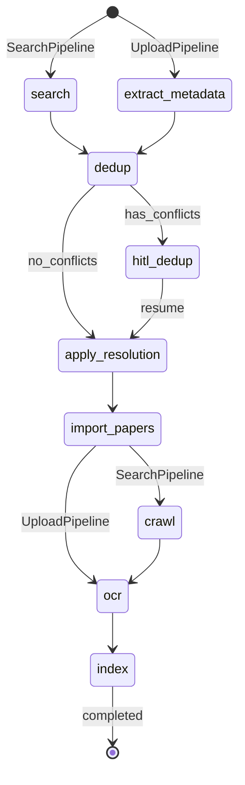

# LangGraph Pipeline

Omelette uses [LangGraph](https://langchain-ai.github.io/langgraph/) to orchestrate multi-step paper processing workflows with checkpointing and HITL (Human-in-the-Loop) support.

## Pipeline Types

### SearchPipeline

```
search → dedup → [HITL if conflicts] → import → crawl → OCR → index
```

Triggered by keyword search. Papers are fetched from multiple sources, deduplicated against existing papers, and processed through the full pipeline.

### UploadPipeline

```
extract_metadata → dedup → [HITL if conflicts] → import → OCR → index
```

Triggered by PDF file upload. Metadata is extracted locally, then the same dedup → OCR → index flow applies (no crawl step needed).

## HITL Conflict Resolution

When deduplication finds conflicts (DOI match or high title similarity), the pipeline **interrupts** and waits for user resolution:

1. Pipeline calls `interrupt()` with the conflict list
2. Frontend displays Git-style conflict resolution UI
3. User chooses: Keep Old / Keep New / Merge / Skip
4. Frontend calls `POST /api/v1/pipelines/{id}/resume` with resolutions
5. Pipeline continues from the interrupted node

## Checkpointing

Pipeline state is persisted via LangGraph's checkpointer (MemorySaver in development, SqliteSaver for production). This enables:

- **Resume after interrupts**: HITL pause and resume
- **State inspection**: Query pipeline progress at any time
- **Debugging**: Inspect state at each node

## API Endpoints

| Method | Path | Description |
|--------|------|-------------|
| POST | `/api/v1/pipelines/search` | Start search pipeline |
| POST | `/api/v1/pipelines/upload` | Start upload pipeline |
| GET | `/api/v1/pipelines/{id}/status` | Get pipeline status |
| POST | `/api/v1/pipelines/{id}/resume` | Resume interrupted pipeline |
| POST | `/api/v1/pipelines/{id}/cancel` | Cancel running pipeline |

## State Machine


