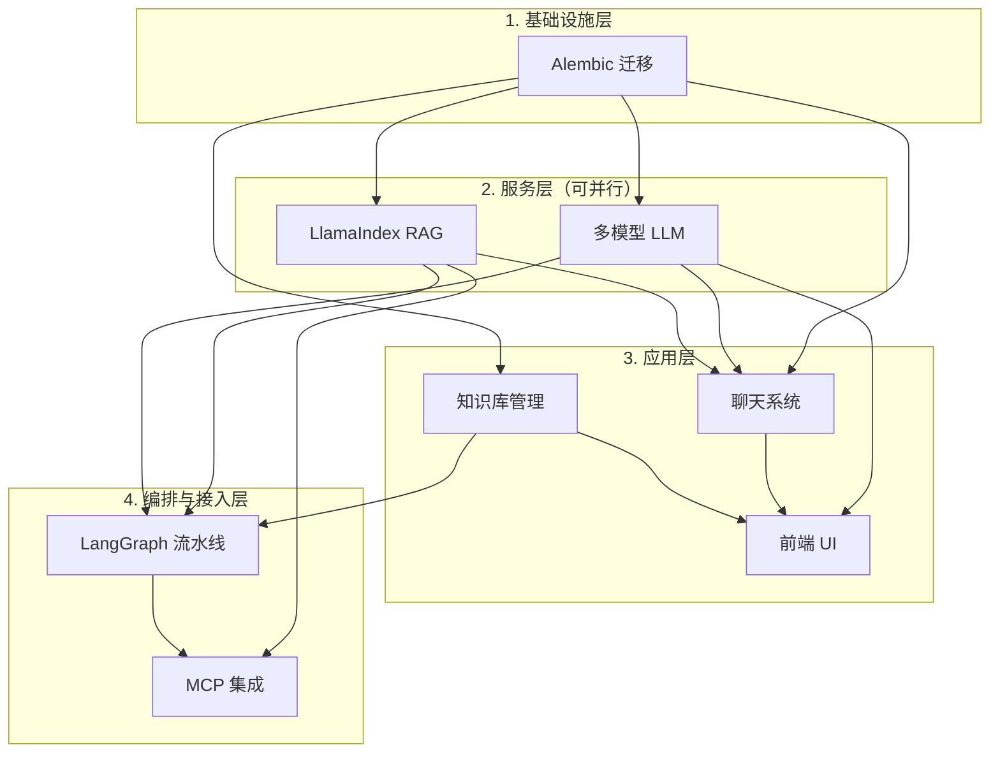

# 跨计划校验与整合报告

## 计划清单与依赖关系图

### 计划清单

| 序号 | 计划文档 | 核心内容 |
|------|----------|----------|
| 1 | `feat-alembic-database-migration-plan` | Alembic 迁移、Conversation/Message/UserSettings 表、Project icon/color |
| 2 | `feat-multi-model-llm-settings-plan` | 多 Provider LLM、UserSettings 持久化、Settings API |
| 3 | `feat-llamaindex-rag-engine-plan` | LlamaIndex RAG、混合检索、重排序、增量索引 |
| 4 | `feat-frontend-ui-overhaul-plan` | shadcn/ui、Playground 布局、路由迁移 |
| 5 | `feat-chat-streaming-citations-plan` | SSE 流式聊天、对话 CRUD、引用追踪 |
| 6 | `feat-knowledge-base-management-plan` | 知识库别名、PDF 上传、去重冲突 UI、订阅管理 |
| 7 | `feat-langgraph-pipeline-orchestration-plan` | LangGraph 流水线、HITL、Search/Upload/Subscription 编排 |
| 8 | `feat-mcp-integration-plan` | FastMCP、Tools、Resources、Claude Desktop 连接 |

### 依赖关系图（Mermaid）



### 依赖关系说明

| 计划 | 依赖 | 被依赖 |
|------|------|--------|
| Alembic | 无 | 多模型、聊天、知识库（均需 UserSettings/Conversation/Message/Project 字段） |
| 多模型 LLM | Alembic Phase 2（UserSettings） | 聊天（LLM 流式）、前端（Settings 页） |
| LlamaIndex RAG | 无（替换现有 RAG） | 聊天、MCP、LangGraph index_node |
| 聊天系统 | Alembic、多模型（LLM stream）、RAG | 前端 Playground |
| 前端 UI | 可 Mock 先行 | 无 |
| 知识库管理 | Alembic Phase 3（Project icon/color） | 前端、LangGraph |
| LangGraph | 所有 Service、DedupService.run_with_conflicts | MCP（间接） |
| MCP | RAG、Search、Writing Service | 无 |

**结论**：无循环依赖，依赖关系清晰。

---

## 全局实施顺序建议

### 推荐顺序（含可并行标注）

```
Phase 0: 基础设施（必须最先）
├── Alembic Phase 1–4 全部完成
└── 产出：迁移脚本、Conversation/Message/UserSettings、Project icon/color

Phase 1: 服务层（可并行，约 2–3 周）
├── [Track A] 多模型 LLM 计划 Phase 1–4
└── [Track B] LlamaIndex RAG 计划 Phase 1–5

Phase 2: 聊天核心（依赖 Phase 0 + Track A + Track B）
├── 聊天系统计划 Phase 1–6
└── 产出：SSE 流式 API、对话 CRUD、引用、工具模式

Phase 3: 前端与知识库（可并行，约 2–3 周）
├── [Track C] 前端 UI 计划 Phase 1–7
└── [Track D] 知识库管理计划 Phase 1–7

Phase 4: 编排层（依赖 Phase 3 后端能力）
├── LangGraph 流水线计划 Phase 1–5
└── 产出：SearchPipeline、UploadPipeline、SubscriptionPipeline、HITL

Phase 5: 外部接入
└── MCP 集成计划 Phase 1–6
```

### 串行 vs 并行

| 必须串行 | 可并行 |
|----------|--------|
| Alembic → 所有依赖它的计划 | 多模型 LLM ∥ LlamaIndex RAG |
| 多模型 + RAG → 聊天系统 | 前端 UI ∥ 知识库管理 |
| 知识库管理 + LangGraph → MCP 稳定接入 | 前端 Phase 1–3 可与后端并行（Mock） |

---

## 校验结果

### 数据模型一致性

#### 一致项

| 表/字段 | 定义来源 | 校验 |
|--------|----------|------|
| Conversation | Alembic、Chat | 字段一致：id, title, knowledge_base_ids, model, tool_mode, created_at, updated_at |
| Message | Alembic、Chat | 字段一致：id, conversation_id, role, content, citations, metadata, created_at |
| UserSettings | Alembic、多模型 | Alembic 含 category/description，多模型仅提 key/value，可兼容 |
| Project | Alembic、知识库 | icon、color 由 Alembic Phase 3 添加，知识库计划使用 |
| Paper | Alembic | notes 字段已包含 |

#### 潜在遗漏

| 问题 | 说明 | 建议 |
|------|------|------|
| **Subscription 表** | 知识库计划 Phase 6 要求「订阅规则 CRUD」，当前仅有 SubscriptionService 无持久化规则表 | 在 Alembic 中新增迁移 `004_add_subscription_rules`，或单独计划补充 |
| **Message.metadata** | Chat 计划未详述 metadata 结构 | 与 citations 区分：citations 为引用列表，metadata 可存 tool_calls、token 数等 |

### API 一致性

#### 路径冲突检查

| 路径模式 | 计划 | 冲突 |
|----------|------|------|
| `/api/v1/settings` | 多模型 | 无 |
| `/api/v1/settings/models` | 多模型 | 无 |
| `/api/v1/settings/test-connection` | 多模型 | 无 |
| `/api/v1/chat/stream` | 聊天 | 无 |
| `/api/v1/conversations` | 聊天 | 无 |
| `/api/v1/knowledge-bases` | 知识库 | 为 projects 别名，无冲突 |
| `/api/v1/knowledge-bases/{id}/papers/upload` | 知识库 | 无 |
| `/api/v1/knowledge-bases/{id}/papers/search-and-add` | 知识库 | 见下 |
| `/api/v1/pipelines/search` | LangGraph | 与 search-and-add 功能重叠 |
| `/api/v1/pipelines/upload` | LangGraph | 与 papers/upload 功能重叠 |

#### 功能重叠与集成建议

| 重叠点 | 说明 | 建议 |
|--------|------|------|
| **search-and-add vs pipelines/search** | 知识库的 `POST /papers/search-and-add` 与 LangGraph 的 `POST /pipelines/search` 均实现「关键词检索→去重→入库」 | 知识库 API 应**内部调用** LangGraph 的 `POST /pipelines/search`，返回 task_id 供前端轮询，避免重复实现 |
| **papers/upload vs pipelines/upload** | 知识库的 `POST /papers/upload` 与 LangGraph 的 `POST /pipelines/upload` | 知识库 API 接收 PDF 后保存文件，调用 `POST /pipelines/upload` 并传入 pdf_paths，由流水线完成元数据提取→去重→OCR→索引 |
| **projects vs knowledge-bases** | 现有 `/projects`，新增 `/knowledge-bases` 别名 | 保持双路径兼容，Chat 的 knowledge_base_ids 即 project_id，语义一致 |

#### 命名风格

- 统一使用 `knowledge-bases`（kebab-case）
- MCP 使用 `kb_id` 作为参数名，与 `knowledge_base_ids` 对应
- 无 `projects` 与 `knowledge-bases` 混用导致的语义歧义

### 技术栈一致性

#### 依赖版本对照

| 包 | 多模型 | LlamaIndex | LangGraph | 聊天 | 建议 |
|----|--------|------------|-----------|------|------|
| langchain-core | >=0.3 | - | >=0.3.0 | - | 统一 >=0.3 |
| langchain-openai | >=0.3 | - | - | - | 保持 |
| langchain-anthropic | >=0.3 | - | - | - | 保持 |
| langchain-community | >=0.3 | - | - | - | 保持 |
| langgraph | - | - | >=0.4.0 | - | 保持 |
| llama-index-core | - | >=0.12.0 | - | - | 保持 |
| llama-index-vector-stores-chroma | - | >=0.4.0 | - | - | 保持 |
| mcp | - | - | - | - | >=1.26 |

#### 前端依赖

| 包 | 前端 UI | 聊天 | 建议 |
|----|---------|------|------|
| @ai-sdk/react | ^5.0.0 | ^5.0.0 | 一致 |
| ai | ^5.0.0 | ^5.0.0 | 一致 |
| react-markdown | ^10.1.0 | ^10.1.0 | 一致 |
| remark-gfm | ^4.0.0 | ^4.0.0 | 一致 |
| remark-math | ^6.0.0 | ^6.0.0 | 一致 |
| rehype-katex | ^7.0.0 | ^7.0.0 | 一致 |
| rehype-highlight | ^7.0.0 | ^7.0.0 | 一致 |
| framer-motion | ^11.0.0 | - | 仅前端 UI |
| katex | ^0.16.0 | ^0.16.0 | 一致 |

#### 实现方式冲突

| 功能 | 计划 A | 计划 B | 建议 |
|------|--------|--------|------|
| PDF 元数据提取 | 知识库：pdfplumber | LangGraph：LlamaIndex 或 pdfplumber | 统一：默认 pdfplumber，LlamaParse 作为可选增强 |
| 去重冲突解决 | 知识库：dedup/preview、resolve、auto-resolve | LangGraph：interrupt + resume | 知识库 UI 调用 LangGraph status/resume，不重复实现去重逻辑 |

### 遗漏检查

#### 头脑风暴功能覆盖矩阵

| 头脑风暴功能 | 覆盖计划 | 状态 |
|--------------|----------|------|
| ChatGPT 风格首页 | 前端 UI、聊天 | ✓ |
| 知识库管理中心 | 知识库、前端 | ✓ |
| MCP 协议支持 | MCP | ✓ |
| 多模型支持 | 多模型 | ✓ |
| 现代 UI 重构 | 前端 UI | ✓ |
| 对话历史 | 聊天、Alembic | ✓ |
| 设置页 | 多模型、前端 | ✓ |
| 去重冲突界面 | 知识库、LangGraph | ✓ |
| 关键词检索添加 | 知识库、LangGraph | ✓ |
| PDF 上传 | 知识库、LangGraph | ✓ |
| 订阅管理 | 知识库、LangGraph | ✓ |
| 引用溯源 | 聊天、LlamaIndex | ✓ |
| 流式输出 | 聊天、前端 | ✓ |
| 工具模式 | 聊天 | ✓ |
| 暗色模式 | 前端 | ✓ |
| 笔记功能 | Alembic（Paper.notes） | ✓ |

#### 未覆盖功能（真空地带）

| 功能 | 头脑风暴提及 | 计划覆盖 | 建议 |
|------|--------------|----------|------|
| PDF 在线预览 | ✓ | 无 | 后续计划或 Phase 6 补充 |
| 导出功能（BibTeX、GB/T 7714、APA） | ✓ | 无 | 后续计划 |
| 研究进度看板 | ✓ | LangGraph 有 progress，无专门看板 UI | 可并入前端或知识库详情 |
| 论文关系图谱 | ✓ | 无 | 后续计划 |
| 多语言（中/英） | ✓ | 前端未明确 | 可并入前端 Phase 7 |
| WebSocket 实时进度 | ✓ | LangGraph 有 SSE stream | 部分覆盖，需确认前端是否接入 |

### 风险评估

#### 跨计划技术风险

| 风险 | 影响计划 | 缓解措施 |
|------|----------|----------|
| **知识库 API 与 LangGraph 集成不清** | 知识库、LangGraph | 明确：search-and-add、upload 内部调用 pipeline API |
| **Subscription 模型缺失** | 知识库、LangGraph | 新增 Alembic 迁移或独立计划 |
| **LlamaIndex 迁移需全量重建索引** | LlamaIndex、聊天、MCP | 迁移前备份 ChromaDB，文档说明重建流程 |
| **HITL 超时与恢复** | LangGraph、知识库 | 定义 HITL_TIMEOUT_HOURS，超时后 AI 解决或跳过 |

#### 计划复杂度与延期风险

| 计划 | 复杂度 | 延期风险 | 原因 |
|------|--------|----------|------|
| **LangGraph** | 高 | 高 | 三种流水线、HITL、Checkpoint、与多服务集成 |
| **LlamaIndex RAG** | 高 | 中高 | GPU/Embedding、全量重建、混合检索与重排序 |
| **聊天系统** | 中高 | 中 | SSE 协议、引用内联、多工具模式 |
| **知识库管理** | 中 | 中 | 去重 UI、双模式添加、与 LangGraph 集成 |
| **前端 UI** | 中 | 中 | 路由迁移、布局重构、多页面 |
| **多模型 LLM** | 中 | 低 | 工厂模式清晰，LangChain 成熟 |
| **Alembic** | 低 | 低 | 标准流程 |
| **MCP** | 低 | 低 | 复用现有 Service |

---

## 发现的问题与建议

### 高优先级

1. **知识库 API 与 LangGraph 集成**
   - **问题**：`search-and-add`、`upload` 与 pipeline API 功能重叠，易重复实现。
   - **建议**：知识库计划明确「search-and-add 内部调用 `POST /pipelines/search`」「upload 内部调用 `POST /pipelines/upload`」，前端仅轮询 task 状态。

2. **Subscription 持久化模型**
   - **问题**：知识库计划要求订阅规则 CRUD，Alembic 未包含 Subscription 表。
   - **建议**：在 Alembic 中新增迁移 `004_add_subscription_rules`，或单独计划，需包含：subscription_id、project_id、keywords、sources、frequency、created_at 等字段。

### 中优先级

3. **PDF 元数据提取统一**
   - **问题**：知识库用 pdfplumber，LangGraph 可选 LlamaIndex。
   - **建议**：默认 pdfplumber，LlamaParse 作为可选（USE_LLAMAPARSE env）。

4. **头脑风暴遗漏功能**
   - **问题**：PDF 在线预览、导出、论文关系图谱、多语言未纳入计划。
   - **建议**：列入 Phase 6「打磨与补充」或单独 backlog。

### 低优先级

5. **Message.metadata 结构**
   - **问题**：Chat 计划未定义 metadata 结构。
   - **建议**：在 Chat 计划中补充 metadata 字段说明（如 tool_calls、token_count）。

6. **现有 Subscription API 与知识库计划**
   - **问题**：当前为 `/projects/{id}/subscriptions/feeds`、`check-rss`、`check-updates`，知识库计划要求完整 CRUD。
   - **建议**：知识库 Phase 6 扩展订阅 API，保留现有 feeds/check 端点，新增 CRUD 与 trigger。

---

## 总结

### 一致性结论

- **依赖关系**：无循环依赖，Alembic 为基础设施，多模型与 LlamaIndex 可并行，聊天依赖二者，前端与知识库可并行。
- **数据模型**：Conversation、Message、UserSettings、Project、Paper 定义一致；Subscription 表需补充。
- **API**：路径无冲突，命名统一；search-and-add、upload 需与 LangGraph pipeline 明确集成关系。
- **技术栈**：LangChain、LlamaIndex、前端依赖版本一致，无实现冲突。

### 实施建议

1. **先完成 Alembic 全阶段**，再启动多模型与 LlamaIndex。
2. **知识库计划**与 LangGraph 计划需对齐：知识库 API 作为编排层入口，内部调用 pipeline。
3. **补充 Subscription 迁移**，支持订阅规则持久化。
4. **优先完成 LangGraph 与 LlamaIndex**，二者为后续聊天、知识库、MCP 的核心依赖。
5. **头脑风暴遗漏功能**纳入 backlog，在 Phase 6 或后续迭代实现。

### 风险提示

- **LangGraph** 与 **LlamaIndex RAG** 为最复杂、最易延期计划，建议预留缓冲时间。
- 迁移 LlamaIndex 后需**全量重建索引**，需提前备份并通知用户。
