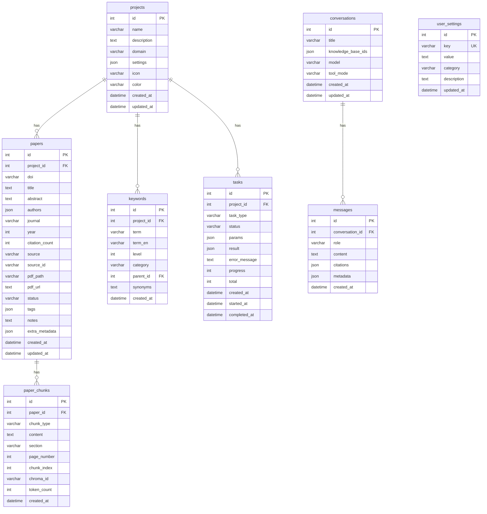

# Alembic 数据库迁移系统实施计划

## 1. Overview

### 为什么需要 Alembic

当前 Omelette 使用 `Base.metadata.create_all` 在应用启动时创建表（`backend/app/database.py` 的 `init_db()`）。这种方式存在以下问题：

1. **无版本控制**：无法追踪 schema 变更历史，难以回滚或复现特定版本
2. **无增量迁移**：每次启动全量创建，无法对已有数据库执行增量变更（如新增列、修改约束）
3. **生产风险**：`create_all` 不会修改已存在的表结构，新增字段需手动处理或重建数据库
4. **协作困难**：多人开发时 schema 变更缺乏标准化流程

### 当前问题总结

| 问题 | 影响 |
|------|------|
| 无迁移历史 | 无法追溯「何时为何」做了 schema 变更 |
| 增量变更困难 | 新增 `icon`、`color` 等字段需手动 ALTER TABLE |
| 新表创建无流程 | Conversation、Message、UserSettings 等表需统一迁移脚本 |
| 开发/生产不一致 | 本地 `create_all` 与生产部署方式可能不同 |

引入 Alembic 后，所有 schema 变更将通过版本化的迁移脚本管理，支持升级、降级和团队协作。

---

## 2. Technical Approach

### 2.1 Alembic 初始化配置

- **SQLAlchemy 模式**：async SQLAlchemy 2.0 + `aiosqlite`
- **数据库**：SQLite（`sqlite+aiosqlite:///`）
- **配置来源**：复用 `app.config.settings.database_url`，在 env.py 中转换为 async URL

### 2.2 目录结构

```
backend/
├── alembic.ini                 # Alembic 主配置（script_location, sqlalchemy.url 占位）
├── alembic/
│   ├── env.py                  # 异步 env，连接 app.database + app.models
│   ├── script.py.mako          # 迁移脚本模板
│   └── versions/
│       ├── 001_initial_schema.py
│       ├── 002_add_conversation_message_usersettings.py
│       └── 003_add_project_icon_color_paper_notes.py
├── app/
│   ├── database.py
│   ├── models/
│   └── ...
└── pyproject.toml
```

### 2.3 env.py 配置要点

- 使用 `run_async_migrations()` 模式，调用 `connection.run_sync()` 执行迁移
- 从 `app.config.settings` 读取 `database_url`，通过 `_get_async_url()` 转为 `sqlite+aiosqlite:///`
- 设置 `target_metadata = Base.metadata`，需在 env.py 中 `import` 所有 ORM 模型以确保 `create_all` / autogenerate 能发现表
- 保持 SQLite WAL 和 foreign_keys PRAGMA（在 `run_migrations_online` 的 connection 上执行）

### 2.4 初始迁移策略

- **基准迁移**：从当前 `create_all` 生成的 schema 反向生成，或手写与现有 ORM 一致的 `CREATE TABLE`
- **不依赖 create_all**：迁移脚本显式定义所有表结构，与 ORM 定义一一对应

---

## 3. Implementation Phases

### Phase 1: Alembic 初始化 + 基准迁移（将现有表纳入版本控制）

**目标**：建立 Alembic 目录，生成与当前 5 张表一致的初始迁移。

**步骤**：
1. 在 `backend/` 下执行 `alembic init alembic`
2. 修改 `alembic.ini`：`script_location = alembic`，移除或注释 `sqlalchemy.url`（由 env.py 动态提供）
3. 重写 `alembic/env.py`：异步引擎、从 settings 读取 URL、导入 `app.models`、`target_metadata = Base.metadata`
4. 生成初始迁移：`alembic revision --autogenerate -m "initial_schema"` 或手写 `001_initial_schema.py`
5. 验证：`alembic upgrade head` 在空库上创建 5 张表，与 `create_all` 结果一致

**产出**：`alembic/versions/001_initial_schema.py`（projects, papers, keywords, paper_chunks, tasks）

---

### Phase 2: 新增 Conversation, Message, UserSettings 模型和迁移

**目标**：添加 3 张新表，支持 Playground 聊天与用户设置持久化。

**步骤**：
1. 在 `app/models/` 下新增 `conversation.py`、`message.py`、`user_settings.py`
2. 在 `app/models/__init__.py` 中导出新模型
3. 生成迁移：`alembic revision --autogenerate -m "add_conversation_message_usersettings"`
4. 检查并修正 autogenerate 输出（JSON 列、外键、索引等）
5. 执行 `alembic upgrade head` 验证

**产出**：`alembic/versions/002_add_conversation_message_usersettings.py`

---

### Phase 3: 修改 Project (icon, color) 和 Paper (notes) 的迁移

**目标**：为 Project 增加 `icon`、`color`，确保 Paper 有 `notes` 字段。

**说明**：Paper 模型当前已有 `notes` 字段，若基准迁移已包含，此阶段仅需添加 Project 的 `icon`、`color`。若基准迁移未包含 Paper.notes，则一并添加。

**步骤**：
1. 修改 `app/models/project.py`：添加 `icon`、`color` 列
2. 检查 `app/models/paper.py`：确认 `notes` 已存在
3. 生成迁移：`alembic revision --autogenerate -m "add_project_icon_color"`
4. 执行 `alembic upgrade head` 验证

**产出**：`alembic/versions/003_add_project_icon_color.py`

---

### Phase 4: 移除 create_all，改为 alembic upgrade head

**目标**：应用启动时不再调用 `create_all`，改为依赖 Alembic 迁移。

**步骤**：
1. 修改 `app/database.py`：移除或注释 `init_db()` 中的 `Base.metadata.create_all`
2. 修改 `app/main.py` 的 lifespan：将 `await init_db()` 替换为执行 `alembic upgrade head`（通过 subprocess 或 `alembic.config.Config` + `command.upgrade()`）
3. 或：保留 `init_db()` 为空/仅做连接检查，在启动脚本（如 `make run` 或 Docker entrypoint）中先执行 `alembic upgrade head`
4. 更新文档和 README，说明部署时需先运行迁移

**推荐**：在 `app/main.py` lifespan 中通过 `alembic.command.upgrade(alembic_cfg, "head")` 执行迁移，确保每次启动前 schema 为最新。

---

## 4. ERD Diagram



---

## 5. Acceptance Criteria

### 5.1 Phase 1

- [ ] `backend/alembic/` 目录存在，包含 `env.py`、`script.py.mako`、`versions/`
- [ ] `backend/alembic.ini` 配置正确，`script_location` 指向 `alembic`
- [ ] `alembic upgrade head` 在空 SQLite 库上创建 projects, papers, keywords, paper_chunks, tasks 五张表
- [ ] 表结构与现有 ORM 定义一致（列名、类型、约束、索引）
- [ ] `alembic current` 显示当前版本
- [ ] `alembic downgrade base` 可回滚到空库（无表）

### 5.2 Phase 2

- [ ] Conversation、Message、UserSettings 模型已定义并导出
- [ ] 迁移脚本创建 conversations、messages、user_settings 三张表
- [ ] Message 表有 `conversation_id` 外键指向 conversations
- [ ] UserSettings 表 `key` 列有 UNIQUE 约束
- [ ] `alembic upgrade head` 成功，新表可正常 CRUD

### 5.3 Phase 3

- [ ] Project 表新增 `icon` VARCHAR(50)、`color` VARCHAR(20)，默认空字符串
- [ ] Paper 表确认有 `notes` TEXT 列（若基准迁移已包含则无需变更）
- [ ] 迁移在已有数据上执行成功，不丢失数据

### 5.4 Phase 4

- [ ] 应用启动时不再调用 `Base.metadata.create_all`
- [ ] 启动流程中执行 `alembic upgrade head`（在 lifespan 或启动脚本中）
- [ ] 全新部署时，仅通过 `alembic upgrade head` 即可完成 schema 初始化
- [ ] 文档更新：说明迁移命令和部署流程

### 5.5 通用

- [ ] 所有迁移脚本可重复执行（幂等）或明确说明不可重复
- [ ] `alembic history` 显示完整迁移链
- [ ] 在 `backend/` 目录下执行，依赖 `omelette` conda 环境

---

## 6. Migration Scripts（伪代码示例）

### 6.1 001_initial_schema.py

```python
"""initial schema: projects, papers, keywords, paper_chunks, tasks

Revision ID: 001
Revises:
Create Date: 2026-03-11

"""
from alembic import op
import sqlalchemy as sa

revision = "001"
down_revision = None
branch_labels = None
depends_on = None

def upgrade() -> None:
    op.create_table(
        "projects",
        sa.Column("id", sa.Integer(), autoincrement=True, nullable=False),
        sa.Column("name", sa.String(255), nullable=False),
        sa.Column("description", sa.Text(), server_default=""),
        sa.Column("domain", sa.String(255), server_default=""),
        sa.Column("settings", sa.JSON(), nullable=True),
        sa.Column("created_at", sa.DateTime(), server_default=sa.func.now()),
        sa.Column("updated_at", sa.DateTime(), server_default=sa.func.now(), onupdate=sa.func.now()),
        sa.PrimaryKeyConstraint("id"),
    )
    op.create_index("ix_projects_name", "projects", ["name"])

    op.create_table(
        "papers",
        sa.Column("id", sa.Integer(), autoincrement=True, nullable=False),
        sa.Column("project_id", sa.Integer(), nullable=False),
        sa.Column("doi", sa.String(255), nullable=True),
        sa.Column("title", sa.Text(), nullable=False),
        # ... 其余列 ...
        sa.Column("notes", sa.Text(), server_default=""),
        sa.ForeignKeyConstraint(["project_id"], ["projects.id"]),
        sa.PrimaryKeyConstraint("id"),
    )
    # ... keywords, paper_chunks, tasks ...

def downgrade() -> None:
    op.drop_table("tasks")
    op.drop_table("paper_chunks")
    op.drop_table("keywords")
    op.drop_table("papers")
    op.drop_table("projects")
```

### 6.2 002_add_conversation_message_usersettings.py

```python
"""add conversation, message, user_settings tables

Revision ID: 002
Revises: 001
Create Date: 2026-03-11

"""
def upgrade() -> None:
    op.create_table(
        "conversations",
        sa.Column("id", sa.Integer(), autoincrement=True, nullable=False),
        sa.Column("title", sa.String(255), server_default=""),
        sa.Column("knowledge_base_ids", sa.JSON(), nullable=True),  # list[int]
        sa.Column("model", sa.String(100), server_default=""),
        sa.Column("tool_mode", sa.String(50), server_default=""),
        sa.Column("created_at", sa.DateTime(), server_default=sa.func.now()),
        sa.Column("updated_at", sa.DateTime(), server_default=sa.func.now(), onupdate=sa.func.now()),
        sa.PrimaryKeyConstraint("id"),
    )
    op.create_table(
        "messages",
        sa.Column("id", sa.Integer(), autoincrement=True, nullable=False),
        sa.Column("conversation_id", sa.Integer(), nullable=False),
        sa.Column("role", sa.String(20), nullable=False),  # user/assistant/system
        sa.Column("content", sa.Text(), nullable=False),
        sa.Column("citations", sa.JSON(), nullable=True),
        sa.Column("metadata", sa.JSON(), nullable=True),
        sa.Column("created_at", sa.DateTime(), server_default=sa.func.now()),
        sa.ForeignKeyConstraint(["conversation_id"], ["conversations.id"], ondelete="CASCADE"),
        sa.PrimaryKeyConstraint("id"),
    )
    op.create_index("ix_messages_conversation_id", "messages", ["conversation_id"])

    op.create_table(
        "user_settings",
        sa.Column("id", sa.Integer(), autoincrement=True, nullable=False),
        sa.Column("key", sa.String(255), nullable=False),
        sa.Column("value", sa.Text(), server_default=""),
        sa.Column("category", sa.String(100), server_default=""),
        sa.Column("description", sa.Text(), server_default=""),
        sa.Column("updated_at", sa.DateTime(), server_default=sa.func.now(), onupdate=sa.func.now()),
        sa.PrimaryKeyConstraint("id"),
        sa.UniqueConstraint("key", name="uq_user_settings_key"),
    )

def downgrade() -> None:
    op.drop_table("user_settings")
    op.drop_table("messages")
    op.drop_table("conversations")
```

### 6.3 003_add_project_icon_color.py

```python
"""add project icon and color columns

Revision ID: 003
Revises: 002
Create Date: 2026-03-11

"""
def upgrade() -> None:
    op.add_column("projects", sa.Column("icon", sa.String(50), server_default="", nullable=True))
    op.add_column("projects", sa.Column("color", sa.String(20), server_default="", nullable=True))
    # Paper.notes: 若 001 已包含则跳过

def downgrade() -> None:
    op.drop_column("projects", "color")
    op.drop_column("projects", "icon")
```

---

## 7. Rollback Strategy

### 7.1 单步回滚

```bash
cd backend
alembic downgrade -1   # 回滚一个版本
```

### 7.2 回滚到指定版本

```bash
alembic downgrade 001  # 回滚到 001
alembic downgrade base # 回滚到空库
```

### 7.3 数据安全

- **备份**：生产环境执行迁移前，备份 SQLite 文件（`cp omelette.db omelette.db.bak`）
- **测试**：在 staging 或本地复制生产数据后，先执行 `alembic upgrade head` 验证
- **downgrade 谨慎**：`downgrade` 会删除表或列，可能导致数据丢失。新增表/列的 downgrade 相对安全；删除列会丢失数据

### 7.4 迁移失败处理

1. 若 `upgrade` 中途失败，Alembic 会记录已执行的版本，可修复迁移脚本后重新 `upgrade`
2. 若需手动修复数据库，可 `alembic stamp <revision>` 将版本表对齐到实际状态
3. 避免直接修改 `alembic_version` 表，除非明确理解其含义

---

## 8. Testing

### 8.1 迁移测试流程

1. **空库升级**：
   ```bash
   rm -f data/omelette.db
   alembic upgrade head
   sqlite3 data/omelette.db ".schema"  # 验证表结构
   ```

2. **降级再升级**：
   ```bash
   alembic downgrade base
   alembic upgrade head
   # 验证应用功能正常
   ```

3. **已有数据升级**：
   ```bash
   # 使用包含现有数据的 db
   alembic upgrade head
   # 验证 Project.icon/color 等新列存在，旧数据完整
   ```

### 8.2 自动化测试建议

- 在 `tests/` 下新增 `test_migrations.py`：
  - 使用临时 SQLite 文件
  - `alembic upgrade head` → 检查表存在
  - `alembic downgrade base` → 检查表已删除
  - 可选：升级后插入 ORM 对象并查询，验证 schema 与 ORM 一致

### 8.3 CI 集成

- 在 GitHub Actions 中增加步骤：
  ```yaml
  - name: Run migrations
    run: cd backend && alembic upgrade head
  ```
- 确保测试环境使用独立数据库，避免污染生产数据

---

## 附录：新模型定义参考

### Conversation

```python
# app/models/conversation.py
class Conversation(Base):
    __tablename__ = "conversations"
    id: Mapped[int] = mapped_column(Integer, primary_key=True, autoincrement=True)
    title: Mapped[str] = mapped_column(String(255), default="")
    knowledge_base_ids: Mapped[list | None] = mapped_column(JSON, default=None)  # list[int]
    model: Mapped[str] = mapped_column(String(100), default="")
    tool_mode: Mapped[str] = mapped_column(String(50), default="")
    created_at: Mapped[datetime] = mapped_column(DateTime, server_default=func.now())
    updated_at: Mapped[datetime] = mapped_column(DateTime, server_default=func.now(), onupdate=func.now())
    messages = relationship("Message", back_populates="conversation", cascade="all, delete-orphan")
```

### Message

```python
# app/models/message.py
class Message(Base):
    __tablename__ = "messages"
    id: Mapped[int] = mapped_column(Integer, primary_key=True, autoincrement=True)
    conversation_id: Mapped[int] = mapped_column(Integer, ForeignKey("conversations.id"), nullable=False, index=True)
    role: Mapped[str] = mapped_column(String(20), nullable=False)  # user/assistant/system
    content: Mapped[str] = mapped_column(Text, nullable=False)
    citations: Mapped[list | None] = mapped_column(JSON, default=None)
    metadata: Mapped[dict | None] = mapped_column(JSON, default=None)
    created_at: Mapped[datetime] = mapped_column(DateTime, server_default=func.now())
    conversation = relationship("Conversation", back_populates="messages")
```

### UserSettings

```python
# app/models/user_settings.py
class UserSettings(Base):
    __tablename__ = "user_settings"
    id: Mapped[int] = mapped_column(Integer, primary_key=True, autoincrement=True)
    key: Mapped[str] = mapped_column(String(255), unique=True, nullable=False, index=True)
    value: Mapped[str] = mapped_column(Text, default="")
    category: Mapped[str] = mapped_column(String(100), default="")
    description: Mapped[str] = mapped_column(Text, default="")
    updated_at: Mapped[datetime] = mapped_column(DateTime, server_default=func.now(), onupdate=func.now())
```
