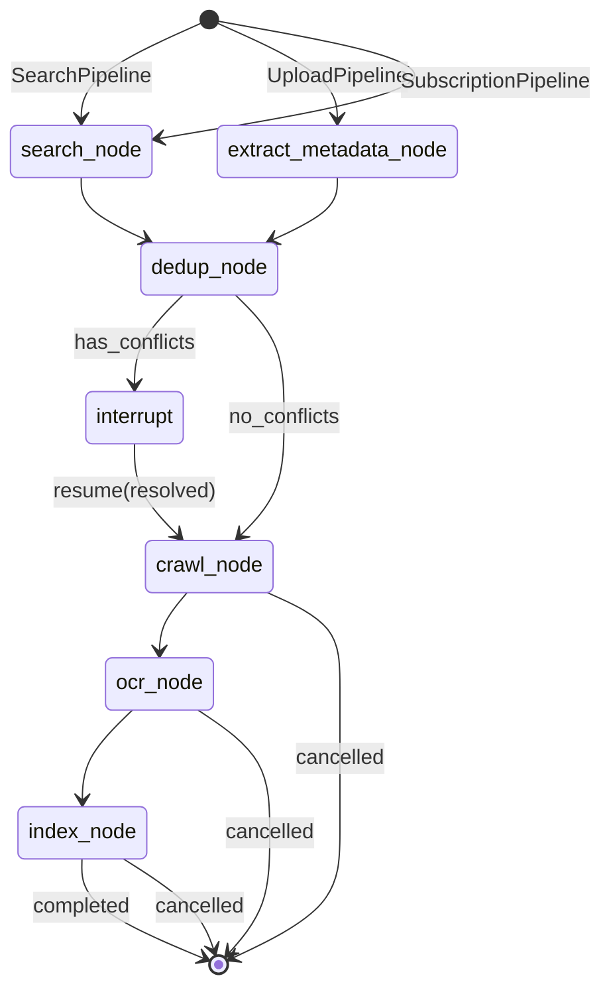

# feat: LangGraph 流水线编排引擎

## 1. Overview

### 1.1 为什么需要统一编排

Omelette 的数据流为：**关键词 → 检索 → 去重 → 下载 PDF → OCR → 索引到 RAG**。当前各服务（keyword_service, search_service, dedup_service, crawler_service, ocr_service, rag_service）独立存在，通过手动调用串联，存在以下问题：

| 问题 | 现状 | 影响 |
|------|------|------|
| **流程分散** | 前端/CLI 需依次调用多个 API，自行维护调用顺序 | 易出错、难以复用、无法保证原子性 |
| **无 HITL** | 去重需用户确认，但当前是自动处理或事后批量处理 | 无法在流程中暂停等待用户解决冲突 |
| **无断点续行** | 网络中断、服务重启后需从头开始 | 长时间任务（检索 50 篇 + 下载 + OCR）体验差 |
| **进度不透明** | Task 模型有 progress/total，但无实时推送 | 用户无法感知当前阶段和剩余时间 |
| **错误恢复弱** | 单步失败后无统一重试/回滚策略 | 需人工介入排查和重跑 |

### 1.2 LangGraph 的优势

- **StateGraph**：显式状态机，节点间通过 TypedDict 传递状态，流程可观测、可调试
- **interrupt()**：在任意节点暂停，保存状态，等待 `Command(resume=...)` 恢复，天然适配 HITL
- **Checkpointing**：InMemorySaver / SQLiteSaver 持久化状态，支持断点续行
- **条件边**：`has_conflicts → interrupt` 等分支逻辑清晰表达
- **与现有服务兼容**：节点内部调用现有 service 方法，不替换 service，只替换调用方式

---

## 2. Technical Approach

### 2.1 StateGraph 设计

#### 2.1.1 PipelineState TypedDict

```python
from typing import TypedDict

class PipelineState(TypedDict):
    """流水线共享状态，节点间通过此结构传递数据。"""
    # 核心数据
    papers: list[dict]              # 论文元数据列表（来自检索或上传）
    conflicts: list[dict]            # 去重发现的冲突列表 [{old, new, type}, ...]
    resolved_conflicts: list[dict]  # 用户解决后的结果 [{conflict_id, action, merged}]
    # 任务与进度
    task_id: int                    # 关联 Task 模型
    project_id: int                 # 知识库 ID
    thread_id: str                   # LangGraph checkpoint thread_id
    progress: int                    # 当前进度（0-100 或阶段内计数）
    total: int                      # 总步数
    stage: str                      # 当前阶段：search|dedup|crawl|ocr|index
    # 流水线类型与参数
    pipeline_type: str              # search|upload|subscription
    params: dict                    # 启动参数（keywords, sources, max_results 等）
    # 错误与取消
    error: str | None               # 错误信息
    cancelled: bool                 # 是否已取消
```

#### 2.1.2 节点定义

| 节点 | 输入 | 输出 | 调用服务 |
|------|------|------|----------|
| **search_node** | params.keywords, params.sources | papers | KeywordService.expand → SearchService.search |
| **dedup_node** | papers, project_id | papers（去重后）, conflicts | DedupService（DOI + title + LLM 候选） |
| **crawl_node** | papers（已入库） | 更新 Paper.pdf_path | CrawlerService.download_paper |
| **ocr_node** | papers（已下载） | chunks | OCRService.extract → chunk_text |
| **index_node** | chunks | - | RAGService.index_chunks |

**元数据提取节点**（UploadPipeline 专用）：

| 节点 | 输入 | 输出 | 说明 |
|------|------|------|------|
| **extract_metadata_node** | params.pdf_paths | papers | LlamaIndex 或 pdfplumber 提取标题、作者、DOI |

#### 2.1.3 条件边

```
dedup_node 执行后:
  if conflicts:
    → interrupt()  # 暂停，返回 conflicts 给前端
  else:
    → crawl_node
```

恢复时：`Command(resume=resolved_conflicts)` → 将 resolved_conflicts 写入 state → 继续到 crawl_node。

#### 2.1.4 流水线状态流转图（Mermaid）



### 2.2 三种流水线

#### 2.2.1 SearchPipeline（关键词检索流水线）

```
关键词扩展 → 多源检索 → 去重（HITL）→ 入库 → 下载 → OCR → 索引
```

- **入口**：`params = {keywords, sources, max_results, project_id}`
- **search_node**：KeywordService.expand_keywords_with_llm（可选）→ SearchService.search
- **dedup_node**：与知识库现有论文对比，发现冲突则 interrupt

#### 2.2.2 UploadPipeline（PDF 上传流水线）

```
上传 → 元数据提取 → 去重（HITL）→ 入库 → OCR → 索引
```

- **入口**：`params = {pdf_paths, project_id}`
- **extract_metadata_node**：LlamaIndex 或 pdfplumber 提取元数据
- **无 crawl_node**：PDF 已存在，直接 OCR

#### 2.2.3 SubscriptionPipeline（订阅更新流水线）

```
定时触发 → 检索 → 去重（可选 HITL）→ 入库 → 下载 → OCR → 索引
```

- **入口**：`params = {subscription_id, project_id}`
- **search_node**：按订阅规则（关键词 + 数据源）检索增量
- **HITL 可选**：可配置 `require_hitl=false`，冲突时自动 AI 解决或跳过

### 2.3 HITL 实现

#### 2.3.1 interrupt 在去重节点

```python
def dedup_node(state: PipelineState) -> PipelineState:
    # 调用 DedupService，得到 papers（去重后）和 conflicts
    papers, conflicts = await dedup_service.run_with_conflicts(project_id, state["papers"])
    state["papers"] = papers
    state["conflicts"] = conflicts

    if conflicts:
        from langgraph.types import interrupt
        interrupt(conflicts)  # 暂停，返回 conflicts 给调用方

    return state
```

#### 2.3.2 前端获取冲突列表

- `GET /api/v1/pipelines/{id}/status` 返回 `status: "interrupted"`, `interrupt_value: conflicts`
- 前端展示类似 git 冲突的左右对比界面
- 用户操作：保留旧的 | 保留新的 | 合并 | 跳过

#### 2.3.3 用户解决后 resume

```python
# 前端调用
POST /api/v1/pipelines/{id}/resume
Body: { "resolved_conflicts": [{ "conflict_id": "...", "action": "keep_new", "merged": {...} }] }

# 后端
graph.invoke(Command(resume=resolved_data), config={"configurable": {"thread_id": thread_id}})
```

#### 2.3.4 超时处理

- 可配置 `HITL_TIMEOUT_HOURS`（如 24）
- 超时后可选：自动 AI 解决（调用 LLM 判断）或自动跳过冲突

### 2.4 检查点（Checkpointing）

| 环境 | Saver | 说明 |
|------|-------|------|
| 开发 | InMemorySaver | 进程内内存，重启丢失 |
| 生产 | SqliteSaver | 持久化到 SQLite，路径可配置 |

- **thread_id**：与 Task 关联，`thread_id = f"task_{task_id}"`
- **断点续行**：网络中断后，前端可轮询 status，用户点击「继续」时重新 invoke，LangGraph 从上次 checkpoint 恢复

### 2.5 进度推送

- 每个节点完成后更新 `Task.progress`、`Task.result`（当前阶段摘要）
- **SSE/WebSocket**：`GET /api/v1/pipelines/{id}/stream` 推送 `{stage, progress, total, message}` 事件
- 前端可展示：检索中(10/50) → 去重中 → 等待用户确认 → 下载中(5/45) → OCR 中 → 索引中

### 2.6 与现有服务集成

- LangGraph 节点内部**调用现有 service 方法**，不替换 service，只替换调用方式
- 需要新增的 DedupService 方法：`run_with_conflicts()`，返回 `(papers, conflicts)` 而非自动删除
- 需注入：`AsyncSession`（DB）、`LLMClient`、各 Service 实例

### 2.7 API 设计

| 方法 | 路径 | 说明 |
|------|------|------|
| POST | `/api/v1/pipelines/search` | 启动检索流水线，Body: `{project_id, keywords, sources?, max_results?}` |
| POST | `/api/v1/pipelines/upload` | 启动上传流水线，Body: `{project_id, pdf_paths}` |
| POST | `/api/v1/pipelines/subscription` | 启动订阅流水线，Body: `{project_id, subscription_id}` |
| GET | `/api/v1/pipelines/{id}/status` | 获取流水线状态，含 `interrupt_value`（若暂停） |
| POST | `/api/v1/pipelines/{id}/resume` | 恢复暂停的流水线，Body: `{resolved_conflicts}` |
| POST | `/api/v1/pipelines/{id}/cancel` | 取消流水线 |
| GET | `/api/v1/pipelines/{id}/stream` | SSE 流式进度（可选） |

响应：`{task_id, thread_id, status}`，status 为 `running` | `interrupted` | `completed` | `failed` | `cancelled`。

---

## 3. Implementation Phases

### Phase 1: LangGraph 基础设施（StateGraph 定义 + 检查点）

**目标**：搭建 LangGraph 骨架，可运行空流水线并持久化状态

**任务**：
- [ ] 新增 `langgraph`、`langchain-core` 依赖
- [ ] 定义 `PipelineState` TypedDict
- [ ] 创建 `app/pipelines/base.py`：`create_graph()` 返回空 StateGraph + 占位节点
- [ ] 集成 SqliteSaver，配置 `checkpoint_dir`
- [ ] 实现 `thread_id = f"task_{task_id}"` 与 Task 关联
- [ ] 单元测试：invoke 空图，验证 checkpoint 写入

### Phase 2: SearchPipeline 实现

**目标**：完整实现关键词检索流水线（不含 HITL）

**任务**：
- [ ] 实现 `search_node`：调用 KeywordService + SearchService
- [ ] 实现 `dedup_node`：调用 DedupService，暂不 interrupt（先自动处理）
- [ ] 实现 `crawl_node`：调用 CrawlerService，批量下载
- [ ] 实现 `ocr_node`：调用 OCRService，chunk_text
- [ ] 实现 `index_node`：调用 RAGService.index_chunks
- [ ] 添加条件边：search → dedup → crawl → ocr → index
- [ ] 新建 Task 记录，更新 progress/total
- [ ] API：`POST /api/v1/pipelines/search`
- [ ] 集成测试：端到端跑通 SearchPipeline

### Phase 3: HITL 去重节点 + interrupt/resume

**目标**：去重冲突时暂停，等待用户解决后恢复

**任务**：
- [ ] DedupService 新增 `run_with_conflicts()`：返回 `(papers, conflicts)` 而非自动删除
- [ ] 在 `dedup_node` 中：当 `conflicts` 非空时 `interrupt(conflicts)`
- [ ] 条件边：`has_conflicts` → END（interrupt 后图自动暂停）
- [ ] API：`GET /api/v1/pipelines/{id}/status` 返回 `interrupt_value`
- [ ] API：`POST /api/v1/pipelines/{id}/resume` — 解析 `resolved_conflicts`，`Command(resume=...)` 恢复
- [ ] 恢复后将 `resolved_conflicts` 应用：删除/保留/合并 Paper 记录
- [ ] 集成测试：模拟冲突 → interrupt → resume → 验证后续节点执行

### Phase 4: UploadPipeline + SubscriptionPipeline

**目标**：支持 PDF 上传和订阅两种入口

**任务**：
- [ ] 实现 `extract_metadata_node`：PDF 元数据提取（LlamaIndex 或 pdfplumber）
- [ ] 定义 UploadPipeline 图：extract → dedup → ocr → index（无 crawl）
- [ ] API：`POST /api/v1/pipelines/upload`
- [ ] 定义 SubscriptionPipeline 图：复用 search_node，入口为订阅规则
- [ ] API：`POST /api/v1/pipelines/subscription`
- [ ] 可选：`require_hitl` 配置，订阅时自动跳过冲突

### Phase 5: 进度推送 + 前端集成

**目标**：实时进度展示与取消能力

**任务**：
- [ ] 每个节点完成后更新 Task.progress、Task.result
- [ ] 实现 `GET /api/v1/pipelines/{id}/stream` SSE 端点
- [ ] API：`POST /api/v1/pipelines/{id}/cancel` — 设置 `state["cancelled"]=True`，节点内检查
- [ ] 前端：流水线状态页，展示 stage、progress、interrupt 时展示冲突解决 UI
- [ ] 文档：API 使用说明

---

## 4. State Machine Diagram

```mermaid
flowchart TB
    subgraph SearchPipeline
        S1[search_node] --> S2[dedup_node]
        S2 -->|has_conflicts| S_INT[interrupt]
        S2 -->|no_conflicts| S3[crawl_node]
        S_INT -->|resume| S3
        S3 --> S4[ocr_node]
        S4 --> S5[index_node]
        S5 --> S_END[completed]
    end

    subgraph UploadPipeline
        U1[extract_metadata_node] --> U2[dedup_node]
        U2 -->|has_conflicts| U_INT[interrupt]
        U2 -->|no_conflicts| U3[ocr_node]
        U_INT -->|resume| U3
        U3 --> U4[index_node]
        U4 --> U_END[completed]
    end

    subgraph SubscriptionPipeline
        SUB1[search_node] --> SUB2[dedup_node]
        SUB2 -->|has_conflicts| SUB_INT[interrupt]
        SUB2 -->|no_conflicts| SUB3[crawl_node]
        SUB_INT -->|resume| SUB3
        SUB3 --> SUB4[ocr_node]
        SUB4 --> SUB5[index_node]
        SUB5 --> SUB_END[completed]
    end
```



---

## 5. Error Handling

### 5.1 节点失败重试

- 单个节点内：对可重试错误（网络超时、5xx）进行有限次重试（如 3 次）
- 可配置 `NODE_RETRY_COUNT`、`NODE_RETRY_DELAY`

### 5.2 流水线回滚

- 节点失败时：记录 `state["error"]`，更新 Task.status=FAILED
- 不自动回滚已完成的节点（如已下载的 PDF 保留）
- 支持「从失败节点重试」：未来可扩展 checkpoint 后按节点重跑

### 5.3 取消与超时

- 节点内检查 `state["cancelled"]`，若为 True 则提前返回
- 可配置 `PIPELINE_TIMEOUT_HOURS`，超时后标记 FAILED

### 5.4 冲突与异常

- 去重冲突：通过 interrupt 交给用户，不视为错误
- 下载失败：单篇失败记录日志，继续处理其余论文，最终汇总失败列表到 result

---

## 6. Acceptance Criteria

### 6.1 功能验收

- [ ] **SearchPipeline**：输入关键词 → 检索 → 去重 → 下载 → OCR → 索引，全程可完成
- [ ] **HITL**：存在去重冲突时流水线暂停，`GET /status` 返回 `interrupt_value`（冲突列表）
- [ ] **Resume**：用户提交 `resolved_conflicts` 后，流水线从去重节点继续执行
- [ ] **Checkpoint**：服务重启后，通过相同 `thread_id` invoke 可恢复执行（需在 Phase 1 验证）
- [ ] **UploadPipeline**：上传 PDF → 元数据提取 → 去重 → OCR → 索引
- [ ] **SubscriptionPipeline**：按订阅规则触发检索流水线
- [ ] **Cancel**：调用 cancel 后，流水线在下一节点检查时停止
- [ ] **Progress**：Task.progress 随阶段更新，SSE 可推送进度事件

### 6.2 集成验收

- [ ] 现有 service API 不变，仅新增 pipeline 调用方式
- [ ] 现有 Task 模型复用，新增 `task_type: "pipeline_search"` 等
- [ ] 前端可启动流水线并查看状态（含 interrupted 时的冲突展示）

### 6.3 非功能验收

- [ ] 单次 SearchPipeline（50 篇）在 30 分钟内完成（含网络波动）
- [ ] Checkpoint 持久化后，恢复执行无数据丢失
- [ ] 并发 3 个流水线时无明显阻塞或死锁

---

## 7. Dependencies

### 7.1 新增 pip 包

```toml
# pyproject.toml 新增

# LangGraph 编排
langgraph>=0.4.0
langchain-core>=0.3.0
langgraph-checkpoint-sqlite>=3.0.0
```

注：`langgraph-checkpoint-sqlite` 用于生产环境 SQLite 持久化，依赖 `aiosqlite`（已有）

### 7.2 现有依赖保留

- 所有现有 service 依赖（httpx, chromadb, pdfplumber 等）不变
