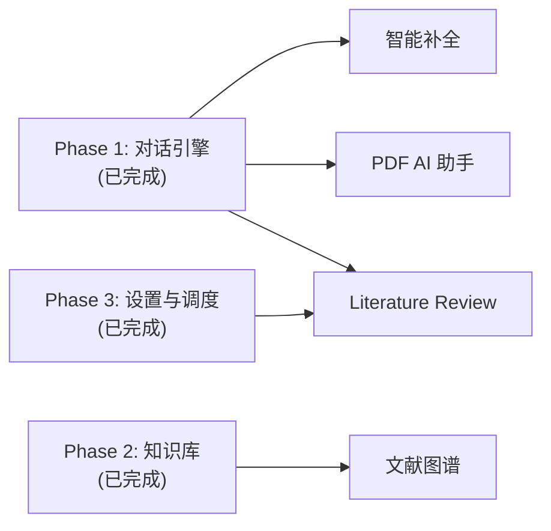
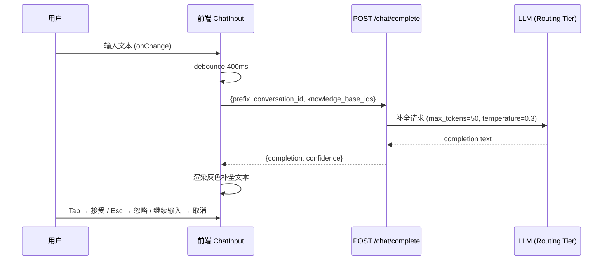
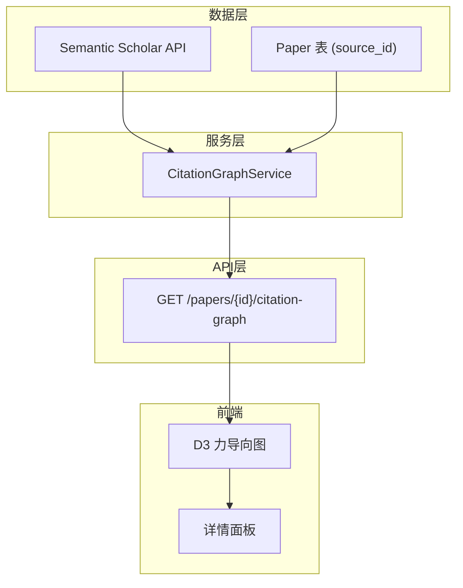
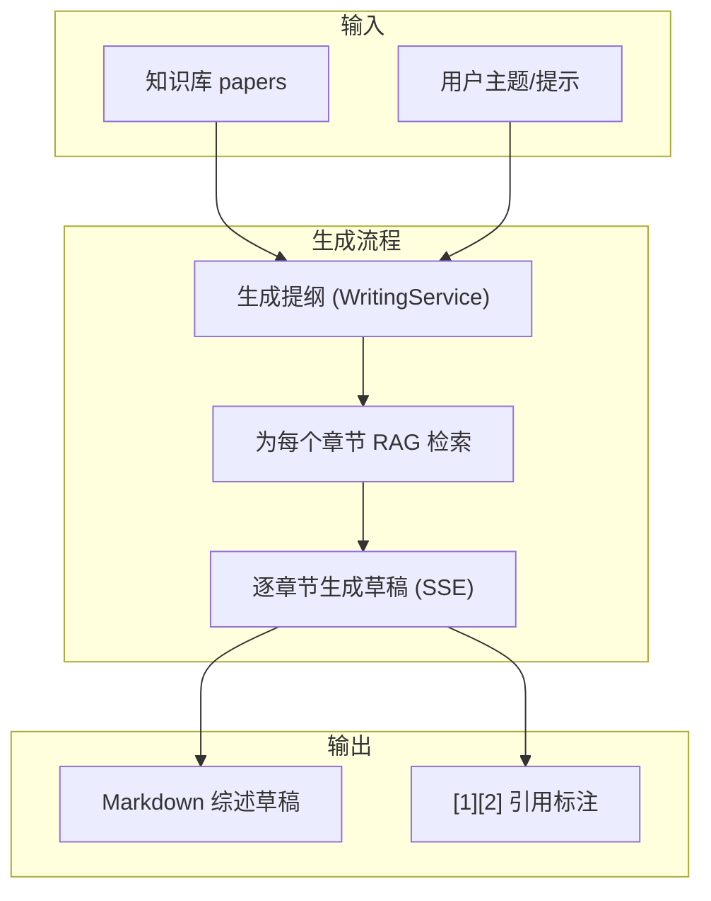
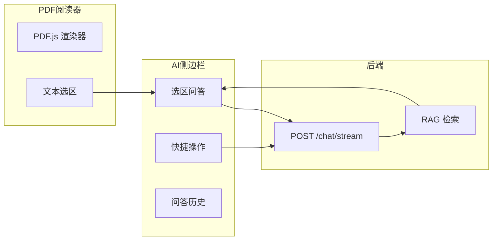
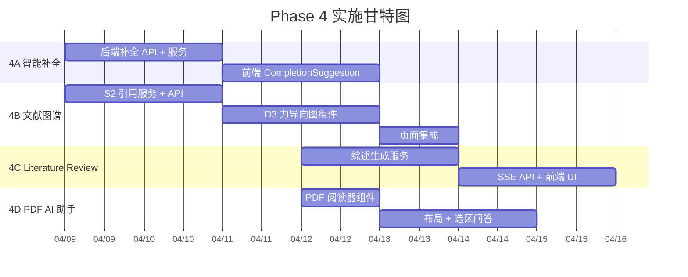

# Phase 4 — 创新功能

## Overview

Phase 4 是 Omelette V3 的差异化竞争力阶段，包含四大创新功能：

1. **智能补全** — 输入框实时预测补全，Tab 接受
2. **文献关系图谱** — 基于 Semantic Scholar 引用数据的 D3 力导向图
3. **自动 Literature Review** — 组合 outline + RAG 生成综述草稿
4. **PDF 阅读器 AI 助手** — 内嵌 PDF 阅读器 + 选区问答

预计工期：2 周（可并行开发）。

## 依赖关系



**前置条件均已满足**：
- Phase 1 对话引擎（意图识别、引用增强）✅
- Phase 2 知识库增强（MinerU、分块策略）✅
- Phase 3 设置与调度（多模型分级、RAG 混合检索）✅

---

## Phase 4A — 智能补全 (3d)

### 目标

用户在聊天输入框输入时，系统实时预测后续内容，以灰色文本展示在光标后，按 Tab 接受。

### 技术方案



### 任务分解

| # | 任务 | 文件 | 工作量 |
|---|------|------|--------|
| 4A-1 | 后端 `POST /api/v1/chat/complete` 端点 | `backend/app/api/v1/chat.py` | 0.5d |
| 4A-2 | 补全服务逻辑（debounce 保护、prompt 构建、LLM 调用） | `backend/app/services/completion_service.py` (新建) | 1d |
| 4A-3 | 前端 `CompletionSuggestion` 组件 | `frontend/src/components/playground/CompletionSuggestion.tsx` (新建) | 1d |
| 4A-4 | `ChatInput` 集成：debounce、API 调用、Tab/Esc 键绑定 | `frontend/src/components/playground/ChatInput.tsx` | 0.5d |

### 4A-1: 后端补全 API

**文件**: `backend/app/api/v1/chat.py`

新增端点：

```python
class CompletionRequest(BaseModel):
    prefix: str = Field(..., min_length=10, max_length=2000)
    conversation_id: int | None = None
    knowledge_base_ids: list[int] = []
    recent_messages: list[dict] = []

class CompletionResponse(BaseModel):
    completion: str
    confidence: float

@router.post("/complete", response_model=ApiResponse[CompletionResponse])
async def complete(req: CompletionRequest):
    svc = CompletionService()
    result = await svc.complete(
        prefix=req.prefix,
        conversation_id=req.conversation_id,
        knowledge_base_ids=req.knowledge_base_ids,
        recent_messages=req.recent_messages,
    )
    return ApiResponse(data=result)
```

### 4A-2: 补全服务

**文件**: `backend/app/services/completion_service.py` (新建)

```python
class CompletionService:
    async def complete(
        self,
        prefix: str,
        conversation_id: int | None = None,
        knowledge_base_ids: list[int] | None = None,
        recent_messages: list[dict] | None = None,
    ) -> dict:
        # 1. 加载最近 3 轮历史（从 conversation_id 或 recent_messages）
        # 2. 构建 system prompt（科研补全上下文）
        # 3. 调用 routing tier LLM（max_tokens=50, temperature=0.3）
        # 4. 返回 {completion, confidence}
        ...
```

**Prompt 模板**：

```
你是一个科研写作助手。根据用户已输入的文本，预测并补全后续内容。
只返回补全的部分（不要重复用户已输入的内容），最多 50 个字符。
如果无法合理预测，返回空字符串。

用户已输入：{prefix}
```

**关键约束**：
- 使用 Routing Tier 模型（轻量、低延迟）
- `max_tokens=50`，`temperature=0.3`
- 输入 < 10 字符时直接返回空
- 超时 2 秒直接返回空

### 4A-3: 前端 CompletionSuggestion 组件

**文件**: `frontend/src/components/playground/CompletionSuggestion.tsx` (新建)

```tsx
interface CompletionSuggestionProps {
  completion: string;
  onAccept: () => void;
  onDismiss: () => void;
}

// 灰色半透明文本，紧跟在光标后
// 显示 "Tab ↹" 提示
```

### 4A-4: ChatInput 集成

**文件**: `frontend/src/components/playground/ChatInput.tsx`

修改点：
- 新增 `useState` 管理 `completion` 状态
- `onChange` 中 debounce 400ms 后调用 `/chat/complete`
- `onKeyDown` 中 Tab → 接受补全插入文本，Esc → 清除
- 继续输入时取消当前请求（`AbortController`）
- 补全文本紧跟在 Textarea 内容后，灰色样式

### 验收标准

- [ ] 输入 ≥ 10 字符且停顿 400ms 后展示灰色补全建议
- [ ] Tab 接受补全，文本插入输入框
- [ ] Esc 或继续输入清除建议
- [ ] 补全延迟 < 2s（routing tier 模型）
- [ ] 无补全建议时不展示任何 UI

---

## Phase 4B — 文献关系图谱 (4d)

### 目标

以种子论文为中心，展示引用/被引/相似文献的关系力导向图，支持交互式探索。

### 技术方案



### 任务分解

| # | 任务 | 文件 | 工作量 |
|---|------|------|--------|
| 4B-1 | S2 引用/被引 API 封装 | `backend/app/services/citation_graph_service.py` (新建) | 1d |
| 4B-2 | 图谱 API 端点 | `backend/app/api/v1/citation_graph.py` (新建) | 0.5d |
| 4B-3 | 前端 D3 力导向图组件 | `frontend/src/components/citation-graph/` (新建) | 2d |
| 4B-4 | 集成到 PapersPage / 新页面 | `frontend/src/pages/project/` | 0.5d |

### 4B-1: CitationGraphService

**文件**: `backend/app/services/citation_graph_service.py` (新建)

```python
class CitationGraphService:
    S2_API = "https://api.semanticscholar.org/graph/v1"

    async def get_citation_graph(
        self,
        paper_id: int,
        depth: int = 1,
        max_nodes: int = 50,
    ) -> dict:
        """获取论文引用关系图。

        Returns:
            {
                "nodes": [{"id", "title", "year", "citation_count", "is_local", "s2_id"}],
                "edges": [{"source", "target", "type": "cites"|"cited_by"}],
                "center_id": paper_id
            }
        """
        # 1. 从 Paper 表获取 source_id（S2 paperId）
        # 2. 调用 S2 GET /paper/{s2_id}/citations?fields=...&limit=20
        # 3. 调用 S2 GET /paper/{s2_id}/references?fields=...&limit=20
        # 4. 标记哪些论文在本地知识库中 (is_local=True)
        # 5. 构建 nodes + edges 图结构
        ...

    async def _fetch_s2_citations(self, s2_id: str) -> list[dict]:
        """调用 S2 citations endpoint。"""
        ...

    async def _fetch_s2_references(self, s2_id: str) -> list[dict]:
        """调用 S2 references endpoint。"""
        ...
```

**S2 API 字段**：`title,year,citationCount,externalIds,authors`

**关键约束**：
- S2 API 速率限制：1 req/s（无 API Key）或 10 req/s（有 API Key）
- 使用 `settings.semantic_scholar_api_key` 认证
- `depth=1` 只获取直接引用/被引；`depth=2` 获取二级（后续扩展）
- `max_nodes` 限制节点数量，避免前端渲染卡顿

### 4B-2: 图谱 API

**文件**: `backend/app/api/v1/citation_graph.py` (新建)

```python
@router.get("/projects/{project_id}/papers/{paper_id}/citation-graph")
async def get_citation_graph(
    project_id: int,
    paper_id: int,
    depth: int = Query(1, ge=1, le=2),
    max_nodes: int = Query(50, ge=10, le=200),
):
    svc = CitationGraphService()
    graph = await svc.get_citation_graph(paper_id, depth=depth, max_nodes=max_nodes)
    return ApiResponse(data=graph)
```

### 4B-3: 前端 D3 力导向图

**新增依赖**: `d3`, `@types/d3`

**文件**: `frontend/src/components/citation-graph/` (新建目录)

| 文件 | 职责 |
|------|------|
| `CitationGraphView.tsx` | 主容器：加载数据、管理状态 |
| `ForceGraph.tsx` | D3 力导向图渲染 |
| `GraphControls.tsx` | 缩放、重置、过滤控件 |
| `NodeDetailPanel.tsx` | 点击节点后显示论文详情侧边栏 |

**图谱视觉设计**：

| 元素 | 视觉编码 |
|------|----------|
| 节点大小 | 引用数量（citationCount），对数缩放 |
| 节点颜色 | 年份（新 → 蓝色，旧 → 灰色）；本地已有 → 绿色高亮 |
| 边方向 | 箭头指向被引方 |
| 边颜色 | `cites` → 蓝色，`cited_by` → 橙色 |
| 中心节点 | 加粗边框 + 脉冲动画 |

**交互**：
- 拖拽节点、缩放画布
- 点击节点 → 右侧详情面板（标题、作者、年份、引用数、摘要）
- 双击本地节点 → 跳转到论文详情页
- 过滤：按年份范围、仅显示本地文献

### 4B-4: 页面集成

在 `PapersPage` 的论文列表中，每篇论文添加"引用图谱"按钮。点击后弹出全屏图谱视图（Dialog 或独立路由）。

### 验收标准

- [ ] 可查看任意论文的引用/被引关系图谱
- [ ] 节点大小、颜色正确编码（引用数、年份）
- [ ] 本地知识库中的论文绿色高亮
- [ ] 点击节点显示详情面板
- [ ] 支持拖拽、缩放、过滤
- [ ] S2 API 速率限制正确处理（指数退避）

---

## Phase 4C — 自动 Literature Review (3d)

### 目标

基于知识库自动生成结构化综述草稿，带引用和章节结构。

### 技术方案



### 任务分解

| # | 任务 | 文件 | 工作量 |
|---|------|------|--------|
| 4C-1 | 综述草稿生成服务 | `backend/app/services/writing_service.py` (扩展) | 1.5d |
| 4C-2 | SSE 流式综述 API | `backend/app/api/v1/writing.py` (扩展) | 0.5d |
| 4C-3 | 前端综述生成 UI | `frontend/src/pages/project/WritingPage.tsx` (扩展) | 1d |

### 4C-1: 综述草稿生成服务

**文件**: `backend/app/services/writing_service.py`

新增方法：

```python
async def generate_literature_review(
    self,
    project_id: int,
    topic: str = "",
    style: str = "narrative",  # narrative | systematic | thematic
    citation_format: str = "numbered",  # numbered | apa | gb_t_7714
    on_progress: Callable | None = None,
) -> AsyncGenerator[str, None]:
    """三步生成综述草稿：提纲 → RAG 检索 → 逐章节生成。

    Yields SSE-compatible text chunks.
    """
    # Step 1: 生成提纲（复用 generate_review_outline）
    outline = await self.generate_review_outline(project_id, topic)

    # Step 2: 为每个章节做 RAG 检索
    rag = RAGService()
    sections = parse_outline_sections(outline["outline"])
    for section in sections:
        sources = await rag.retrieve_only(project_id, section["query"], top_k=8)
        section["sources"] = sources

    # Step 3: 逐章节流式生成
    for section in sections:
        async for chunk in self._generate_section_draft(section, citation_format):
            yield chunk
```

**Prompt 模板（章节生成）**：

```
你是一个学术综述写作助手。请为以下章节撰写综述段落。

章节标题：{section_title}
相关文献摘录：
{formatted_sources}

要求：
1. 使用学术语言，逻辑清晰
2. 在适当位置使用 [1][2] 格式引用
3. 每个引用必须对应提供的文献
4. 段落长度 200-400 字
```

### 4C-2: SSE 流式综述 API

**文件**: `backend/app/api/v1/writing.py`

新增端点：

```python
class ReviewDraftRequest(BaseModel):
    topic: str = ""
    style: str = "narrative"
    citation_format: str = "numbered"

@router.post("/review-draft/stream")
async def stream_review_draft(
    project_id: int,
    req: ReviewDraftRequest,
):
    svc = WritingService(llm=get_llm_client())
    return StreamingResponse(
        svc.generate_literature_review(
            project_id=project_id,
            topic=req.topic,
            style=req.style,
            citation_format=req.citation_format,
        ),
        media_type="text/event-stream",
    )
```

### 4C-3: 前端综述生成 UI

**文件**: `frontend/src/pages/project/WritingPage.tsx`

修改点：
- 新增 "生成综述草稿" 按钮
- 点击后弹出配置 Dialog：主题、风格（叙述/系统/主题）、引用格式
- 确认后调用 SSE API，流式展示生成结果
- 生成结果支持 Markdown 渲染（含公式、表格）
- 支持复制、下载为 `.md` 文件
- 引用标注 `[1][2]` 可悬停查看来源

### 验收标准

- [ ] 可基于知识库自动生成结构化综述草稿
- [ ] 草稿带 `[1][2]` 引用标注，对应知识库文献
- [ ] 支持流式展示生成过程
- [ ] 支持叙述/系统/主题三种综述风格
- [ ] 可复制或下载生成的 Markdown

---

## Phase 4D — PDF 阅读器 AI 助手 (3d)

### 目标

内嵌 PDF 阅读器，支持选中文本向 AI 提问、解释、翻译、找引用。

### 技术方案



### 任务分解

| # | 任务 | 文件 | 工作量 |
|---|------|------|--------|
| 4D-1 | PDF 阅读器组件（react-pdf / pdfjs-dist） | `frontend/src/components/pdf-reader/PDFViewer.tsx` (新建) | 1d |
| 4D-2 | 阅读器布局 + AI 侧边栏 | `frontend/src/components/pdf-reader/PDFReaderLayout.tsx` (新建) | 0.5d |
| 4D-3 | 选区问答组件 + 快捷操作 | `frontend/src/components/pdf-reader/SelectionQA.tsx` (新建) | 1d |
| 4D-4 | 路由 + PapersPage 入口 | `frontend/src/App.tsx`, `PapersPage.tsx` | 0.5d |

### 4D-1: PDF 阅读器组件

**新增依赖**: `react-pdf` (基于 pdfjs-dist)

**文件**: `frontend/src/components/pdf-reader/PDFViewer.tsx` (新建)

```tsx
interface PDFViewerProps {
  url: string;          // PDF 文件 URL（/api/v1/papers/{id}/pdf 或本地路径）
  onTextSelect?: (text: string, pageNumber: number) => void;
}

// 功能：
// - 渲染 PDF 页面（虚拟化，仅渲染可见页）
// - 支持缩放、翻页、搜索
// - 文本选区 → 调用 onTextSelect
// - 高亮选中区域
```

### 4D-2: 阅读器布局

**文件**: `frontend/src/components/pdf-reader/PDFReaderLayout.tsx` (新建)

```tsx
// 左侧 70%: PDFViewer
// 右侧 30%: AI 侧边栏（可折叠）
// 顶部: 工具栏（缩放、页码、搜索）
```

布局使用 `ResizablePanel` (shadcn/ui) 实现左右分栏，用户可拖拽调整比例。

### 4D-3: 选区问答组件

**文件**: `frontend/src/components/pdf-reader/SelectionQA.tsx` (新建)

```tsx
interface SelectionQAProps {
  selectedText: string;
  paperId: int;
  projectId: int;
}

// 快捷操作按钮（选中文本后浮现）：
// - "解释这段话"
// - "翻译成中文/英文"
// - "在知识库中找相关引用"
// - "自由提问"（输入框）

// 使用现有 POST /chat/stream 端点
// tool_mode: "qa"
// 将选中文本作为用户消息的前缀
```

**Prompt 增强**：

选区问答时，system prompt 注入论文上下文：

```
你正在阅读论文「{paper_title}」。用户选中了以下文本并提出问题。
请基于论文上下文和知识库内容回答。

选中文本：{selected_text}
```

### 4D-4: 路由与入口

**文件**: `frontend/src/App.tsx`

新增路由：
```tsx
<Route path="/projects/:projectId/papers/:paperId/read" element={<PDFReaderPage />} />
```

**文件**: `frontend/src/pages/project/PapersPage.tsx`

在论文列表中，点击论文标题或"阅读"按钮 → 导航到 PDF 阅读器页面。

**后端**：需新增 PDF 文件服务端点（如果还没有）：

```python
@router.get("/projects/{project_id}/papers/{paper_id}/pdf")
async def serve_pdf(project_id: int, paper_id: int):
    # 从 paper.pdf_path 读取并返回文件
    ...
```

### 验收标准

- [ ] 可在应用内打开并阅读 PDF
- [ ] 支持缩放、翻页、文本搜索
- [ ] 选中文本后弹出快捷操作菜单
- [ ] 可对选中文本提问、解释、翻译、找引用
- [ ] AI 回答在右侧侧边栏展示
- [ ] 问答历史在侧边栏保留

---

## 实施顺序建议



**可并行**：4A + 4B 可与 4C + 4D 并行开发，两组无依赖。

---

## 系统级影响分析

### 交互图

- **智能补全**: `ChatInput → /chat/complete → CompletionService → LLMClient(routing tier)` — 新增独立路径，不影响现有对话流
- **文献图谱**: `PapersPage → /papers/{id}/citation-graph → CitationGraphService → S2 API` — 新增独立路径
- **Literature Review**: `WritingPage → /writing/review-draft/stream → WritingService → RAGService + LLMClient` — 扩展现有 WritingService
- **PDF AI 助手**: `PDFReader → /chat/stream (with paper context) → ChatPipeline` — 复用现有对话引擎

### 错误传播

| 场景 | 错误处理 |
|------|----------|
| S2 API 不可用 | 图谱页面展示"无法获取引用数据"，不影响其他功能 |
| 补全 LLM 超时 | 前端静默忽略（不展示建议），用户无感 |
| 综述生成中断 | SSE 关闭，展示已生成部分 + "生成中断"提示 |
| PDF 加载失败 | 展示错误提示 + "下载 PDF"降级链接 |

### API 表面新增

| 端点 | 方法 | 说明 |
|------|------|------|
| `/api/v1/chat/complete` | POST | 智能补全 |
| `/api/v1/projects/{id}/papers/{pid}/citation-graph` | GET | 引用图谱 |
| `/api/v1/projects/{id}/writing/review-draft/stream` | POST | 综述草稿流式生成 |
| `/api/v1/projects/{id}/papers/{pid}/pdf` | GET | PDF 文件服务 |

---

## 依赖与风险

| 风险 | 影响 | 缓解措施 |
|------|------|----------|
| S2 API 速率限制（1 req/s 无 Key） | 图谱加载慢 | 使用 API Key（10 req/s）；缓存结果到 DB |
| 补全延迟 > 2s | 用户体验差 | Routing tier 模型 + 超时 2s 熔断 |
| PDF.js 包体积大 | 前端加载慢 | lazy import + CDN worker |
| 综述生成幻觉 | 引用错误 | Prompt 强约束 + 仅允许引用检索到的来源 |

### 前端新增依赖

| 包 | 用途 | 版本 |
|----|------|------|
| `d3` / `d3-force` / `d3-selection` | 力导向图可视化 | latest |
| `react-pdf` | PDF 阅读器 | latest |
| `@types/d3` | D3 类型定义 | latest |

---

## 成功指标

| 指标 | 目标 |
|------|------|
| 补全接受率 | > 20% 的补全被 Tab 接受 |
| 图谱加载时间 | < 3s（50 节点） |
| 综述生成速度 | < 2min（含 RAG 检索 + 生成） |
| PDF 阅读器打开时间 | < 2s（本地 PDF） |

---

## Sources & References

### Internal References

- PRD 对话逻辑: `docs/prd/v3/01-chat-logic.md` (智能补全设计)
- PRD 创新功能: `docs/prd/v3/05-innovation.md` (文献图谱、Literature Review、PDF AI 助手)
- PRD 架构: `docs/prd/v3/04-architecture.md` (LLM 分级、SSE 协议)
- PRD 实施路线: `docs/prd/v3/06-implementation-roadmap.md` (Phase 4 甘特图)

### External References

- Semantic Scholar API: https://api.semanticscholar.org/api-docs/graph
- D3.js 力导向图: https://d3js.org/d3-force
- react-pdf: https://github.com/wojtekmaj/react-pdf
- Connected Papers (参考): https://connectedpapers.com
