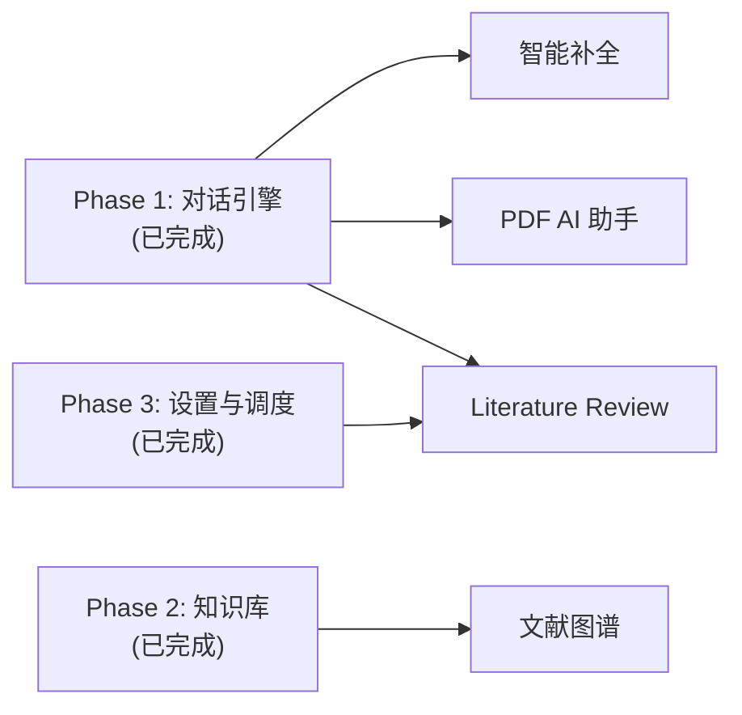
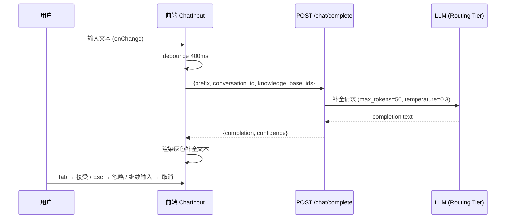
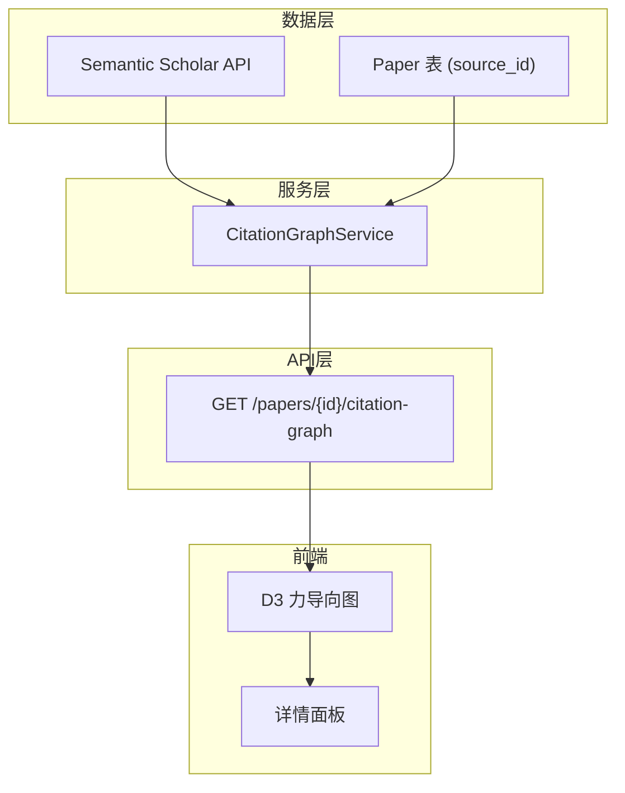
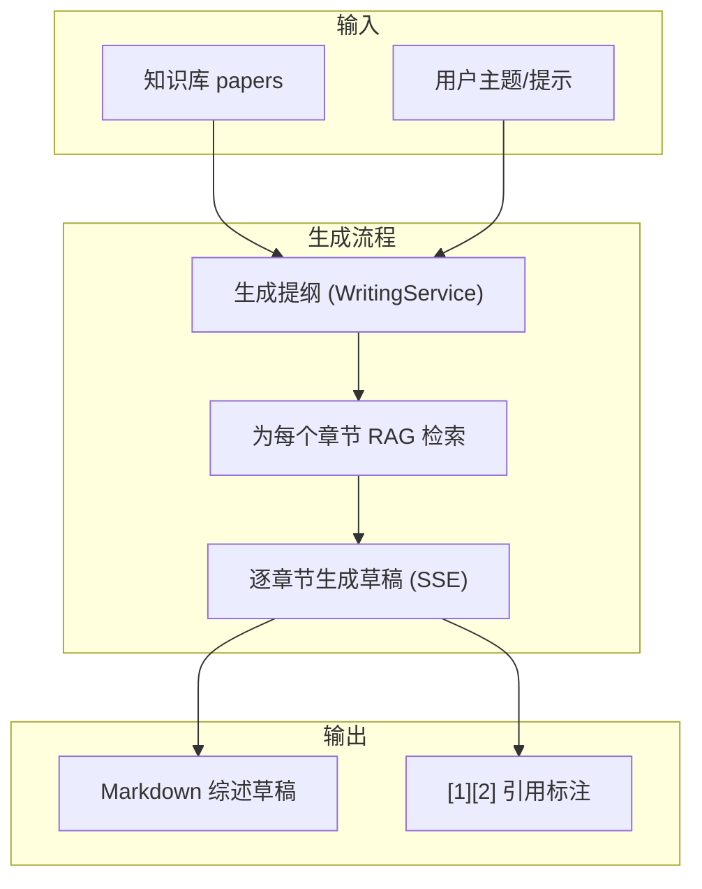
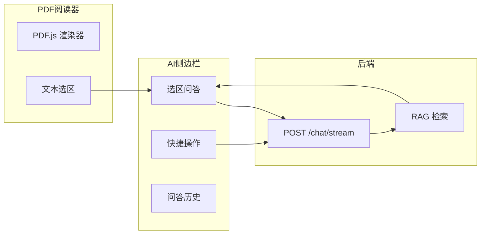
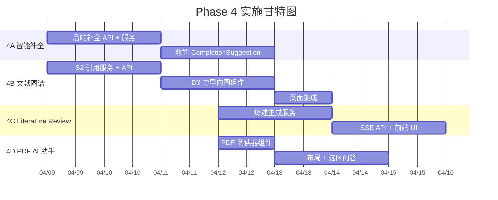

# Phase 4 — 创新功能

## Enhancement Summary

**Deepened on:** 2026-03-15
**Sections enhanced:** 4 (4A/4B/4C/4D)
**Research agents used:** best-practices-researcher ×2, framework-docs-researcher, learnings-researcher

### Key Improvements
1. **4B 文献图谱**: 推荐使用 `react-force-graph-2d` 替代手写 D3，开箱即用且 Canvas 渲染性能更优
2. **4D PDF 阅读器**: 确定 Vite Worker 配置方案、虚拟化渲染方案、扫描件检测方法
3. **全局**: 发现 6 个项目 learnings 直接相关——`asyncio.to_thread` 包装 LlamaIndex、流式节流 50-80ms、React.lazy 懒加载大包
4. **4C Literature Review**: 引入 SubQuestionQueryEngine 适合对比型综述，SSE 多事件格式优化

### New Considerations Discovered
- `react-force-graph-2d` 比手写 D3 集成更快，且内置 Canvas 渲染
- `react-resizable-panels` 最新版 API 使用 `Group`/`Panel`/`Separator`（非 `PanelGroup`/`PanelResizeHandle`）
- RAG 检索中 LlamaIndex `retriever.retrieve()` 是同步阻塞调用，必须 `asyncio.to_thread` 包装
- 流式 Markdown 渲染需 50-80ms 节流，否则每 token 触发 remark+rehype 全量解析
- D3、PDF.js、react-markdown 等大包必须 `React.lazy` 懒加载，避免首屏体积膨胀

---

## Overview

Phase 4 是 Omelette V3 的差异化竞争力阶段，包含四大创新功能：

1. **智能补全** — 输入框实时预测补全，Tab 接受
2. **文献关系图谱** — 基于 Semantic Scholar 引用数据的 D3 力导向图
3. **自动 Literature Review** — 组合 outline + RAG 生成综述草稿
4. **PDF 阅读器 AI 助手** — 内嵌 PDF 阅读器 + 选区问答

预计工期：2 周（可并行开发）。

## 依赖关系



**前置条件均已满足**：
- Phase 1 对话引擎（意图识别、引用增强）✅
- Phase 2 知识库增强（MinerU、分块策略）✅
- Phase 3 设置与调度（多模型分级、RAG 混合检索）✅

---

## Phase 4A — 智能补全 (3d)

### 目标

用户在聊天输入框输入时，系统实时预测后续内容，以灰色文本展示在光标后，按 Tab 接受。

### 技术方案



### 任务分解

| # | 任务 | 文件 | 工作量 |
|---|------|------|--------|
| 4A-1 | 后端 `POST /api/v1/chat/complete` 端点 | `backend/app/api/v1/chat.py` | 0.5d |
| 4A-2 | 补全服务逻辑（debounce 保护、prompt 构建、LLM 调用） | `backend/app/services/completion_service.py` (新建) | 1d |
| 4A-3 | 前端 `CompletionSuggestion` 组件 | `frontend/src/components/playground/CompletionSuggestion.tsx` (新建) | 1d |
| 4A-4 | `ChatInput` 集成：debounce、API 调用、Tab/Esc 键绑定 | `frontend/src/components/playground/ChatInput.tsx` | 0.5d |

### 4A-1: 后端补全 API

**文件**: `backend/app/api/v1/chat.py`

新增端点：

```python
class CompletionRequest(BaseModel):
    prefix: str = Field(..., min_length=10, max_length=2000)
    conversation_id: int | None = None
    knowledge_base_ids: list[int] = []
    recent_messages: list[dict] = []

class CompletionResponse(BaseModel):
    completion: str
    confidence: float

@router.post("/complete", response_model=ApiResponse[CompletionResponse])
async def complete(req: CompletionRequest):
    svc = CompletionService()
    result = await svc.complete(
        prefix=req.prefix,
        conversation_id=req.conversation_id,
        knowledge_base_ids=req.knowledge_base_ids,
        recent_messages=req.recent_messages,
    )
    return ApiResponse(data=result)
```

### 4A-2: 补全服务

**文件**: `backend/app/services/completion_service.py` (新建)

```python
class CompletionService:
    async def complete(
        self,
        prefix: str,
        conversation_id: int | None = None,
        knowledge_base_ids: list[int] | None = None,
        recent_messages: list[dict] | None = None,
    ) -> dict:
        # 1. 加载最近 3 轮历史（从 conversation_id 或 recent_messages）
        # 2. 构建 system prompt（科研补全上下文）
        # 3. 调用 routing tier LLM（max_tokens=50, temperature=0.3）
        # 4. 返回 {completion, confidence}
        ...
```

**Prompt 模板**：

```
你是一个科研写作助手。根据用户已输入的文本，预测并补全后续内容。
只返回补全的部分（不要重复用户已输入的内容），最多 50 个字符。
如果无法合理预测，返回空字符串。

用户已输入：{prefix}
```

**关键约束**：
- 使用 Routing Tier 模型（轻量、低延迟）
- `max_tokens=50`，`temperature=0.3`
- 输入 < 10 字符时直接返回空
- 超时 2 秒直接返回空

### 4A-3: 前端 CompletionSuggestion 组件

**文件**: `frontend/src/components/playground/CompletionSuggestion.tsx` (新建)

```tsx
interface CompletionSuggestionProps {
  completion: string;
  onAccept: () => void;
  onDismiss: () => void;
}

// 灰色半透明文本，紧跟在光标后
// 显示 "Tab ↹" 提示
```

### 4A-4: ChatInput 集成

**文件**: `frontend/src/components/playground/ChatInput.tsx`

修改点：
- 新增 `useState` 管理 `completion` 状态
- `onChange` 中 debounce 400ms 后调用 `/chat/complete`
- `onKeyDown` 中 Tab → 接受补全插入文本，Esc → 清除
- 继续输入时取消当前请求（`AbortController`）
- 补全文本紧跟在 Textarea 内容后，灰色样式

### 边界情况与降级

- **Routing Tier 未就绪时**：使用当前主模型 + 严格 2s 超时，后续接入 routing tier 后自动切换
- **conversation_id 为空（新会话）**：仅基于 `prefix` 和 `recent_messages` 补全，不加载历史
- **多行输入时**：补全建议显示在最后一行光标后
- **限流保护**：补全 API 添加简单限流（每秒最多 2 次请求），前端 debounce 400ms + AbortController 取消前次请求
- **confidence 字段**：暂定为 LLM 返回 `completion` 的长度归一化值（非空→0.8，空→0.0），后续可基于 logprob 优化
- **Race Condition**：使用 `requestId` 或 `AbortController` 校验，只处理最新请求的结果
- **Tab 与表单导航冲突**：有补全时拦截 Tab，无补全时放行正常 Tab 导航

### Research Insights

**Best Practices:**
- 使用 `useDebouncedCompletion` 自定义 hook，结合 `useRef` 管理 timer 和 AbortController
- Ghost text 展示方式：在 Textarea 后叠加 `<span>` 显示灰色补全文本，或使用 `contenteditable` div
- Tab 接受时需检查 `event.preventDefault()` 并插入文本，同时清除补全状态

**Performance Considerations:**
- 补全 prompt 使用 `max_tokens=30-50`，`temperature=0.3`
- 后端 LLM 调用通过 `_services` 注入模式，与 chat 路由一致
- 前端渲染可用 `useDeferredValue` 或 `requestAnimationFrame` 批处理

**Implementation Pattern:**
```tsx
// useDebouncedCompletion hook 核心逻辑
function useDebouncedCompletion(prefix: string, delay = 400) {
  const [completion, setCompletion] = useState('');
  const abortRef = useRef<AbortController | null>(null);
  const timerRef = useRef<ReturnType<typeof setTimeout>>();

  useEffect(() => {
    setCompletion('');
    if (prefix.length < 10) return;

    timerRef.current = setTimeout(async () => {
      abortRef.current?.abort();
      abortRef.current = new AbortController();
      try {
        const res = await fetch('/api/v1/chat/complete', {
          method: 'POST',
          signal: abortRef.current.signal,
          body: JSON.stringify({ prefix }),
        });
        const data = await res.json();
        setCompletion(data.data?.completion ?? '');
      } catch { /* aborted or error */ }
    }, delay);

    return () => clearTimeout(timerRef.current);
  }, [prefix, delay]);

  return completion;
}
```

**References:**
- [Learnings] Chat Routing Chain Performance: 流式 debounce 80ms 避免重渲染
- [Learnings] UI Polish: ChatInput 已有 toolbar 布局，新增 CompletionSuggestion 需保持一致

### 验收标准

- [ ] 输入 ≥ 10 字符且停顿 400ms 后展示灰色补全建议
- [ ] Tab 接受补全，文本插入输入框
- [ ] Esc 或继续输入清除建议
- [ ] 补全延迟 < 2s
- [ ] 无补全建议时不展示任何 UI
- [ ] 快速输入时不会触发多余请求（debounce + AbortController）

---

## Phase 4B — 文献关系图谱 (4d)

### 目标

以种子论文为中心，展示引用/被引/相似文献的关系力导向图，支持交互式探索。

### 技术方案



### 任务分解

| # | 任务 | 文件 | 工作量 |
|---|------|------|--------|
| 4B-1 | S2 引用/被引 API 封装 | `backend/app/services/citation_graph_service.py` (新建) | 1d |
| 4B-2 | 图谱 API 端点 | `backend/app/api/v1/citation_graph.py` (新建) | 0.5d |
| 4B-3 | 前端 D3 力导向图组件 | `frontend/src/components/citation-graph/` (新建) | 2d |
| 4B-4 | 集成到 PapersPage / 新页面 | `frontend/src/pages/project/` | 0.5d |

### 4B-1: CitationGraphService

**文件**: `backend/app/services/citation_graph_service.py` (新建)

```python
class CitationGraphService:
    S2_API = "https://api.semanticscholar.org/graph/v1"

    async def get_citation_graph(
        self,
        paper_id: int,
        depth: int = 1,
        max_nodes: int = 50,
    ) -> dict:
        """获取论文引用关系图。

        Returns:
            {
                "nodes": [{"id", "title", "year", "citation_count", "is_local", "s2_id"}],
                "edges": [{"source", "target", "type": "cites"|"cited_by"}],
                "center_id": paper_id
            }
        """
        # 1. 从 Paper 表获取 source_id（S2 paperId）
        # 2. 调用 S2 GET /paper/{s2_id}/citations?fields=...&limit=20
        # 3. 调用 S2 GET /paper/{s2_id}/references?fields=...&limit=20
        # 4. 标记哪些论文在本地知识库中 (is_local=True)
        # 5. 构建 nodes + edges 图结构
        ...

    async def _fetch_s2_citations(self, s2_id: str) -> list[dict]:
        """调用 S2 citations endpoint。"""
        ...

    async def _fetch_s2_references(self, s2_id: str) -> list[dict]:
        """调用 S2 references endpoint。"""
        ...
```

**S2 API 字段**：`title,year,citationCount,externalIds,authors`

**S2 API 认证**：Header `x-api-key: {api_key}`（无 Key 约 1 req/s，有 Key 约 10 req/s）

**速率限制与重试**（Research Insight）：

```python
from tenacity import retry, stop_after_attempt, wait_exponential

@retry(stop=stop_after_attempt(5), wait=wait_exponential(multiplier=1, min=2, max=30))
async def _fetch_s2(self, url: str) -> dict:
    headers = {}
    if settings.semantic_scholar_api_key:
        headers["x-api-key"] = settings.semantic_scholar_api_key
    async with httpx.AsyncClient(timeout=10) as client:
        resp = await client.get(url, headers=headers)
        if resp.status_code == 429:
            raise Exception("S2 rate limited")
        resp.raise_for_status()
        return resp.json()
```

**关键约束**：
- S2 API 速率限制：1 req/s（无 API Key）或 10 req/s（有 API Key）
- 使用 `settings.semantic_scholar_api_key` 认证
- `depth=1` 只获取直接引用/被引；`depth=2` 获取二级（后续扩展）
- `max_nodes` 限制节点数量，避免前端渲染卡顿

**source_id 解析策略**：
- `source == "semantic_scholar"` 且 `source_id` 有值 → 直接使用
- 有 DOI → 调用 S2 `GET /paper/DOI:{doi}` 解析 paperId
- 有标题但无 DOI → 调用 S2 `GET /paper/search?query={title}&limit=1` 匹配
- 均无 → 返回 `{"error": "无法获取引用数据"}` + 前端提示"该论文暂不支持引用图谱"

### 4B-2: 图谱 API

**文件**: `backend/app/api/v1/citation_graph.py` (新建)

```python
@router.get("/projects/{project_id}/papers/{paper_id}/citation-graph")
async def get_citation_graph(
    project_id: int,
    paper_id: int,
    depth: int = Query(1, ge=1, le=2),
    max_nodes: int = Query(50, ge=10, le=200),
):
    svc = CitationGraphService()
    graph = await svc.get_citation_graph(paper_id, depth=depth, max_nodes=max_nodes)
    return ApiResponse(data=graph)
```

### 4B-3: 前端力导向图

**推荐方案**: 使用 `react-force-graph-2d` 替代手写 D3

> **Research Insight**: `react-force-graph` 内置 Canvas 渲染，与 React 生命周期兼容，50-200 节点性能稳定，
> 无需处理 D3 与 React 的 DOM 冲突。比手写 D3 + React 集成快 2-3 倍开发时间。

**新增依赖**: `react-force-graph-2d`（内含 d3-force-3d）

**文件**: `frontend/src/components/citation-graph/` (新建目录)

| 文件 | 职责 |
|------|------|
| `CitationGraphView.tsx` | 主容器：加载数据、管理状态、ForceGraph2D |
| `GraphControls.tsx` | 过滤控件（年份范围、仅本地） |
| `NodeDetailPanel.tsx` | 点击节点后显示论文详情侧边栏 |

**图谱视觉设计**：

| 元素 | 视觉编码 |
|------|----------|
| 节点大小 | 引用数量（citationCount），`Math.log10(count + 1) * 8` 对数缩放 |
| 节点颜色 | `is_local` → 绿色 `#22c55e`；年份 > 2020 → 蓝色 `#3b82f6`；其他 → 灰色 `#94a3b8` |
| 边方向 | 箭头指向被引方（`linkDirectionalArrowLength={5}`） |
| 边颜色 | `cites` → 蓝色，`cited_by` → 橙色 |
| 中心节点 | 自定义 `nodeCanvasObject` 绘制加粗边框 |

**交互**：
- 拖拽节点、缩放画布（react-force-graph 内置）
- 点击节点 → 右侧详情面板（标题、作者、年份、引用数、摘要）
- 双击本地节点 → 跳转到论文详情页
- 过滤：按年份范围、仅显示本地文献

**核心代码示例**：

```tsx
import { lazy, Suspense, useState, useCallback } from 'react';
const ForceGraph2D = lazy(() => import('react-force-graph-2d'));

export function CitationGraphView({ graphData }) {
  const [selectedNode, setSelectedNode] = useState(null);

  const handleNodeClick = useCallback((node) => setSelectedNode(node), []);

  return (
    <div className="relative h-[600px]">
      <Suspense fallback={<GraphSkeleton />}>
        <ForceGraph2D
          graphData={graphData}
          nodeId="id"
          nodeLabel={(d) => d.title}
          nodeVal={(d) => Math.log10((d.citation_count ?? 0) + 1) * 8}
          nodeColor={(d) => d.is_local ? '#22c55e' : d.year > 2020 ? '#3b82f6' : '#94a3b8'}
          linkDirectionalArrowLength={5}
          linkDirectionalArrowRelPos={1}
          linkColor={(l) => l.type === 'cites' ? '#3b82f6' : '#f97316'}
          onNodeClick={handleNodeClick}
        />
      </Suspense>
      {selectedNode && <NodeDetailPanel node={selectedNode} onClose={() => setSelectedNode(null)} />}
    </div>
  );
}
```

**References:**
- react-force-graph: https://github.com/vasturiano/react-force-graph
- [Learnings] Code Quality Audit: 大包用 `React.lazy` 懒加载，避免首屏体积膨胀

### 4B-4: 页面集成

在 `PapersPage` 的论文列表中，每篇论文添加"引用图谱"按钮。点击后弹出全屏图谱视图（Dialog 或独立路由）。

### 边界情况

- **无引用/被引数据**：显示"该论文暂无引用关系数据"空状态页
- **S2 返回 404**：提示"Semantic Scholar 未收录此论文"
- **source_id 非 S2 格式**：通过 DOI/标题做 S2 ID 解析（见上方策略）
- **节点数量超限**：`max_nodes` 默认 50，超出时按引用数排序截断，前端提示"仅展示引用数最高的 N 篇"

### 验收标准

- [ ] 可查看任意论文的引用/被引关系图谱（有 DOI 或 S2 ID 的论文）
- [ ] 节点大小、颜色正确编码（引用数、年份）
- [ ] 本地知识库中的论文绿色高亮
- [ ] 点击节点显示详情面板
- [ ] 支持拖拽、缩放、过滤
- [ ] S2 API 速率限制正确处理（指数退避）
- [ ] 无引用数据时展示友好空状态

---

## Phase 4C — 自动 Literature Review (3d)

### 目标

基于知识库自动生成结构化综述草稿，带引用和章节结构。

### 技术方案



### 任务分解

| # | 任务 | 文件 | 工作量 |
|---|------|------|--------|
| 4C-1 | 综述草稿生成服务 | `backend/app/services/writing_service.py` (扩展) | 1.5d |
| 4C-2 | SSE 流式综述 API | `backend/app/api/v1/writing.py` (扩展) | 0.5d |
| 4C-3 | 前端综述生成 UI | `frontend/src/pages/project/WritingPage.tsx` (扩展) | 1d |

### 4C-1: 综述草稿生成服务

**文件**: `backend/app/services/writing_service.py`

新增方法：

```python
async def generate_literature_review(
    self,
    project_id: int,
    topic: str = "",
    style: str = "narrative",  # narrative | systematic | thematic
    citation_format: str = "numbered",  # numbered | apa | gb_t_7714
    on_progress: Callable | None = None,
) -> AsyncGenerator[str, None]:
    """三步生成综述草稿：提纲 → RAG 检索 → 逐章节生成。

    Yields SSE-compatible text chunks.
    """
    # Step 1: 生成提纲（复用 generate_review_outline）
    outline = await self.generate_review_outline(project_id, topic)

    # Step 2: 解析提纲为结构化章节列表
    # parse_outline_sections 将 Markdown 提纲解析为:
    #   [{"title": "章节标题", "query": "该章节的检索关键词/问题"}, ...]
    # 解析策略: 按 ## 标题分割，每个标题作为 query 传入 RAG
    # 若解析失败（格式异常），降级为将整个 outline 作为单一章节
    rag = RAGService()
    sections = parse_outline_sections(outline["outline"])
    for section in sections:
        sources = await rag.retrieve_only(project_id, section["query"], top_k=8)
        section["sources"] = sources

    # Step 3: 逐章节流式生成
    for section in sections:
        async for chunk in self._generate_section_draft(section, citation_format):
            yield chunk
```

**Prompt 模板（章节生成）**：

```
你是一个学术综述写作助手。请为以下章节撰写综述段落。

章节标题：{section_title}
相关文献摘录：
{formatted_sources}

要求：
1. 使用学术语言，逻辑清晰
2. 在适当位置使用 [1][2] 格式引用
3. 每个引用必须对应提供的文献
4. 段落长度 200-400 字
```

### 4C-2: SSE 流式综述 API

**文件**: `backend/app/api/v1/writing.py`

新增端点：

```python
class ReviewDraftRequest(BaseModel):
    topic: str = ""
    style: str = "narrative"
    citation_format: str = "numbered"

@router.post("/review-draft/stream")
async def stream_review_draft(
    project_id: int,
    req: ReviewDraftRequest,
):
    svc = WritingService(llm=get_llm_client())
    return StreamingResponse(
        svc.generate_literature_review(
            project_id=project_id,
            topic=req.topic,
            style=req.style,
            citation_format=req.citation_format,
        ),
        media_type="text/event-stream",
    )
```

### 4C-3: 前端综述生成 UI

**文件**: `frontend/src/pages/project/WritingPage.tsx`

修改点：
- 新增 "生成综述草稿" 按钮
- 点击后弹出配置 Dialog：主题、风格（叙述/系统/主题）、引用格式
- 确认后调用 SSE API，流式展示生成结果
- 生成结果支持 Markdown 渲染（含公式、表格）
- 支持复制、下载为 `.md` 文件
- 引用标注 `[1][2]` 可悬停查看来源

### 边界情况

- **知识库为空**：提前检查 `collection.count()`，返回 "知识库中暂无文献，请先添加文献后再生成综述"
- **生成中断（用户取消/超时）**：SSE 关闭时，前端保留已展示的内容，标记"生成已中断"
- **引用映射**：生成每章节时维护 `sources_map: dict[int, dict]`（编号→文献信息），随 SSE 事件一并下发，前端用于引用悬停展示
- **parse_outline_sections 解析失败**：降级为将整个 outline 文本作为单一 query 做全局 RAG 检索
- **style 参数**：传入 `generate_review_outline` 的 prompt 中，不同风格使用不同提纲模板

### Research Insights

**Best Practices:**
- 提纲 → RAG → 逐章节生成的三步流程经实践验证最有效（避免长上下文和引用错位）
- Prompt 强约束「仅引用提供的文献」可显著降低幻觉（GPT-4 仍有约 18-28% fabricated citations）
- SSE 区分 `section-start`、`text-delta`、`citation-map` 等多事件类型，便于前端分段渲染

**Performance Considerations:**
- LlamaIndex `retriever.retrieve()` 是同步阻塞调用，必须用 `asyncio.to_thread` 包装
- 流式 Markdown 渲染需 50-80ms 节流（`useDeferredValue` 或自定义 throttle），否则每 token 触发 remark+rehype 全量解析
- Citation 批量查询：`Paper.id.in_(paper_ids)`，避免 N+1

**Advanced: SubQuestionQueryEngine:**
- LlamaIndex 的 `SubQuestionQueryEngine` 适合「比较/对比」类综述，将复杂问题拆成子问题分别检索
- 可作为 `style=systematic` 的增强方案

**Implementation Pattern (SSE Events):**
```
event: section-start
data: {"title": "1. Introduction", "section_index": 0}

event: text-delta
data: {"delta": "近年来，深度学习在..."}

event: citation-map
data: {"citations": {"1": {"paper_id": 42, "title": "...", "authors": "..."}}}

event: section-end
data: {"section_index": 0}
```

**References:**
- [Learnings] blocking-sync-calls: `asyncio.to_thread` 包装 LlamaIndex 同步调用
- [Learnings] RAG Rich Citation Performance: 流式渲染节流 50-80ms
- [Research] VeriCite/FACTUM: 引用验证相关研究

### 验收标准

- [ ] 可基于知识库自动生成结构化综述草稿
- [ ] 草稿带 `[1][2]` 引用标注，对应知识库文献
- [ ] 引用标注可悬停查看来源论文信息
- [ ] 支持流式展示生成过程
- [ ] 支持叙述/系统/主题三种综述风格
- [ ] 可复制或下载生成的 Markdown
- [ ] 知识库为空时提示用户

---

## Phase 4D — PDF 阅读器 AI 助手 (3d)

### 目标

内嵌 PDF 阅读器，支持选中文本向 AI 提问、解释、翻译、找引用。

### 技术方案



### 任务分解

| # | 任务 | 文件 | 工作量 |
|---|------|------|--------|
| 4D-0 | PDF 文件服务端点 + ChatStreamRequest 扩展 | `backend/app/api/v1/papers.py`, `chat.py` | 0.5d |
| 4D-1 | PDF 阅读器组件（react-pdf / pdfjs-dist） | `frontend/src/components/pdf-reader/PDFViewer.tsx` (新建) | 1d |
| 4D-2 | 阅读器布局 + AI 侧边栏 | `frontend/src/components/pdf-reader/PDFReaderLayout.tsx` (新建) | 0.5d |
| 4D-3 | 选区问答组件 + 快捷操作 | `frontend/src/components/pdf-reader/SelectionQA.tsx` (新建) | 1d |
| 4D-4 | 路由 + PapersPage 入口 | `frontend/src/App.tsx`, `PapersPage.tsx` | 0.5d |

### 4D-0: PDF 文件服务端点 + ChatStreamRequest 扩展

**文件**: `backend/app/api/v1/papers.py`

```python
from fastapi.responses import FileResponse

@router.get("/{paper_id}/pdf")
async def serve_pdf(project_id: int, paper_id: int, db: AsyncSession = Depends(get_db)):
    paper = await db.get(Paper, paper_id)
    if not paper or paper.project_id != project_id:
        raise HTTPException(404, "Paper not found")
    if not paper.pdf_path or not Path(paper.pdf_path).exists():
        raise HTTPException(404, "PDF file not available")
    return FileResponse(paper.pdf_path, media_type="application/pdf")
```

**ChatStreamRequest 扩展**（`backend/app/api/v1/chat.py`）：

```python
class ChatStreamRequest(BaseModel):
    # ... 现有字段 ...
    paper_id: int | None = None        # PDF 阅读器选区问答时传入
    paper_title: str | None = None
    selected_text: str | None = None   # 用户选中的文本
```

当 `paper_id` 和 `selected_text` 存在时，ChatPipeline 的 `understand` 节点在 system prompt 中注入论文上下文。

### 4D-1: PDF 阅读器组件

**新增依赖**: `react-pdf` (基于 pdfjs-dist)

**文件**: `frontend/src/components/pdf-reader/PDFViewer.tsx` (新建)

```tsx
interface PDFViewerProps {
  url: string;          // PDF 文件 URL（/api/v1/papers/{id}/pdf 或本地路径）
  onTextSelect?: (text: string, pageNumber: number) => void;
}

// 功能：
// - 渲染 PDF 页面（虚拟化，仅渲染可见页）
// - 支持缩放、翻页、搜索
// - 文本选区 → 调用 onTextSelect
// - 高亮选中区域
```

### 4D-2: 阅读器布局

**文件**: `frontend/src/components/pdf-reader/PDFReaderLayout.tsx` (新建)

```tsx
// 左侧 70%: PDFViewer
// 右侧 30%: AI 侧边栏（可折叠）
// 顶部: 工具栏（缩放、页码、搜索）
```

布局使用 `react-resizable-panels` 实现左右分栏，用户可拖拽调整比例。（如 shadcn/ui 后续提供 ResizablePanel 可替换）

### 4D-3: 选区问答组件

**文件**: `frontend/src/components/pdf-reader/SelectionQA.tsx` (新建)

```tsx
interface SelectionQAProps {
  selectedText: string;
  paperId: int;
  projectId: int;
}

// 快捷操作按钮（选中文本后浮现）：
// - "解释这段话"
// - "翻译成中文/英文"
// - "在知识库中找相关引用"
// - "自由提问"（输入框）

// 使用现有 POST /chat/stream 端点
// tool_mode: "qa"
// 将选中文本作为用户消息的前缀
```

**Prompt 增强**：

选区问答时，system prompt 注入论文上下文：

```
你正在阅读论文「{paper_title}」。用户选中了以下文本并提出问题。
请基于论文上下文和知识库内容回答。

选中文本：{selected_text}
```

### 4D-4: 路由与入口

**文件**: `frontend/src/App.tsx`

新增路由：
```tsx
<Route path="/projects/:projectId/papers/:paperId/read" element={<PDFReaderPage />} />
```

**文件**: `frontend/src/pages/project/PapersPage.tsx`

在论文列表中，点击论文标题或"阅读"按钮 → 导航到 PDF 阅读器页面。

**后端**：需新增 PDF 文件服务端点（如果还没有）：

```python
@router.get("/projects/{project_id}/papers/{paper_id}/pdf")
async def serve_pdf(project_id: int, paper_id: int):
    # 从 paper.pdf_path 读取并返回文件
    ...
```

### 边界情况

- **PDF 无文本层（扫描件）**：react-pdf 无法选中文本时，提示"该 PDF 为扫描件，请使用 OCR 处理后的文本进行问答"，侧边栏展示该论文已有的 chunks 供浏览
- **PDF 加载失败**：展示错误提示 + "下载 PDF" 降级链接
- **pdf_path 为空**：跳转时检查，若无 PDF 文件则提示"论文暂无 PDF 文件"
- **"找引用"操作**：限定在当前论文所在 project 的知识库中检索

### Research Insights

**Best Practices:**
- 使用 `react-pdf` v10.x（推荐 `^10.4.1`），兼容 React 18/19
- Vite Worker 配置：`pdfjs.GlobalWorkerOptions.workerSrc = new URL('pdfjs-dist/build/pdf.worker.min.mjs', import.meta.url).toString()`
- 文本选择：启用 `renderTextLayer={true}`，监听 `onMouseUp` + `window.getSelection()` 获取选区
- 扫描件检测：第一页调用 `page.getTextContent()`，若无文本项则判定为扫描件

**Performance Considerations:**
- PDF.js + react-pdf 包体积大，必须 `React.lazy` + `Suspense` 懒加载
- 可选 CDN Worker：`pdfjs.GlobalWorkerOptions.workerSrc = \`https://cdnjs.cloudflare.com/ajax/libs/pdf.js/${pdfjs.version}/pdf.worker.min.mjs\``
- 虚拟化渲染：配合 `@tanstack/react-virtual` 只渲染可见页 ±2 页，大 PDF 时性能提升显著
- Vite build 配置 `manualChunks` 将 pdf-viewer 独立打包

**Implementation Pattern (Text Selection + Floating Toolbar):**
```tsx
<div onMouseUp={() => {
  const selection = window.getSelection();
  const text = selection?.toString().trim();
  if (text) {
    const range = selection?.getRangeAt(0);
    const rect = range?.getBoundingClientRect();
    setSelectionState({ text, rect });
  }
}}>
  <Page renderTextLayer={true} renderAnnotationLayer={true} ... />
</div>

{selectionState && (
  <FloatingToolbar
    position={selectionState.rect}
    onExplain={() => askAI(selectionState.text, 'explain')}
    onTranslate={() => askAI(selectionState.text, 'translate')}
    onFindCitations={() => askAI(selectionState.text, 'find_citations')}
  />
)}
```

**Implementation Pattern (Scanned PDF Detection):**
```tsx
async function detectScannedPdf(pdfDoc: PDFDocumentProxy): Promise<boolean> {
  const page = await pdfDoc.getPage(1);
  const textContent = await page.getTextContent();
  return !textContent.items.some(
    (item) => 'str' in item && (item as TextItem).str.trim().length > 0
  );
}
```

**react-resizable-panels API（最新版）：**
```tsx
import { Group, Panel, Separator } from 'react-resizable-panels';

<Group direction="horizontal" autoSaveId="pdf-reader-layout">
  <Panel defaultSize={70} minSize={50}>
    <PDFViewer url={pdfUrl} onTextSelect={handleTextSelect} />
  </Panel>
  <Separator className="w-1.5 bg-border hover:bg-primary/20 transition-colors" />
  <Panel defaultSize={30} minSize={20} collapsible>
    <AISidebar selectedText={selectedText} paperId={paperId} />
  </Panel>
</Group>
```

**References:**
- [Learnings] Code Quality Audit: React.lazy 懒加载大包（bundle 从 1396KB 降到 450KB）
- [Learnings] UI Polish: 使用 PageHeader、EmptyState、Skeleton 统一组件
- react-pdf docs: https://github.com/wojtekmaj/react-pdf
- react-resizable-panels docs: https://github.com/bvaughn/react-resizable-panels

### 验收标准

- [ ] 可在应用内打开并阅读 PDF
- [ ] 支持缩放、翻页、文本搜索
- [ ] 选中文本后弹出快捷操作菜单
- [ ] 可对选中文本提问、解释、翻译、找引用
- [ ] AI 回答在右侧侧边栏展示
- [ ] 问答历史在侧边栏保留
- [ ] PDF 加载失败时展示友好错误提示

---

## 实施顺序建议



**可并行**：4A + 4B 可与 4C + 4D 并行开发，两组无依赖。

---

## 系统级影响分析

### 交互图

- **智能补全**: `ChatInput → /chat/complete → CompletionService → LLMClient(routing tier)` — 新增独立路径，不影响现有对话流
- **文献图谱**: `PapersPage → /papers/{id}/citation-graph → CitationGraphService → S2 API` — 新增独立路径
- **Literature Review**: `WritingPage → /writing/review-draft/stream → WritingService → RAGService + LLMClient` — 扩展现有 WritingService
- **PDF AI 助手**: `PDFReader → /chat/stream (with paper context) → ChatPipeline` — 复用现有对话引擎

### 错误传播

| 场景 | 错误处理 |
|------|----------|
| S2 API 不可用 | 图谱页面展示"无法获取引用数据"，不影响其他功能 |
| 补全 LLM 超时 | 前端静默忽略（不展示建议），用户无感 |
| 综述生成中断 | SSE 关闭，展示已生成部分 + "生成中断"提示 |
| PDF 加载失败 | 展示错误提示 + "下载 PDF"降级链接 |

### API 表面新增

| 端点 | 方法 | 说明 |
|------|------|------|
| `/api/v1/chat/complete` | POST | 智能补全 |
| `/api/v1/projects/{id}/papers/{pid}/citation-graph` | GET | 引用图谱 |
| `/api/v1/projects/{id}/writing/review-draft/stream` | POST | 综述草稿流式生成 |
| `/api/v1/projects/{id}/papers/{pid}/pdf` | GET | PDF 文件服务 |

---

## 依赖与风险

| 风险 | 影响 | 缓解措施 |
|------|------|----------|
| S2 API 速率限制（1 req/s 无 Key） | 图谱加载慢 | 使用 API Key（10 req/s）；缓存结果到 DB |
| 补全延迟 > 2s | 用户体验差 | Routing tier 模型 + 超时 2s 熔断 |
| PDF.js 包体积大 | 前端加载慢 | lazy import + CDN worker |
| 综述生成幻觉 | 引用错误 | Prompt 强约束 + 仅允许引用检索到的来源 |

### 前端新增依赖

| 包 | 用途 | 版本 |
|----|------|------|
| `react-force-graph-2d` | 力导向图可视化（内含 d3-force） | latest |
| `react-pdf` | PDF 阅读器（基于 pdfjs-dist） | `^10.4.1` |
| `react-resizable-panels` | PDF 阅读器左右分栏布局 | `^4.7.3` |
| `@tanstack/react-virtual` | PDF 虚拟化渲染（可选） | latest |

> **性能注意事项**：
> - `react-pdf` + `pdfjs-dist` 和 `react-force-graph-2d` 包体积较大
> - 必须使用 `React.lazy` + `Suspense` 懒加载，避免首屏体积膨胀
> - PDF Worker 推荐使用 CDN 或 `new URL(..., import.meta.url)` 配置
> - Vite build 中配置 `manualChunks` 将这些大包独立打包

---

## 成功指标

| 指标 | 目标 |
|------|------|
| 补全接受率 | > 20% 的补全被 Tab 接受 |
| 图谱加载时间 | < 3s（50 节点） |
| 综述生成速度 | < 2min（含 RAG 检索 + 生成） |
| PDF 阅读器打开时间 | < 2s（本地 PDF） |

---

## Sources & References

### Internal References

- PRD 对话逻辑: `docs/prd/v3/01-chat-logic.md` (智能补全设计)
- PRD 创新功能: `docs/prd/v3/05-innovation.md` (文献图谱、Literature Review、PDF AI 助手)
- PRD 架构: `docs/prd/v3/04-architecture.md` (LLM 分级、SSE 协议)
- PRD 实施路线: `docs/prd/v3/06-implementation-roadmap.md` (Phase 4 甘特图)

### External References

- Semantic Scholar API: https://api.semanticscholar.org/api-docs/graph
- D3.js 力导向图: https://d3js.org/d3-force
- react-pdf: https://github.com/wojtekmaj/react-pdf
- Connected Papers (参考): https://connectedpapers.com
