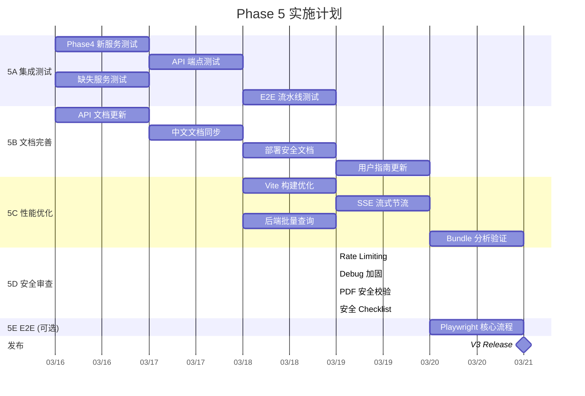

# Phase 5 — 打磨发布

## Overview

Phase 0–4 已完成全部核心功能开发。Phase 5 聚焦于**质量保障、文档完善、性能优化和安全加固**，确保 V3 可以稳定发布。

本阶段不新增功能，仅对已有功能进行全面测试、补齐文档、优化性能瓶颈、修复安全隐患。

**预计工作量**：7–8 工作日

---

## Enhancement Summary (Research Insights)

**研究代理**: best-practices-researcher ×3, framework-docs-researcher ×1

### Key Improvements
1. **5A 测试**: 使用 `httpx AsyncClient` + `ASGITransport` 替代 `TestClient`，SSE 端点直接解析 `resp.text`
2. **5C 性能**: Vite 7 使用 `codeSplitting.groups`（非 `manualChunks`），`useDeferredValue` + AI SDK `experimental_throttle: 80` 组合方案
3. **5D 安全**: `slowapi` 为首选限流方案，全局异常处理器分环境返回错误详情
4. **5B 文档**: `vitepress-plugin-mermaid` 支持流程图，`vitepress-openapi` 可自动从 OpenAPI schema 生成 API 文档

### New Considerations Discovered
- Vite 7 的 Rolldown 引擎废弃了 `manualChunks` 对象形式，改用 `codeSplitting.groups`
- pdfjs-dist worker 生产环境需复制到 `public/` 或通过插件复制到 `dist/`，避免 hash 导致 404
- `slowapi` 0.1.9 必须显式传入 `request` 参数
- VitePress `vitepress-openapi` 可直接从 FastAPI `/openapi.json` 渲染交互式 API 文档

---

## Problem Statement / Motivation

1. **测试覆盖不足**：约 10 个后端服务和新增的 Phase 4 模块缺少测试
2. **API 文档过时**：Phase 1–4 新增的端点（completion、citation-graph、review-draft/stream、PDF serve）未在文档中反映
3. **前端性能隐患**：Vite 未配置 `manualChunks` 代码分割，react-pdf/react-force-graph 等大包可能影响首屏
4. **安全遗留**：无 rate limiting、`APP_DEBUG=True` 默认开启、error message 暴露内部信息
5. **无端到端测试**：Playwright E2E 配置存在但未实际运行

---

## 任务分解

### 5A — 后端集成测试 (3d)

| # | 任务 | 文件 | 工作量 |
|---|------|------|--------|
| 5A-1 | Phase 4 新服务单元测试 | `backend/tests/test_completion.py`, `test_citation_graph.py` (新建) | 1d |
| 5A-2 | Phase 4 API 端点测试 | `backend/tests/test_chat.py` (扩展), `test_papers.py` (扩展), `test_writing.py` (扩展) | 0.5d |
| 5A-3 | 缺失服务测试补齐 | `backend/tests/test_embedding.py`, `test_mineru.py`, `test_paper_processor.py` (新建) | 1d |
| 5A-4 | 端到端流水线测试 | `backend/tests/test_e2e_pipeline.py` (新建) | 0.5d |

#### 5A-1: Phase 4 新服务单元测试

**文件**: `backend/tests/test_completion.py` (新建), `backend/tests/test_citation_graph.py` (新建)

**测试要点**：

```python
# test_completion.py
class TestCompletionService:
    async def test_prefix_too_short_returns_empty(self):
        """prefix < 10 字符应返回空补全"""

    async def test_normal_completion(self):
        """正常长度 prefix 应返回非空补全"""

    async def test_llm_error_returns_empty(self):
        """LLM 调用失败应降级返回空补全而非抛异常"""

    async def test_completion_strips_prefix_echo(self):
        """若 LLM 返回内容包含 prefix 前缀，应自动剥离"""

# test_citation_graph.py
class TestCitationGraphService:
    async def test_resolve_s2_id_from_doi(self):
        """DOI 可解析为 S2 paper ID"""

    async def test_resolve_s2_id_from_title_search(self):
        """标题搜索降级策略"""

    async def test_graph_structure(self):
        """返回 nodes + edges 结构"""

    async def test_s2_api_rate_limit_retry(self):
        """429 时 tenacity 重试"""

    async def test_depth_limit(self):
        """depth=1 不递归引用的引用"""
```

**Mock 策略**：
- `CompletionService`: mock `LLMClient.chat()`
- `CitationGraphService`: mock `httpx.AsyncClient.get()` 模拟 S2 API 响应

**Research Insights - 测试基础设施**：

```python
# conftest.py 推荐 fixture（httpx AsyncClient + ASGITransport）
import pytest
from httpx import ASGITransport, AsyncClient
from app.main import app

@pytest.fixture
async def client():
    transport = ASGITransport(app=app)
    async with AsyncClient(transport=transport, base_url="http://test") as ac:
        yield ac
```

- **pytest-asyncio**: 推荐 `asyncio_mode = "auto"`，`async def` 测试自动运行
- **LLM Mock**: 使用 `LLM_PROVIDER=mock` 环境变量或 `monkeypatch.setattr(chat_module, "_init_services", _mock_init_services)`
- **外部 API Mock**: `patch("app.services.citation_graph_service.httpx.AsyncClient")` + `AsyncMock`

#### 5A-2: Phase 4 API 端点测试

**文件**: 扩展现有测试文件

**测试要点**：
- `POST /chat/complete`: 200 + 正确结构, 422 (prefix 太短)
- `GET /papers/{id}/citation-graph`: 200 + 图数据, 404 (paper 不存在)
- `GET /papers/{id}/pdf`: 200 + PDF 文件, 404 (无 PDF)
- `POST /writing/review-draft/stream`: SSE 响应流, 事件格式正确

**Research Insights - SSE 端点测试**：

```python
async def test_review_draft_stream(client):
    resp = await client.post(
        f"/api/v1/projects/{pid}/writing/review-draft/stream",
        json={"topic": "deep learning", "style": "narrative"},
    )
    assert resp.status_code == 200
    assert resp.headers["content-type"].startswith("text/event-stream")

    events = []
    for line in resp.text.split("\n"):
        if line.startswith("event: "):
            event_type = line[7:]
        elif line.startswith("data: "):
            events.append({"type": event_type, "data": json.loads(line[6:])})

    event_types = [e["type"] for e in events]
    assert "section-start" in event_types
    assert "text-delta" in event_types
    assert "done" in event_types
```

#### 5A-3: 缺失服务测试补齐

**需要补测的模块**：

| 服务 | 文件 | 重点测试 |
|------|------|----------|
| `EmbeddingService` | `test_embedding.py` | 模型加载、batch 编码、GPU/CPU 切换 |
| `MineruClient` | `test_mineru.py` | HTTP 调用、解析结果映射、超时处理 |
| `PaperProcessor` | `test_paper_processor.py` | 全流程：PDF→OCR→分块→索引 |
| `UserSettingsService` | `test_user_settings.py` | CRUD、默认值、无效值校验 |

#### 5A-4: 端到端流水线测试

**文件**: `backend/tests/test_e2e_pipeline.py` (新建)

**测试场景**：
1. **搜索→去重→下载→OCR→索引 完整流水线**：验证 Pipeline 状态正确流转
2. **Chat 问答流水线**：用户消息→意图→检索→生成→流式输出
3. **HITL 中断/恢复**：验证 `StateSnapshot.next` 行为（参考 learnings: `langgraph-hitl-interrupt-api-snapshot-next`）

**注意事项**（来自 learnings）：
- 数据库路径使用 `tempfile.mkdtemp()` 避免污染（参考 `test-database-pollution-tempfile-mkdtemp`）
- 依赖环境变量的分支需 `monkeypatch` 显式 mock（参考 `ci-crawler-tests-and-docs-deadlink`）

---

### 5B — 文档完善 (2d)

| # | 任务 | 文件 | 工作量 |
|---|------|------|--------|
| 5B-1 | Phase 4 API 文档更新 | `docs/api/chat.md`, `docs/api/papers.md`, `docs/api/writing.md` | 0.5d |
| 5B-2 | 中文 API 文档同步 | `docs/zh/api/*.md` | 0.5d |
| 5B-3 | 部署与安全文档 | `docs/guide/deployment.md` (新建) | 0.5d |
| 5B-4 | 用户指南更新 | `docs/guide/getting-started.md` (更新) | 0.5d |

#### 5B-1: Phase 4 API 文档更新

需要新增/更新的端点文档：

| 端点 | 文档位置 | 说明 |
|------|----------|------|
| `POST /chat/complete` | `docs/api/chat.md` | 输入补全 |
| `GET /papers/{id}/citation-graph` | `docs/api/papers.md` | 引用图谱 |
| `GET /papers/{id}/pdf` | `docs/api/papers.md` | PDF 文件服务 |
| `POST /writing/review-draft/stream` | `docs/api/writing.md` | 流式综述 |
| SSE 事件格式 | `docs/api/writing.md` | section-start/text-delta/citation-map/done |

**文档模板**（每个端点，参考 Stripe/GitHub API 风格）：
```markdown
### POST /api/v1/chat/complete

输入补全，基于当前输入前缀预测后续内容。

**Request Body:**
| 字段 | 类型 | 必填 | 说明 |
|------|------|------|------|
| prefix | string | ✅ | 用户输入前缀 (10-2000字符) |
| conversation_id | int | ❌ | 会话 ID |
| knowledge_base_ids | int[] | ❌ | 关联知识库 |
| recent_messages | object[] | ❌ | 最近消息上下文 |

**Response:**
| 字段 | 类型 | 说明 |
|------|------|------|
| completion | string | 补全文本 |
| confidence | float | 置信度 0-1 |

**cURL 示例:**
\`\`\`bash
curl -X POST http://localhost:8000/api/v1/chat/complete \
  -H "Content-Type: application/json" \
  -d '{"prefix": "深度学习在自然语言处理中的应用"}'
\`\`\`
```

**Research Insights - 文档自动化**：
- **`vitepress-openapi`** 可直接从 FastAPI `/openapi.json` 渲染交互式 API 文档，减少手动维护
- **`vitepress-plugin-mermaid`** 支持在文档中嵌入 Mermaid 流程图，安装: `npm i vitepress-plugin-mermaid mermaid -D`
- VitePress 死链检测已有 `ignoreDeadLinks` 配置，文件间引用使用相对路径（`../brainstorms/xxx`）

#### 5B-3: 部署与安全文档

**新建** `docs/guide/deployment.md`，包含：

1. **环境要求**：Python 3.12+, Node.js 20+, GPU (可选), conda
2. **安装步骤**：conda 环境创建、pip 依赖、npm 依赖
3. **MinerU 部署**：独立 conda 环境、模型下载（推荐 ModelScope）、GPU 配置
4. **环境变量**：`.env.example` 各字段说明
5. **安全配置**：
   - `APP_SECRET_KEY` 必须设置非空值（启用 API Key 认证）
   - `APP_DEBUG=false` 生产环境必须关闭
   - CORS origin 配置
   - 建议 nginx 反代 + rate limiting
6. **启动命令**：uvicorn + npm run dev/build

#### 5B-4: 用户指南更新

更新内容覆盖 Phase 4 新功能：
- 智能补全使用说明（Tab 接受、Esc 取消）
- 引用图谱操作指引
- 综述生成功能说明
- PDF 阅读器 + AI 助手使用说明

---

### 5C — 性能优化 (2d)

| # | 任务 | 文件 | 工作量 |
|---|------|------|--------|
| 5C-1 | Vite 构建优化 + 代码分割 | `frontend/vite.config.ts` | 0.5d |
| 5C-2 | SSE 流式渲染节流 | `frontend/src/hooks/useThrottledValue.ts` (新建) | 0.5d |
| 5C-3 | 后端批量查询优化 | `backend/app/services/writing_service.py`, `citation_graph_service.py` | 0.5d |
| 5C-4 | Bundle 分析与优化验证 | — | 0.5d |

#### 5C-1: Vite 构建优化

**文件**: `frontend/vite.config.ts`

> **重要**: Vite 7 使用 Rolldown 引擎，`manualChunks` 对象形式已废弃，改用 `codeSplitting.groups`。

```typescript
build: {
  rolldownOptions: {
    output: {
      codeSplitting: {
        groups: [
          { name: 'react-pdf', test: /node_modules[\\/](react-pdf|pdfjs-dist)/, priority: 25 },
          { name: 'react-force-graph', test: /node_modules[\\/]react-force-graph-2d/, priority: 24 },
          { name: 'katex', test: /node_modules[\\/]katex/, priority: 23 },
          { name: 'ai-sdk', test: /node_modules[\\/](@ai-sdk|ai)\//, priority: 22 },
          { name: 'react-vendor', test: /node_modules[\\/](react|react-dom)/, priority: 20 },
          { name: 'vendor', test: /node_modules/, priority: 10 },
        ],
      },
    },
  },
  chunkSizeWarningLimit: 500,
},
```

**Bundle 分析**: 添加 `rollup-plugin-visualizer`

```typescript
import { visualizer } from 'rollup-plugin-visualizer'
// 在 plugins 中加入：
visualizer({ filename: 'dist/stats.html', gzipSize: true })
```

**pdfjs-dist Worker 配置**：生产环境需将 worker 文件复制到 `public/` 目录，避免 hash 导致 404。

**目标**：main bundle ≤ 300KB（参考 learnings: 从 1396KB 降至 450KB 的先例）

#### 5C-2: SSE 流式渲染节流

**推荐方案**：`useDeferredValue` + AI SDK `experimental_throttle` 组合

```typescript
// Chat 对话场景：AI SDK 内置节流
const { messages } = useChat({
  experimental_throttle: 80, // 80ms 节流
});
const deferredMessages = useDeferredValue(messages);

// 综述生成场景：自定义节流 hook
export function useThrottledValue<T>(value: T, interval = 60): T {
  const [throttled, setThrottled] = useState(value);
  const lastUpdate = useRef(0);

  useEffect(() => {
    const now = Date.now();
    if (now - lastUpdate.current >= interval) {
      setThrottled(value);
      lastUpdate.current = now;
    } else {
      const timer = setTimeout(() => {
        setThrottled(value);
        lastUpdate.current = Date.now();
      }, interval - (now - lastUpdate.current));
      return () => clearTimeout(timer);
    }
  }, [value, interval]);

  return throttled;
}
```

**应用场景**：
- `WritingPage.tsx` 综述流式渲染 → `useThrottledValue(reviewContent, 80)`
- `MessageBubble` → 已有 `memo()`，可增加 `useDeferredValue`

**Web Vitals 目标**：LCP ≤ 2.5s, INP ≤ 200ms, CLS ≤ 0.1

#### 5C-3: 后端批量查询优化

**优化点**：
1. `WritingService.generate_literature_review()`: 提纲生成后一次性加载所有 Paper（`Paper.id.in_(ids)`），避免逐章节重复查询
2. `CitationGraphService`: S2 API 结果缓存（同一 paper 在 depth>1 时可能被多次请求）
3. `RAGService.retrieve_only()`: 确认 `asyncio.to_thread` 包装到位（参考 learnings: `blocking-sync-calls`）

#### 5C-4: Bundle 分析与优化验证

1. 执行 `npm run build` 并检查 chunk 大小
2. 使用 `rollup-plugin-visualizer` 生成 bundle 分析图
3. 验证 lazy-loaded 组件（PDFViewer, CitationGraphView）不在 main chunk 中
4. 检查 `pdfjs-dist` worker 是否正确被排除（worker 通过 `new URL()` 加载）

---

### 5D — 安全审查与加固 (1d)

| # | 任务 | 文件 | 工作量 |
|---|------|------|--------|
| 5D-1 | Rate Limiting 实现 | `backend/app/middleware/rate_limit.py` (新建) | 0.3d |
| 5D-2 | Debug 模式与错误信息加固 | `backend/app/main.py`, 各 API 端点 | 0.3d |
| 5D-3 | PDF 文件安全校验 | `backend/app/api/v1/papers.py`, `upload.py` | 0.2d |
| 5D-4 | 安全 checklist 验证 | — | 0.2d |

#### 5D-1: Rate Limiting

**方案**: 使用 `slowapi` 0.1.9（首选方案，与 FastAPI 集成最好）

> **注意**: slowapi 0.1.9 必须显式传入 `request` 参数

```python
from slowapi import Limiter, _rate_limit_exceeded_handler
from slowapi.util import get_remote_address
from slowapi.errors import RateLimitExceeded
from slowapi.middleware import SlowAPIMiddleware

limiter = Limiter(
    key_func=get_remote_address,
    default_limits=["120/minute"],
)

app.state.limiter = limiter
app.add_exception_handler(RateLimitExceeded, _rate_limit_exceeded_handler)
app.add_middleware(SlowAPIMiddleware)

# 在路由中使用（注意：request 参数必须存在）
@router.post("/chat/stream")
@limiter.limit("30/minute")
async def stream_chat(request: Request, body: ChatStreamRequest, ...):
    ...
```

**限流策略**：

| 端点类型 | 限制 | 说明 |
|----------|------|------|
| `POST /chat/stream` | 30/min | 流式对话 |
| `POST /chat/complete` | 60/min | 补全请求频繁 |
| `POST /writing/review-draft/stream` | 5/min | 综述生成耗时长 |
| 其他 API | 120/min | 通用默认 |

**备选方案**: nginx `limit_req` 可作为应用层前的第一道限流

#### 5D-2: Debug 模式加固

1. `APP_DEBUG` 默认改为 `False`（`.env.example` 和 `config.py`）
2. 注册全局异常处理器：

```python
@app.exception_handler(Exception)
async def global_exception_handler(request: Request, exc: Exception):
    logger.exception("Unhandled exception: %s", exc)
    detail = str(exc) if settings.app_debug else "Internal server error"
    return JSONResponse(
        status_code=500,
        content={"code": 500, "message": detail, "data": None},
    )
```

3. 检查所有 `task["error"] = str(e)` 位置，生产环境只返回错误类型名称

#### 5D-3: PDF 文件安全校验

1. **PDF 魔数校验**：`serve_pdf` 端点返回前检查 `content[:5] == b"%PDF-"`
2. **上传文件类型验证**：`upload.py` 增加 MIME type 和魔数双重校验
3. **路径遍历检查**：`paper.pdf_path` 必须在 `settings.pdf_dir` 下（复用 pipelines 的逻辑）

#### 5D-4: 安全 Checklist

基于安全审计报告（`docs/security/SECURITY-AUDIT-2025-03-11.md`）逐项验证：

- [ ] 所有路径遍历问题已修复
- [ ] API Key 认证在 `APP_SECRET_KEY` 非空时生效
- [ ] CORS 配置正确（生产环境限定来源）
- [ ] `APP_DEBUG=False` 在 `.env.example` 中标注
- [ ] Rate limiting 已部署
- [ ] 上传文件大小和类型校验完整
- [ ] 错误响应不暴露内部信息
- [ ] S2 API Key 等敏感配置不在日志中输出

---

### 5E — 前端 E2E 测试 (可选, 1d)

| # | 任务 | 文件 | 工作量 |
|---|------|------|--------|
| 5E-1 | Playwright E2E 核心流程 | `e2e/` (新建) | 1d |

**核心测试场景**：
1. 登录/首页加载
2. 创建项目 → 上传 PDF → 查看论文列表
3. 打开对话 → 发送消息 → 接收流式回复
4. 打开 PDF 阅读器 → 选中文本 → AI 问答
5. 打开引用图谱 → 节点交互
6. 综述生成 → 流式显示 → 下载

---

## System-Wide Impact

### 性能影响

- Vite 代码分割将显著降低首屏加载时间
- SSE 节流将减少不必要的 DOM 重渲染
- Rate limiting 会为极端并发场景增加额外延迟（可忽略）

### 安全影响

- Rate limiting 可能影响自动化脚本（需在文档中说明）
- Debug 关闭后，错误排查需依赖日志文件

### 测试影响

- 新增测试将延长 CI 执行时间（预计 +30s~1min）
- E2E 测试需要完整运行环境（后端 + 前端 + 数据库）

---

## 实施顺序



**可并行**：5A（测试）+ 5B（文档）可并行；5C（性能）+ 5D（安全）可并行。

---

## Acceptance Criteria

### 功能完整性
- [ ] 所有 Phase 4 新服务有对应单元测试
- [ ] 所有新增 API 端点有测试覆盖
- [ ] `CompletionService`、`CitationGraphService` 测试通过
- [ ] `EmbeddingService`、`MineruClient`、`PaperProcessor` 有基本测试

### 文档完整性
- [ ] Phase 4 新增端点均有 API 文档（英文 + 中文）
- [ ] 部署指南文档完整（环境要求、安装、启动、安全配置）
- [ ] 用户指南涵盖智能补全、引用图谱、综述生成、PDF 阅读器

### 性能指标
- [ ] main bundle ≤ 300KB（代码分割后）
- [ ] react-pdf、react-force-graph 独立 chunk
- [ ] SSE 流式渲染无明显卡顿（≤ 50ms Long Task）
- [ ] `npm run build` 无 chunk size warning

### 安全指标
- [ ] Rate limiting 已启用
- [ ] `APP_DEBUG` 默认关闭
- [ ] 错误响应不暴露内部信息
- [ ] PDF serve 有魔数校验
- [ ] 安全 checklist 全部通过

---

## Dependencies & Risks

| 风险 | 影响 | 缓解 |
|------|------|------|
| E2E 测试需完整环境 | CI 配置复杂 | 先本地验证，CI 作为后续优化 |
| MinerU 测试依赖 GPU | 无 GPU 环境无法跑 | MinerU client mock + 集成测试标记 `@pytest.mark.gpu` |
| `slowapi` 与 FastAPI 版本兼容 | 可能有 API 变更 | 安装时测试基本功能 |
| 文档工作量可能超预期 | 中文翻译耗时 | 优先英文，中文次之 |

---

## Sources & References

### Internal References
- 安全审计: `docs/security/SECURITY-AUDIT-2025-03-11.md`
- 数据库测试隔离: `docs/solutions/test-failures/test-database-pollution-tempfile-mkdtemp.md`
- HITL 中断测试: `docs/solutions/integration-issues/langgraph-hitl-interrupt-api-snapshot-next.md`
- 性能分析: `docs/solutions/performance-issues/blocking-sync-calls-asyncio-to-thread.md`
- RAG 流式性能: `docs/solutions/performance-issues/2026-03-12-rag-rich-citation-performance-analysis.md`
- 代码质量审计: `docs/solutions/compound-issues/codebase-quality-audit-4-batch-remediation.md`
- CI 测试问题: `docs/solutions/build-errors/ci-crawler-tests-and-docs-deadlink.md`

### Research Documents (Deepen Phase)
- 集成测试: `docs/solutions/integration-testing/2026-03-16-fastapi-langgraph-integration-testing-best-practices.md`
- 前端性能: `docs/solutions/2026-03-16-frontend-performance-best-practices.md`
- 安全加固: `docs/research/2026-03-16-fastapi-security-hardening-best-practices.md`
- VitePress 文档: `docs/research/2026-03-16-vitepress-docs-api-best-practices.md`

### PRD References
- Phase 5 路线图: `docs/prd/v3/06-implementation-roadmap.md` (L204-215)
- 架构设计: `docs/prd/v3/04-architecture.md`
