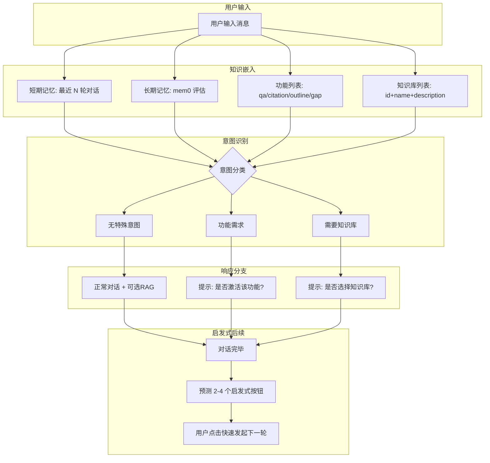
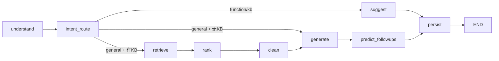
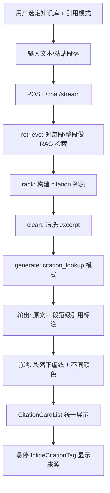
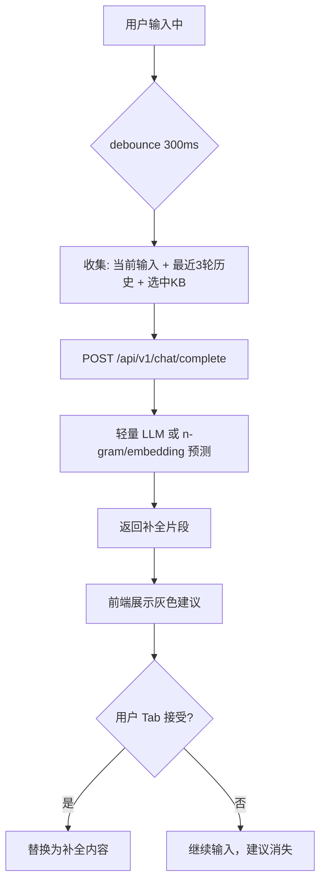
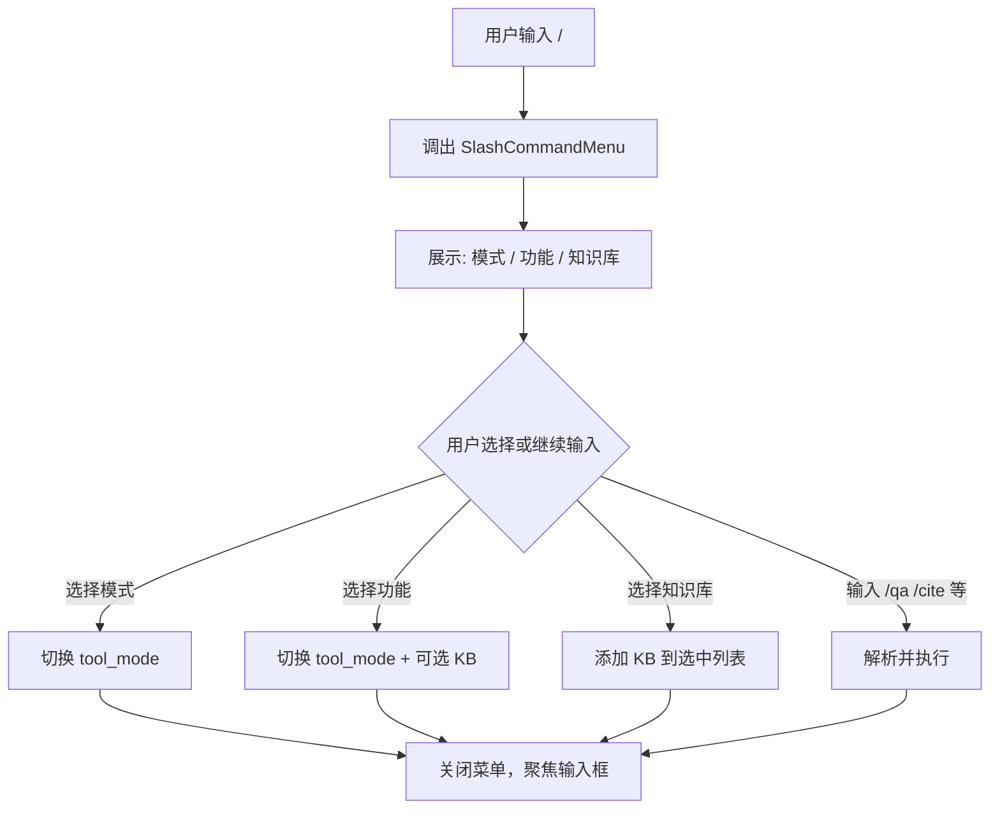

# Omelette V3 PRD — 对话逻辑模块

> 版本：V3.0 Draft | 日期：2026-03-15 | 状态：规划中

## 1. 模块概述

对话逻辑模块是 Omelette 的核心交互入口，负责处理用户与 AI 的对话流程、意图识别、引用查询、智能补全和快捷指令。本 PRD 细化四个子功能的设计与实现方案。

### 1.1 与现有架构的关系

- **现有 Chat Pipeline**：`understand → [has KB?] → retrieve → rank → clean → generate → persist`（6 节点 LangGraph）
- **流式协议**：Vercel AI SDK 5.0 Data Stream Protocol（SSE）
- **前端**：`useChat` + `DefaultChatTransport` + `MessageBubbleV2` + `ThinkingChain` + `CitationCardList`

### 1.2 模块边界

| 子模块 | 状态 | 说明 |
|--------|------|------|
| 正常提问（意图感知） | V3 新增 | 无 KB/功能块时的智能路由与提示 |
| 引用查询 | V2 已有，V3 增强 | 段落级引用、不同颜色标注、悬停来源 |
| 智能补全 | V3 新增 | 输入时实时预测 |
| 斜杠命令 | V3 新增 | `/` 调出快捷指令菜单 |

---

## 2. 正常提问（意图感知对话）

### 2.1 用户故事

| ID | 角色 | 需求 | 验收标准 |
|----|------|------|----------|
| U1 | 科研人员 | 未选知识库时提问，希望系统识别我可能需要引用某知识库 | 系统提示「是否选择知识库 X？」 |
| U2 | 科研人员 | 未选功能模式时提问「帮我找这段话的引用」，希望系统建议激活引用模式 | 系统提示「是否切换到引用查询模式？」 |
| U3 | 科研人员 | 普通闲聊或通用问题，不希望被强制选知识库 | 直接回答，可选 RAG 增强 |
| U4 | 科研人员 | 对话结束后希望有下一步建议 | 展示 2–4 个启发式按钮供快速选择 |

### 2.2 交互流程



**流程说明**：

1. **知识嵌入**：在 `understand` 节点前或内，将以下上下文注入 system prompt 或单独传给意图分类：
   - 短期记忆：当前会话最近 5–10 轮消息（已有 `history_messages`）
   - 长期记忆：<!-- TODO: mem0 评估后接入，当前留空，可先用占位 prompt -->
   - 功能列表：`qa`、`citation_lookup`、`review_outline`、`gap_analysis` 及描述
   - 知识库列表：`GET /api/v1/projects` 返回的 `id`、`name`、`description`

2. **意图识别**：单次 LLM 调用，返回结构化 JSON：`{ "intent": "function"|"kb"|"general", "suggested_function"?: "citation_lookup", "suggested_kb_ids"?: [1,2] }`

3. **分支处理**：
   - `function`：流式输出提示文案 + 发射 `data-intent-suggestion` 事件，前端展示确认按钮
   - `kb`：同上，提示选择知识库
   - `general`：走现有 `generate` 流程，可选 RAG（若用户有历史选过的 KB，可弱化检索）

4. **启发式后续**：`generate` 完成后，再调用一次轻量 LLM，基于对话内容预测 2–4 个后续问题，通过 `data-suggested-followups` 事件下发，前端渲染为可点击按钮。

### 2.3 LangGraph 节点设计

在现有 6 节点基础上扩展：

| 节点 | 职责 | 前置条件 | 输出 |
|------|------|----------|------|
| `understand` | 加载历史、构建 system prompt、**新增**：调用意图识别（仅当 `knowledge_base_ids` 为空且 `tool_mode` 为默认时） | 入口 | `intent_result`, `history_messages`, `system_prompt` |
| `intent_route` | 条件边：根据 `intent_result` 决定走 `suggest` 或 `retrieve`/`generate` | understand 后 | 路由 |
| `suggest`（新增） | 生成提示文案 + 发射 `data-intent-suggestion`，不调用 RAG | intent 为 function/kb | 流式文案 |
| `retrieve` | 不变 | 有 KB | `rag_results` |
| `rank` | 不变 | retrieve 后 | `citations` |
| `clean` | 不变 | rank 后 | `citations`（更新） |
| `generate` | 不变，**新增**：完成后触发 followup 预测 | 所有路径汇聚 | `assistant_content` |
| `predict_followups`（新增） | 轻量 LLM 调用，预测 2–4 个后续问题，发射 `data-suggested-followups` | generate 后、persist 前 | 无 state 更新 |
| `persist` | 不变 | 所有路径 | `conversation_id` |

**图结构变更**：



<!-- TODO: 意图识别准确率不足时的降级策略：允许用户忽略建议直接发送 -->

### 2.4 API 设计

**请求**：沿用 `POST /api/v1/chat/stream`，请求体不变。

**响应**：新增 SSE 事件类型：

| 事件类型 | 时机 | 数据格式 | 前端处理 |
|----------|------|----------|----------|
| `data-intent-suggestion` | 意图为 function/kb 时 | `{ "type": "function"|"kb", "message": "是否激活引用查询模式？", "suggested_function"?: "citation_lookup", "suggested_kb_ids"?: [1,2] }` | 展示确认/取消按钮，确认后自动切换模式/KB 并重发 |
| `data-suggested-followups` | 对话完成后 | `{ "items": ["总结这篇文献", "找出相关引用", ...] }` | 渲染为可点击按钮，点击即作为新消息发送 |

### 2.5 前端组件设计

| 组件 | 职责 | 位置 |
|------|------|------|
| `IntentSuggestionBanner` | 展示意图建议（功能/知识库），提供「确认」「忽略」按钮 | 消息流中，assistant 消息下方 |
| `SuggestedFollowupButtons` | 展示 2–4 个启发式按钮，点击发送 | 每条 assistant 消息下方 |
| `ThinkingChain` | 已有，展示 `data-thinking` 各步骤 | 不变 |

**反馈机制**：

- 意图识别中：`data-thinking` 步骤 `intent`，label 为「识别意图」
- 建议展示时：Banner 高亮，确认后显示「已切换模式」toast
- 启发式预测中：可选 `data-thinking` 步骤 `followup`，或静默（避免过多步骤感）

---

## 3. 引用查询

### 3.1 用户故事

| ID | 角色 | 需求 | 验收标准 |
|----|------|------|----------|
| U5 | 科研人员 | 选定知识库后输入文本，希望每段话下方用不同颜色虚线标注来源 | 段落与引用颜色一一对应 |
| U6 | 科研人员 | 不修改我的原文，除非有错误 | 输出保持用户原文，仅增加标注 |
| U7 | 科研人员 | 引用内容在对话框下方统一呈现 | 已有 CitationCardList |
| U8 | 科研人员 | 鼠标悬停显示来源文献和具体段落 | 已有 InlineCitationTag HoverCard |
| U9 | 科研人员 | 引用完整、准确，不遗漏或错误关联 | 优化检索与匹配流程 |

### 3.2 交互流程



**核心差异**：`citation_lookup` 模式下，`generate` 的 system prompt 要求「保持用户原文不变，仅在对应位置标注 [1][2]」，且需按段落粒度匹配引用。

### 3.3 段落级引用与颜色映射

| 需求 | 实现方案 |
|------|----------|
| 每段话不同颜色 | `CITATION_COLORS` 按 `paper_id` 或 `citation.index` 取模，同一文章同一颜色 |
| 虚线标注 | 在 `InlineCitationTag` 或父级 `span` 上使用 `border-bottom: 1.5px dashed ${color}`（已有） |
| 不修改原文 | `citation_lookup` 的 prompt 明确约束：「Do not alter the user's text. Only add citation markers [N].」 |

### 3.4 LangGraph 节点设计

引用查询复用现有 `retrieve → rank → clean → generate` 链路，需做以下调整：

- `understand`：当 `tool_mode === "citation_lookup"` 时，使用 `TOOL_MODE_PROMPTS["citation_lookup"]`，并**强化**「不修改原文」的约束
- `retrieve`：对长文本可按段落拆分后分别检索，再合并去重；或整段检索后由 rank 做段落级分配
  <!-- TODO: 段落拆分策略：按换行/句号/固定长度？需实验确定 -->

> **代码审计发现的关键问题**（详见 [07-code-audit-and-fixes.md](./07-code-audit-and-fixes.md)）：
>
> 1. **retrieve_node 硬编码 `top_k=5`**：引用查询模式需要更高的 `top_k`（建议 15-20）以确保引用覆盖率。应改为从 state 中读取可配置值，`citation_lookup` 模式自动提高 `top_k`。
> 2. **RAG query 内部 LLM 冗余**：`rag_service.query()` 内部会调 LLM 生成答案，但 `generate_node` 又会调一次。应新增 `RAGService.retrieve_only()` 方法仅做检索。
> 3. **相邻 chunk 上下文拼接 BUG**：`_get_adjacent_chunks` 返回的 prev+next 文本被重复拼接在主 chunk 两侧，导致 excerpt 内容错乱。这直接影响引用查询的准确性。
> 4. **多 KB 检索结果无去重**：同一论文在多个 KB 中索引时会产生重复引用。`rank_node` 中需按 `paper_id + chunk_index` 去重。

### 3.5 API 设计

无新增 API，沿用 `POST /api/v1/chat/stream`。请求体需包含 `tool_mode: "citation_lookup"` 和 `knowledge_base_ids`。

**响应**：沿用 `data-citation`、`text-delta` 等，确保 `citation_lookup` 模式下 LLM 输出格式为「原文 + [1][2]」。

### 3.6 前端组件设计

| 组件 | 现状 | V3 增强 |
|------|------|---------|
| `InlineCitationTag` | 已有，按 index 取色，悬停显示 | 确保按 `paper_id` 取色，同一文章同色 |
| `CitationCardList` | 已有，展示在消息下方 | 引用模式下可考虑折叠/展开优化 |
| `remark-citation` | 解析 `[N]` 为 `citation-ref` | 不变 |

**颜色策略**：当前 `CITATION_COLORS[(citationIndex - 1) % 6]` 按 citation 序号。若需「同一文章同色」，需在 `CitationDict` 中传递 `paper_id`，前端用 `paper_id` 取模。

```ts
// 建议：按 paper_id 取色，同一文献同色
const colorIndex = citation.paper_id != null
  ? citation.paper_id % CITATION_COLORS.length
  : (citation.index - 1) % CITATION_COLORS.length;
```

### 3.7 引用完整性优化

> **代码审计发现的关键问题**（详见 [07-code-audit-and-fixes.md](./07-code-audit-and-fixes.md)）

| 问题 | 根因 | 修复方案 |
|------|------|----------|
| 引用 excerpt 内容错乱 | `_get_adjacent_chunks` 拼接 BUG：前后文被重复贴在主 chunk 两侧 | **P0**：分离 prev/next chunk，按 `[前]\n[主]\n[后]` 正确拼接 |
| 引用不完整 | `top_k=5` 硬编码，且无 Reranker | 提高 `top_k` 至 15-20，引入 BGE Reranker 后取 top_n=5-8 |
| 低质量引用干扰回答 | 无 relevance score 过滤 | `rank_node` 增加 `MIN_RELEVANCE = 0.3` 过滤 |
| 多 KB 重复引用 | 同一论文在多 KB 索引，结果无去重 | 按 `paper_id + chunk_index` 去重 |
| 双重 LLM 调用浪费 | `rag_service.query()` 内部调 LLM + `generate_node` 再调 LLM | 新增 `retrieve_only()` 仅检索不生成 |
| 错误关联 | clean 阶段无校验 | rank 阶段引入 relevance 阈值过滤 |
| 段落与引用错位 | prompt 未按段落对应 | prompt 中要求 LLM 按段落—引用对应输出 |

---

## 4. 智能补全

### 4.1 用户故事

| ID | 角色 | 需求 | 验收标准 |
|----|------|------|----------|
| U10 | 科研人员 | 输入时实时预测后续内容 | 输入框下方或行内展示补全建议 |
| U11 | 科研人员 | 补全考虑当前对话历史和知识库 | 补全内容与上下文相关 |

### 4.2 交互流程



### 4.3 技术方案

| 方案 | 优点 | 缺点 | 建议 |
|------|------|------|------|
| 流式 LLM 补全 | 上下文感知强 | 延迟高、成本高 | 仅作为可选增强 |
| 本地 n-gram / 简单统计 | 延迟低 | 无上下文 | 不适合科研场景 |
| 小模型 + 缓存 | 折中 | 需部署小模型 | <!-- TODO: 评估 Ollama 小模型或 embedding 近邻 --> |
| 服务端 LLM 单次调用 | 实现简单 | 每次输入都调用成本高 | 需 debounce + 缓存 |

**推荐**：Phase 1 采用 **debounce + 单次 LLM 调用**，限制为：仅当输入 ≥ 10 字符且停顿 400ms 时触发，返回 1 个补全片段（最多 50 字符）。后续可评估 WebSocket 长连接或本地小模型。

### 4.4 API 设计

**新增**：`POST /api/v1/chat/complete`

| 字段 | 类型 | 必填 | 说明 |
|------|------|------|------|
| `prefix` | string | 是 | 用户当前输入 |
| `conversation_id` | int | 否 | 当前会话 ID |
| `knowledge_base_ids` | int[] | 否 | 选中的知识库 |
| `recent_messages` | array | 否 | 最近 3 轮 {role, content}，可由前端传入或后端从 conversation 加载 |

**响应**：

```json
{
  "completion": "后续预测的文本片段",
  "confidence": 0.85
}
```

非流式，单次返回。若无需补全可返回 `{ "completion": "" }`。

### 4.5 前端组件设计

| 组件 | 职责 |
|------|------|
| `ChatInput` | 扩展：监听 `onChange`，debounce 后调用 `complete` API，将返回的 `completion` 以灰色行内或下方展示 |
| `CompletionSuggestion` | 新增：展示补全建议，支持 Tab 接受、Esc 忽略 |

**交互**：

- 补全建议以灰色、斜体或下划线样式显示在光标后
- Tab：接受补全，插入到输入框
- Esc：清除建议
- 继续输入：取消当前请求，重新 debounce

**反馈机制**：

- 请求中：输入框右侧显示 loading 小图标（可选，避免闪烁）
- 无补全时：不展示任何 UI

<!-- TODO: WebSocket 长连接方案评估，用于降低冷启动延迟 -->

---

## 5. 斜杠命令

### 5.1 用户故事

| ID | 角色 | 需求 | 验收标准 |
|----|------|------|----------|
| U12 | 科研人员 | 输入 `/` 调出快捷指令菜单 | 弹出菜单，可搜索、选择 |
| U13 | 科研人员 | 可选择模式、功能、加载知识库 | 选择后自动切换并填充 |
| U14 | 科研人员 | 支持快捷指令如 `/qa`、`/cite 知识库名` | 输入即执行 |

### 5.2 交互流程



### 5.3 命令结构

| 类别 | 命令示例 | 行为 |
|------|----------|------|
| 模式 | `/qa` | 切换为 qa 模式 |
| 模式 | `/cite` | 切换为 citation_lookup |
| 模式 | `/outline` | 切换为 review_outline |
| 模式 | `/gap` | 切换为 gap_analysis |
| 知识库 | `/kb 知识库名` 或 选择列表项 | 添加/切换知识库 |
| 组合 | `/cite 我的文献库` | 切换模式 + 加载指定 KB |

### 5.4 API 设计

**可选**：`GET /api/v1/chat/slash-commands` 返回可用命令列表（若命令静态可前端写死）。

**推荐**：命令列表前端维护，无需新 API。知识库列表已有 `GET /api/v1/projects`。

### 5.5 前端组件设计

| 组件 | 职责 |
|------|------|
| `SlashCommandMenu` | 弹出菜单，展示模式/功能/KB 列表，支持键盘上下选择、Enter 确认 |
| `ChatInput` | 监听 `onKeyDown`，当输入 `/` 时打开 `SlashCommandMenu`，将光标位置传给菜单用于定位 |
| `ToolModeSelector` | 已有，可与 SlashCommandMenu 共享模式列表 |

**菜单结构**：

```
/ 快捷指令
├── 模式
│   ├── /qa — 问答
│   ├── /cite — 引用查询
│   ├── /outline — 综述提纲
│   └── /gap — 缺口分析
└── 知识库
    ├── 项目A
    ├── 项目B
    └── ...
```

**反馈机制**：

- 选择后：toast 提示「已切换到引用查询模式」或「已加载知识库：项目A」
- 若选择「加载知识库」：顶部 KB 选择器同步更新，Badge 展示新增的 KB

---

## 6. 反馈机制汇总

| 阶段 | 后端事件 | 前端展示 |
|------|----------|----------|
| 意图识别 | `data-thinking(step=intent)` | ThinkingChain 显示「识别意图」 |
| 意图建议 | `data-intent-suggestion` | IntentSuggestionBanner |
| 检索 | `data-thinking(step=retrieve)` | 「搜索知识库」 |
| 排序 | `data-thinking(step=rank)` | 「分析引用」 |
| 清洗 | `data-thinking(step=clean)` | 「优化引用文本」 |
| 生成 | `data-thinking(step=generate)` | 「生成回答」 |
| 引用 | `data-citation` | InlineCitationTag + CitationCardList |
| 启发式 | `data-suggested-followups` | SuggestedFollowupButtons |
| 完成 | `data-thinking(step=complete)` | 收起 ThinkingChain |
| 智能补全 | 无流式 | 输入框内灰色建议 + 可选 loading |
| 斜杠命令 | 无 | Toast 确认 |

---

## 7. 实施优先级

| 阶段 | 功能 | 依赖 |
|------|------|------|
| P1 | 意图感知（understand 扩展 + intent_route + suggest） | 无 |
| P1 | 启发式后续（predict_followups） | P1 意图 |
| P2 | 引用查询增强（颜色按 paper_id、段落级优化） | 无 |
| P2 | 斜杠命令（SlashCommandMenu） | 无 |
| P3 | 智能补全（complete API + ChatInput 集成） | 无 |

---

## 8. 附录

### 8.1 ChatState 扩展字段（意图感知）

```python
# state.py 新增
intent_result: dict | None  # {"intent": "function"|"kb"|"general", "suggested_function"?: str, "suggested_kb_ids"?: list[int]}
```

### 8.2 意图识别 Prompt 模板（草案）

```
你是一个科研助手。根据用户输入、当前功能模式、可用知识库列表，判断用户意图。

可用功能模式：qa（问答）、citation_lookup（引用查询）、review_outline（综述提纲）、gap_analysis（缺口分析）。
可用知识库：{kb_list}

用户输入：{message}
当前模式：{tool_mode}
当前选中知识库：{kb_ids}

请返回 JSON：{"intent": "function"|"kb"|"general", "suggested_function"?: "citation_lookup"|..., "suggested_kb_ids"?: [1,2], "reason": "简短说明"}
```

### 8.3 参考文件

- 现有 Chat Pipeline：`backend/app/pipelines/chat/graph.py`、`nodes.py`
- 前端 Chat：`frontend/src/hooks/use-chat-stream.ts`、`MessageBubbleV2.tsx`
- 引用组件：`InlineCitationTag.tsx`、`CitationCardList.tsx`、`CitationCard.tsx`
