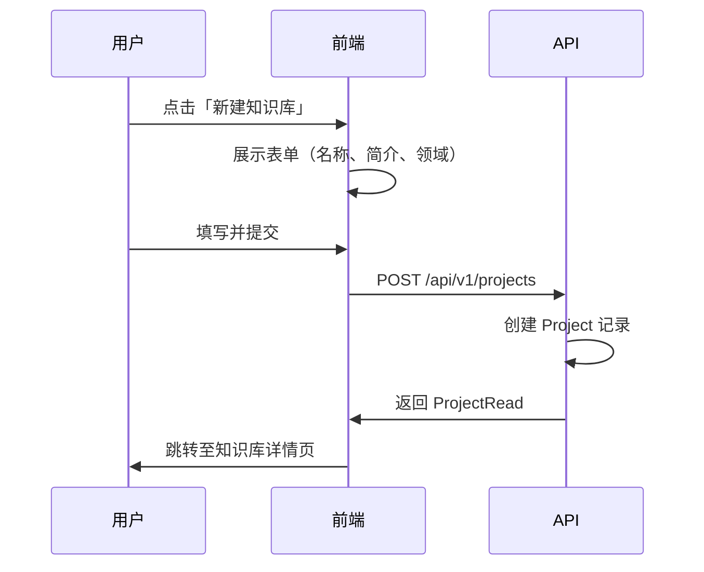
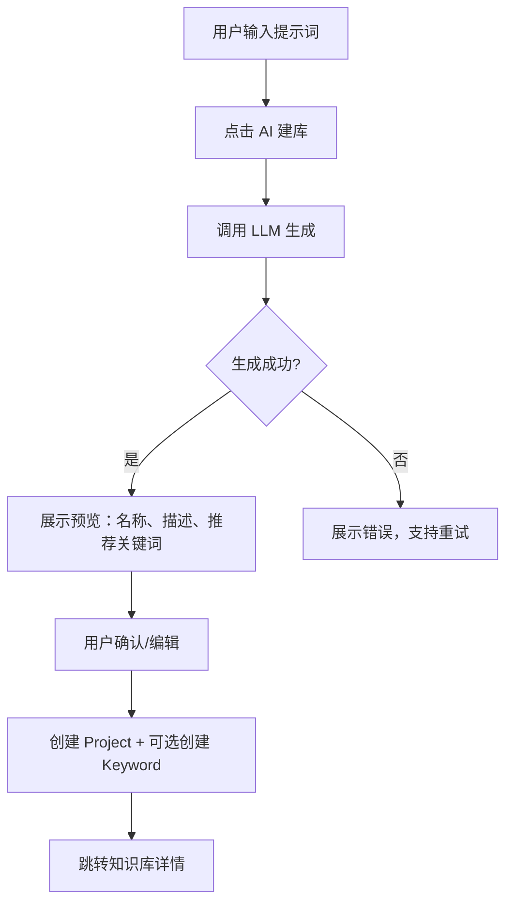
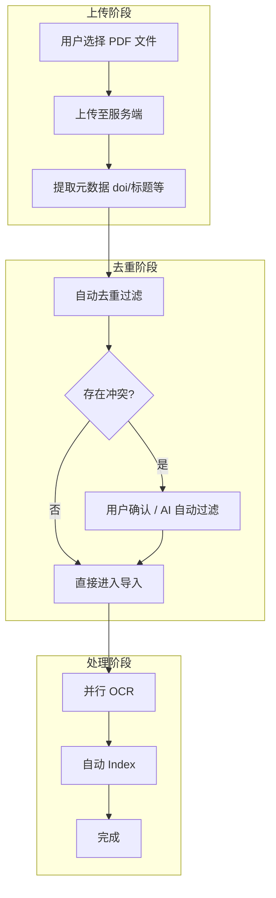
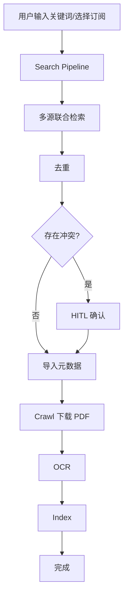
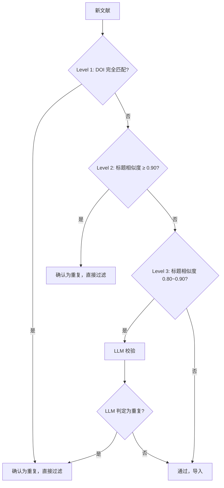
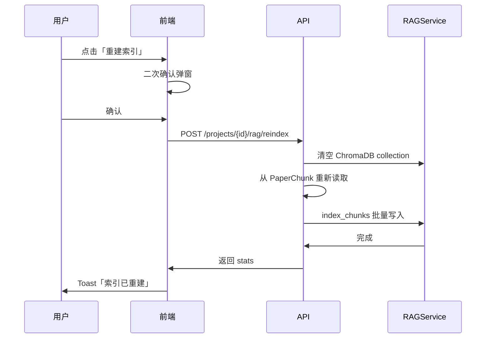
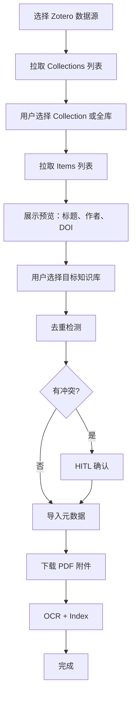

# Omelette V3 PRD — 知识库管理模块

> 版本：V3.0 Draft | 日期：2026-03-15 | 状态：规划中

## 1. 模块概述

知识库管理模块是 Omelette 的核心数据入口，负责科研文献的创建、导入、去重、索引与订阅更新。本 PRD 细化以下四个子模块：

1. **创建新知识库**：手动创建、AI 辅助创建、Zotero 导入创建
2. **文献上传与管理**：PDF 上传、网络爬取、去重、列表、reindex、批量操作
3. **Zotero 联动**：API 集成、导入、数据库导入、双向同步评估
4. **订阅管理**：多源订阅、增量更新、定时任务、新文献通知

### 1.1 与现有实现的关系

| 现有能力 | V3 增强点 |
|----------|-----------|
| Project 模型（知识库） | 新增 AI 建库、Zotero 导入入口 |
| Upload Pipeline（extract→dedup→import→ocr→index） | 分级去重、AI 自动过滤、并行 OCR、进度反馈 |
| Search Pipeline | 网络爬取流程整合 |
| DedupService（DOI + 标题 + LLM） | 分级判定机制、HITL 冲突解决 |
| Subscription（RSS/API） | 多源统一、增量策略、定时任务、通知 |
| RAGService（LlamaIndex + ChromaDB） | reindex 机制、批量操作 |

---

## 2. 创建新知识库

### 2.1 功能一：手动输入名称和简介

#### 用户故事

> 作为科研人员，我希望通过填写名称和简介快速创建一个空知识库，以便后续逐步添加文献。

#### 交互流程



#### 数据模型变更

**无变更**。沿用现有 `Project` 模型：

- `name`, `description`, `domain` 已支持
- `settings` 可扩展存储后续配置

#### API 设计

沿用现有：

| 方法 | 路径 | 说明 |
|------|------|------|
| POST | `/api/v1/projects` | 创建知识库，Body: `ProjectCreate` |

#### 前端反馈

- 提交时：Loading 状态 + 禁用按钮
- 成功：Toast 提示「知识库已创建」，跳转详情
- 失败：Toast 展示错误信息

---

### 2.2 功能二：AI 按钮 — 根据用户提示词自动新建

#### 用户故事

> 作为科研人员，我希望输入一段研究主题描述，由 AI 自动生成知识库名称、描述和推荐关键词，以便快速搭建结构化知识库。

#### 交互流程



#### 数据模型变更

**可选扩展**（留空点）：

- `Project.settings` 中可存储 `ai_prompt`、`ai_generated_at` 等元数据，便于后续追溯
- 暂不新增表，优先复用现有字段

#### API 设计

| 方法 | 路径 | 说明 |
|------|------|------|
| POST | `/api/v1/projects/ai-create/preview` | 根据提示词生成预览，不落库 |

**Request:**

```json
{
  "prompt": "我想研究大语言模型在医疗诊断中的应用，重点关注多模态输入和可解释性"
}
```

**Response:**

```json
{
  "code": 0,
  "data": {
    "name": "LLM 医疗诊断与可解释性",
    "description": "聚焦大语言模型在医疗诊断场景的应用，涵盖多模态输入（文本、影像）与可解释性研究",
    "domain": "AI in Healthcare",
    "suggested_keywords": [
      {"term": "large language model", "level": "primary"},
      {"term": "medical diagnosis", "level": "primary"},
      {"term": "multimodal", "level": "secondary"},
      {"term": "explainability", "level": "secondary"}
    ]
  }
}
```

| 方法 | 路径 | 说明 |
|------|------|------|
| POST | `/api/v1/projects` | 创建知识库（与手动创建共用，Body 可包含 `suggested_keywords` 用于批量创建 Keyword） |

#### LangGraph 节点

**无需独立 Pipeline**。AI 建库为单次 LLM 调用，可在 `ProjectService` 或新建 `ProjectAIService` 中实现：

```python
# 伪代码
async def generate_project_preview(prompt: str) -> dict:
    result = await llm.chat_json(
        messages=[...],
        task_type="project_ai_create",
    )
    return result  # name, description, domain, suggested_keywords
```

#### 前端反馈

- 点击 AI 建库：展示 Loading，禁用表单
- 生成中：进度文案「正在生成名称与推荐关键词…」
- 成功：展示预览卡片，支持编辑后确认
- 失败：Toast 错误 + 重试按钮

#### 技术可行性

- **可行**：现有 `LLMClient.chat_json` 已支持结构化输出
- **留空点**：`suggested_keywords` 的层级（primary/secondary）与现有 Keyword 三级体系的映射关系待定

---

### 2.3 功能三：从 Zotero 导入创建

#### 用户故事

> 作为 Zotero 用户，我希望选择 Zotero 中的某个 Collection，一键导入为 Omelette 知识库，以便在保留原有分类的同时获得 AI 能力。

#### 交互流程

详见 **第四节「Zotero 联动」** 中的「文章导入」部分。创建流程为：

1. 用户选择 Zotero 数据源（API / 本地 .sqlite）
2. 选择 Collection 或全库
3. 系统拉取条目列表，展示预览
4. 用户确认后创建 Project，并导入文献元数据

---

## 3. 文献上传与管理

### 3.1 PDF 上传流程

#### 用户故事

> 作为用户，我希望上传 PDF 后，系统自动提取元数据、去重、OCR 并建立索引，我只需在冲突时参与确认，其余步骤自动完成。

#### 交互流程



#### 现有 vs 目标流程对比

| 环节 | 现有实现 | V3 目标 |
|------|----------|---------|
| 元数据提取 | `pdf_metadata.extract_metadata` | 保持，支持 pdfplumber + 可选增强 |
| 去重 | DOI + 标题相似度 0.85，同步检测 | 分级判定（见 3.3），支持 AI 自动过滤 |
| 用户确认 | 上传接口返回 conflicts，前端需二次调用 | 统一为 Pipeline HITL，支持 resume |
| OCR | 串行，`asyncio.to_thread` | 并行（多 PDF 同时 OCR，控制并发数） |
| Index | 后台 `process_papers_background` | 保持，增加 SSE 进度推送 |

#### 数据模型变更

**无新增表**。沿用 `Paper`、`PaperChunk`、`PaperStatus`。

可选扩展：

- `Task` 表：若需显式任务队列，可关联 `project_id`、`paper_ids`、`stage`、`progress`
- 现有 `process_papers_background` 为 fire-and-forget，进度通过 **留空点**：Task/SSE 机制待设计

#### API 设计

**现有接口保留并增强：**

| 方法 | 路径 | 说明 |
|------|------|------|
| POST | `/api/v1/projects/{id}/papers/upload` | 上传 PDF，返回 `papers` + `conflicts` |
| POST | `/api/v1/projects/{id}/papers/process` | 触发 OCR+Index，支持 `paper_ids` 或全量 |

**新增（可选）：**

| 方法 | 路径 | 说明 |
|------|------|------|
| POST | `/api/v1/projects/{id}/pipeline/upload/run` | 启动 Upload Pipeline（含 HITL），返回 `thread_id` |
| GET | `/api/v1/projects/{id}/pipeline/upload/status/{thread_id}` | 轮询或 SSE 获取进度 |

#### LangGraph 节点

沿用 `create_upload_pipeline`，节点顺序：

```
extract_metadata → dedup → [hitl_dedup | apply_resolution] → import_papers → ocr → index
```

**增强点：**

1. **ocr_node**：改为批量并行，例如 `asyncio.gather` 限制并发为 3
2. **进度反馈**：每个 node 更新 `state["progress"]`、`state["stage"]`，通过 SSE 推送给前端

#### 前端反馈

| 阶段 | 反馈形式 |
|------|----------|
| 上传中 | 进度条（按文件数） |
| 元数据提取 | 「正在解析 PDF 元数据…」 |
| 去重 | 「检测到 N 篇可能重复，请确认」或「无冲突，继续处理」 |
| HITL | 冲突列表 + 操作按钮（保留旧/保留新/跳过） |
| OCR | 「正在 OCR：3/10」进度 |
| Index | 「正在建立索引：5/10」 |
| 完成 | Toast「已导入 N 篇文献，索引完成」 |

#### 留空点

- [ ] AI 自动过滤冲突：根据用户偏好（如「优先保留有 PDF 的」）自动决策，需定义策略枚举
- [ ] 并行 OCR 的并发数配置（默认 3，可配置）
- [ ] 大文件上传分片（当前单文件 50MB 限制）

---

### 3.2 网络爬取流程

#### 用户故事

> 作为用户，我希望通过关键词在多个学术源（Semantic Scholar、OpenAlex、arXiv 等）检索，将结果去重后导入知识库，并自动下载 PDF、OCR、索引。

#### 交互流程



#### 现有实现

- `create_search_pipeline`：search → dedup → hitl → apply_resolution → import → crawl → ocr → index
- `SearchService`：多 Provider（Semantic Scholar、OpenAlex、arXiv、Crossref）

#### 数据模型变更

**无变更**。`Paper.source` 已区分 `semantic_scholar`、`openalex`、`arxiv` 等。

#### API 设计

| 方法 | 路径 | 说明 |
|------|------|------|
| POST | `/api/v1/projects/{id}/pipeline/search/run` | 启动 Search Pipeline，Body: `query`, `sources`, `max_results` |
| GET | `/api/v1/projects/{id}/pipeline/search/status/{thread_id}` | 进度查询 |

#### LangGraph 节点

沿用 `create_search_pipeline`，与 3.1 类似增加进度推送。

#### 前端反馈

- 检索中：「正在检索 Semantic Scholar、OpenAlex…」
- 去重/HITL：同 PDF 上传
- Crawl：「正在下载 PDF：5/20」
- 后续同 OCR、Index

---

### 3.3 分级去重判定机制设计

#### 设计目标

将去重分为三个等级，不同等级采用不同策略，减少误杀、控制 LLM 调用成本。



#### 等级定义

| 等级 | 条件 | 动作 | 实现位置 |
|------|------|------|----------|
| L1 | DOI 非空且与库内某篇相同 | 直接视为重复，不导入 | `dedup_node`、`DedupService.doi_hard_dedup` |
| L2 | 标题相似度 ≥ 0.90（无 DOI 或 DOI 不同） | 直接视为重复 | `dedup_node`，阈值可配置 |
| L3 | 标题相似度 0.80~0.90 | 调用 LLM 校验 | `DedupService.llm_verify_duplicate` |
| 通过 | 相似度 < 0.80 | 导入 | - |

#### 数据模型变更

**无**。冲突结构沿用 `DedupConflictPair`，可扩展 `reason`：

- `doi_duplicate`
- `title_similarity_high`（≥0.90）
- `title_similarity_medium`（0.80~0.90，待 LLM）

#### 配置项（留空点）

- `DEDUP_TITLE_HARD_THRESHOLD`：默认 0.90
- `DEDUP_TITLE_LLM_THRESHOLD`：默认 0.80
- 是否启用 L3 LLM 校验（可关闭以节省成本）

#### 代码审计发现的问题

> 详见 [07-code-audit-and-fixes.md](./07-code-audit-and-fixes.md)

| 问题 | 严重性 | 说明 |
|------|--------|------|
| **去重阈值分散** | P1 | Pipeline `dedup_node` 用 0.85，`DedupService` 用 0.90/0.80，上传 API 用 0.85。应统一到 `config.py` |
| **Pipeline 未复用 DedupService** | P1 | `dedup_node` 重复实现去重逻辑，不支持 L3 LLM 校验。应改为调用 `DedupService` |
| **apply_resolution BUG** | P0 | `action in ("keep_new", "skip")` 导致 `skip` 时仍导入新文献。应改为仅 `keep_new` 才添加 |
| **OCR 分块策略不一致** | P1 | Pipeline `ocr_node` 按页分块（一页一 chunk），`paper_processor` 用语义分块（1024字/100重叠）。应统一为语义分块 |
| **index_node N+1 查询** | P1 | 每篇 Paper 单独查 PaperChunk，应改为批量查询后按 paper_id 分组 |
| **index_node 缺 chunk_type** | P1 | 未传递 `chunk_type` 和 `section` 到 ChromaDB，导致引用无法按章节定位 |
| **Pipeline 取消无效** | P1 | 仅改 `task["status"]`，未将 `cancelled` 写入 Pipeline state，节点仍继续执行 |

---

### 3.4 文献列表

#### 用户故事

> 作为用户，我希望在知识库内浏览文献列表，支持翻页、展开摘要、点击进入 PDF 查看器。

#### 交互流程

- 列表页：表格/卡片展示，支持分页、筛选（状态、年份）、搜索（标题/摘要）
- 行操作：展开摘要、查看 PDF、编辑、删除
- 点击标题或「查看」：进入 PDF 查看器（需支持 `pdf_path` 或 `pdf_url`）

#### 数据模型变更

**无**。`Paper` 已包含 `abstract`、`pdf_path`、`pdf_url`、`status`。

#### API 设计

沿用现有：

| 方法 | 路径 | 说明 |
|------|------|------|
| GET | `/api/v1/projects/{id}/papers` | 分页列表，支持 `page`, `page_size`, `status`, `year`, `q`, `sort_by`, `order` |
| GET | `/api/v1/projects/{id}/papers/{paper_id}` | 单篇详情 |

**PDF 访问：**

- 方案 A：静态文件服务，`/api/v1/papers/{id}/pdf` 返回文件流
- 方案 B：前端直接请求 `pdf_path` 对应 URL（需确保同源或 CORS）
- **留空点**：PDF 查看器具体实现（iframe / PDF.js / 第三方）

#### 前端反馈

- 列表加载：Skeleton
- 展开摘要：内联展开，无额外请求
- PDF 加载：Loading 状态，失败时提示

---

### 3.5 Reindex 按钮和机制

#### 用户故事

> 作为用户，当嵌入模型升级或索引异常时，我希望一键重建知识库的向量索引，而不必重新上传或 OCR。

#### 交互流程



#### 数据模型变更

**无**。仅操作 ChromaDB 与 `PaperChunk`，不修改 `Paper`。

#### API 设计

| 方法 | 路径 | 说明 |
|------|------|------|
| POST | `/api/v1/projects/{id}/rag/reindex` | 清空并重建索引，返回 `{indexed: N}` |

> 注：现有 `POST /rag/index` 为增量添加，不先清空。Reindex 需先调用 `DELETE /rag/index` 再 `POST /rag/index`，或封装为独立 `POST /rag/reindex` 端点。

**实现要点：**

1. 删除 `project_{id}` collection（调用 `RAGService.delete_index`）
2. 查询 `Paper.status == INDEXED` 的 Paper 及其 PaperChunk
3. 调用 `RAGService.index_chunks` 批量写入
4. 使用 `asyncio.to_thread` 包装，避免阻塞

#### 前端反馈

- 点击后：Loading「正在重建索引…」
- 大库：使用现有 `POST /rag/index/stream` 获取 SSE 进度（`stage`、`percent`）
- 完成：Toast「索引已重建，共 N 个片段」

#### 留空点

- [ ] 增量 reindex：仅对变更的 Paper 更新，避免全量重建
- [ ] 嵌入模型切换后的兼容性（不同模型向量维度不同，需清空重建）

---

### 3.6 批量操作

#### 用户故事

> 作为用户，我希望对多篇文献执行批量删除、批量重新 OCR、批量导出等操作。

#### 交互流程

- 列表支持多选（复选框）
- 选中后展示批量操作栏：删除、重新处理（OCR+Index）、导出元数据
- 删除：二次确认，软删除或硬删除待定
- 重新处理：将 `status` 回退至 `PDF_DOWNLOADED` 或 `OCR_COMPLETE`，重新跑 Pipeline

#### 数据模型变更

**无**。若引入软删除，可增加 `Paper.deleted_at`，当前可先硬删除。

#### API 设计

| 方法 | 路径 | 说明 |
|------|------|------|
| DELETE | `/api/v1/projects/{id}/papers/bulk` | Body: `{paper_ids: [1,2,3]}`，批量删除 |
| POST | `/api/v1/projects/{id}/papers/bulk/process` | Body: `{paper_ids: [1,2,3]}`，批量重新 OCR+Index |
| GET | `/api/v1/projects/{id}/papers/export` | Query: `paper_ids`，导出 CSV/BibTeX（留空点） |

#### 前端反馈

- 批量删除：确认弹窗「将删除 N 篇文献，且无法恢复」
- 批量处理：同 3.1 的 OCR/Index 进度
- 导出：下载文件

---

## 4. Zotero 联动

### 4.1 Zotero API 集成方案

#### 技术背景

- Zotero Web API v3：`https://api.zotero.org`
- 认证：API Key（`Authorization: Bearer <key>` 或 `Zotero-API-Key`）
- 用户库：`/users/{user_id}/...`
- 群组库：`/groups/{group_id}/...`

#### 资源端点

| 资源 | 端点示例 |
|------|----------|
| 顶层 Collection | `/users/{uid}/collections/top` |
| 某 Collection 子集 | `/collections/{key}/collections` |
| Collection 内条目 | `/collections/{key}/items` |
| 单条 Item | `/items/{itemKey}` |
| Item 附件（含 PDF） | `/items/{itemKey}/children`，过滤 `itemType=attachment` |

#### 数据模型变更

**新增表：`zotero_connection`（可选，用于存储 API 配置）**

| 字段 | 类型 | 说明 |
|------|------|------|
| id | int | PK |
| user_id | int | 关联用户（若有多用户） |
| api_key | str | 加密存储 |
| library_type | str | `user` / `group` |
| library_id | str | user_id 或 group_id |
| last_synced_at | datetime | 上次同步时间 |
| created_at | datetime | - |

**留空点**：当前 Omelette 无多用户，可简化为全局配置或 `Project.settings["zotero_api_key"]`。

#### API 设计

| 方法 | 路径 | 说明 |
|------|------|------|
| POST | `/api/v1/integrations/zotero/connect` | 保存 API Key、library_type、library_id |
| GET | `/api/v1/integrations/zotero/collections` | 拉取顶层 Collections 列表 |
| GET | `/api/v1/integrations/zotero/collections/{key}/items` | 拉取某 Collection 内 Items |
| GET | `/api/v1/integrations/zotero/items/{key}` | 单条 Item 详情（含附件） |

#### 实现要点

- 使用 `httpx.AsyncClient`，Header：`Zotero-API-Key: {key}`
- Zotero Item 的 `data` 含 `title`, `creators`, `date`, `DOI` 等，需映射为 `StandardizedPaper` / `Paper`
- 附件中 `contentType=application/pdf` 的 `links.attachment.href` 可下载 PDF

---

### 4.2 文章导入（单篇 / 批量 / 整个 Collection）

#### 用户故事

> 作为用户，我希望从 Zotero 选择单篇、多篇或整个 Collection，导入到 Omelette 知识库，并自动下载 PDF、OCR、索引。

#### 交互流程



#### 数据模型变更

**无**。导入后生成 `Paper`，`source="zotero"`，`source_id` 存 Zotero itemKey。

可选：`Paper.extra_metadata["zotero_key"]` 用于双向同步时匹配。

#### API 设计

| 方法 | 路径 | 说明 |
|------|------|------|
| POST | `/api/v1/projects/{id}/import/zotero` | Body: `{collection_key?: str, item_keys?: list[str]}`，启动导入 Pipeline |

#### LangGraph 节点

**新建 `ZoteroImportPipeline`：**

```
fetch_zotero_items → dedup → [hitl_dedup | apply_resolution] → import_papers → crawl_zotero_pdfs → ocr → index
```

- `fetch_zotero_items`：根据 `collection_key` 或 `item_keys` 从 Zotero API 拉取，转换为 `StandardizedPaper` 列表
- `crawl_zotero_pdfs`：对每条 Item 的附件中 PDF 调用 Zotero 附件 URL 下载，写入 `pdf_path`

#### 前端反馈

- 拉取 Collections：Loading「正在连接 Zotero…」
- 拉取 Items：Progress「已获取 50 条…」
- 去重/HITL：同 3.1
- 下载 PDF：Progress「正在下载：5/20」
- OCR/Index：同 3.1

---

### 4.3 数据库（.sqlite）导入

#### 用户故事

> 作为用户，当无法使用 Zotero API（如无网络、私有库）时，我希望上传 Zotero 的 `zotero.sqlite` 文件，解析后导入文献。

#### 技术背景

- Zotero 本地数据库：`~/Zotero/zotero.sqlite`
- 主要表：`items`（条目）、`itemData`（字段值）、`itemAttachments`（附件）、`collections` 等
- 需解析 SQLite，映射为 `Paper` 结构

#### 交互流程

1. 用户上传 `zotero.sqlite` 文件
2. 后端解析 SQLite，提取 `items` 中 type 为 `journalArticle`、`conferencePaper` 等
3. 关联 `itemData` 获取 title、DOI、authors 等
4. 展示预览列表，用户选择目标知识库
5. 导入元数据；PDF 需从本地路径解析（`itemAttachments` 存相对路径）
6. **留空点**：用户本地上传的 sqlite 中，PDF 路径为上传者机器路径，无法直接使用。可选方案：仅导入元数据，或要求用户同时上传 PDF 包

#### 数据模型变更

**无**。

#### API 设计

| 方法 | 路径 | 说明 |
|------|------|------|
| POST | `/api/v1/import/zotero-sqlite/preview` | 上传 sqlite，返回解析后的条目列表（不落库） |
| POST | `/api/v1/projects/{id}/import/zotero-sqlite` | Body: `{item_ids: [...]}`，导入选中条目（仅元数据） |

#### 留空点

- [ ] PDF 路径解析：Zotero 存储路径格式因平台而异，需兼容 Windows/macOS/Linux
- [ ] 大 sqlite 文件上传限制与超时
- [ ] 是否支持「上传 sqlite + 打包 PDF 目录」的混合导入

---

### 4.4 双向同步可能性评估

#### 目标

Omelette 中的修改（如添加笔记、标签）同步回 Zotero，或 Zotero 的修改同步到 Omelette。

#### 技术评估

| 方向 | 可行性 | 说明 |
|------|--------|------|
| Zotero → Omelette | ✅ 可行 | 通过 API 轮询或 Webhook（若 Zotero 支持）拉取变更 |
| Omelette → Zotero | ⚠️ 部分可行 | Zotero API 支持 Write（创建/更新 Item），需维护 itemKey 映射 |
| 实时双向 | ❌ 复杂 | 需解决冲突策略、版本号、离线编辑等 |

#### 建议

- **V3 范围**：仅实现 **Zotero → Omelette** 单向导入与定期「增量拉取」
- **后续迭代**：评估 Omelette → Zotero 的写回（如笔记、标签），需设计 `Paper.extra_metadata["zotero_key"]` 的维护
- **留空点**：Zotero 的 `version` 机制用于增量同步，需在后续 PRD 中细化

---

## 5. 订阅管理

### 5.1 多源订阅（RSS、API）

#### 用户故事

> 作为用户，我希望为知识库添加多种订阅源（如 arXiv 某分类 RSS、Semantic Scholar API 检索），系统按计划自动检查并导入新文献。

#### 数据模型

沿用 `Subscription` 模型，扩展 `sources` 与 `query`：

- `sources`：`["rss", "semantic_scholar", "openalex"]` 或 RSS URL
- `query`：检索关键词或 RSS Feed URL
- `subscription_type`：`rss` | `api`（可选新增字段，或从 `sources` 推断）

#### 统一抽象

```python
# 订阅源类型
class SubscriptionSourceType:
    RSS = "rss"           # 单个 RSS URL
    API_SEARCH = "api"   # 多源 API 检索
```

单个 Subscription 可对应：
- 一个 RSS Feed URL，或
- 一组 API 源 + 检索词

#### API 设计

沿用现有 CRUD，增强 `SubscriptionCreate`：

```json
{
  "name": "arXiv 光学",
  "subscription_type": "rss",
  "feed_url": "https://export.arxiv.org/rss/physics.optics",
  "frequency": "daily",
  "max_results": 50
}
```

```json
{
  "name": "LLM 医疗 多源检索",
  "subscription_type": "api",
  "query": "large language model medical diagnosis",
  "sources": ["semantic_scholar", "openalex", "arxiv"],
  "frequency": "weekly",
  "max_results": 30
}
```

#### 前端反馈

- 添加订阅：表单校验，保存后 Toast
- 订阅列表：展示类型、上次运行时间、找到数量

---

### 5.2 增量更新策略

#### 策略设计

| 源类型 | 增量依据 | 实现 |
|--------|----------|------|
| RSS | `published` / `updated` 时间戳 | `SubscriptionService.check_rss_feed(since=...)` 已支持 |
| API | 出版年份 / 检索结果去重 | `check_api_updates` 按 `since_days` 过滤，与库内 DOI 去重 |

#### 去重

- 拉取到新条目后，先与 `Project` 内 `Paper` 做 DOI/标题去重
- 仅导入不重复的，避免重复文献

#### 留空点

- [ ] API 源（如 Semantic Scholar）是否支持按日期过滤，需查阅各 API 文档
- [ ] 跨订阅源去重：同一文献可能被多个订阅拉取，需在导入前统一去重

---

### 5.3 定时任务机制

#### 用户故事

> 作为用户，我希望订阅按设定频率（每日/每周）自动运行，无需手动触发。

#### 实现方案

| 方案 | 优点 | 缺点 |
|------|------|------|
| APScheduler | 轻量、进程内 | 单机、重启丢失 |
| Celery Beat | 分布式、持久化 | 引入 Redis/RabbitMQ |
| 系统 Crontab | 简单 | 需额外配置 |
| 后台线程 + asyncio | 无新依赖 | 需自行实现调度逻辑 |

#### 建议（V3）

- 使用 **APScheduler** 或 **简单 asyncio 循环**：在 FastAPI 启动时注册定时任务
- 任务：遍历 `Subscription` 中 `is_active=True` 且 `frequency` 到期者，调用 `SubscriptionService.check_*`，将新文献导入对应 Project
- 调度逻辑放在 `app/scheduler.py` 或 `app/tasks/subscription.py`

#### 数据模型变更

- `Subscription.last_run_at`：已有，用于判断是否到期
- 可选：`Subscription.next_run_at`，由调度器计算

#### API 设计

| 方法 | 路径 | 说明 |
|------|------|------|
| POST | `/api/v1/projects/{id}/subscriptions/{sub_id}/trigger` | 手动触发（已有） |
| GET | `/api/v1/subscriptions/next-run` | 查询下次预计运行时间（留空点） |

#### 留空点

- [ ] 定时任务持久化：服务重启后恢复调度
- [ ] 多实例部署时的任务互斥（避免重复执行）

---

### 5.4 新文献通知

#### 用户故事

> 作为用户，当订阅发现新文献并导入后，我希望收到通知（应用内或邮件）。

#### 实现方案

| 渠道 | 实现难度 | 说明 |
|------|----------|------|
| 应用内 | 低 | 前端轮询或 WebSocket，展示「N 篇新文献已导入」 |
| 邮件 | 中 | 需 SMTP 配置，发送摘要邮件 |
| 桌面通知 | 低 | 前端 Notification API |

#### 建议（V3）

- **优先**：应用内通知 — 在订阅触发完成后，写入 `Notification` 表（需新增）或复用现有消息机制
- **后续**：邮件、桌面通知

#### 数据模型变更（留空点）

**新增 `notification` 表：**

| 字段 | 类型 | 说明 |
|------|------|------|
| id | int | PK |
| project_id | int | 关联知识库 |
| subscription_id | int | 关联订阅 |
| type | str | `new_papers` |
| payload | JSON | `{paper_count, paper_ids}` |
| read_at | datetime | 已读时间 |
| created_at | datetime | - |

#### API 设计

| 方法 | 路径 | 说明 |
|------|------|------|
| GET | `/api/v1/notifications` | 未读通知列表 |
| POST | `/api/v1/notifications/{id}/read` | 标记已读 |

---

## 6. 反馈机制总览

> 原则：每步操作都需要有前端可视化进度。

| 操作类型 | 反馈方式 | 实现要点 |
|----------|----------|----------|
| 创建知识库 | Toast + 跳转 | 同步接口 |
| AI 建库 | Loading + 预览卡片 | 单次 LLM 调用 |
| PDF 上传 | 进度条 + 阶段文案 | 分阶段，HITL 时中断 |
| 网络检索 | 同上 | Search Pipeline |
| Zotero 导入 | 同上 | ZoteroImport Pipeline |
| Reindex | Loading + 可选 SSE | 长时间任务 |
| 批量操作 | 确认弹窗 + 进度 | 复用 Pipeline |
| 订阅触发 | Toast + 结果摘要 | 异步任务 |
| 定时订阅 | 无直接反馈 | 依赖通知 |

---

## 7. 留空点汇总

| 编号 | 模块 | 留空点 |
|------|------|--------|
| 1 | 创建知识库 | AI 建库的 `suggested_keywords` 与 Keyword 三级体系映射 |
| 2 | 文献上传 | AI 自动过滤冲突的策略枚举 |
| 3 | 文献上传 | 并行 OCR 并发数配置 |
| 4 | 文献上传 | 大文件分片上传 |
| 5 | 文献列表 | PDF 查看器实现方案 |
| 6 | Reindex | 增量 reindex、嵌入模型切换兼容性 |
| 7 | Zotero | 多用户下的 `zotero_connection` 存储 |
| 8 | Zotero | sqlite 导入的 PDF 路径解析与打包方案 |
| 9 | Zotero | 双向同步的冲突策略与版本管理 |
| 10 | 订阅 | API 源按日期过滤能力 |
| 11 | 订阅 | 跨订阅源去重 |
| 12 | 订阅 | 定时任务持久化与多实例互斥 |
| 13 | 通知 | `notification` 表与推送机制 |

---

## 8. 附录：Pipeline 状态与进度字段

为支持前端进度展示，建议 `PipelineState` 统一包含：

```python
# state.py 扩展
progress: int          # 0-100
stage: str             # "extract" | "dedup" | "hitl" | "import" | "crawl" | "ocr" | "index"
stage_detail: str      # "正在 OCR：3/10"
result_summary: dict   # {"imported": 5, "indexed": 5, "conflicts": 2}
```

SSE 推送格式可复用 Chat 的 Data Stream Protocol，或自定义 `stage`、`progress` 事件。

---

*本文档为知识库管理模块详细 PRD，与 [00-overview.md](./00-overview.md) 及后续架构文档配套使用。*
