# Omelette V3 — 整体架构设计与技术方案

> 版本：V3.0 Draft | 日期：2026-03-15 | 状态：规划中

## 文档说明

本文档由 Omelette 子 Agent 产出，负责细化「整体架构设计与技术方案」。基于现有技术栈与架构问题，提供渐进式、可落地的设计建议。

### 设计原则

1. **从简到繁**：优先解决 P0 问题（Pipeline 持久化、API 去重），再逐步引入 Reranker、混合检索、模型分级
2. **模块解耦**：编排层与服务层边界清晰，各 service 可独立测试、独立替换
3. **多人协作**：按域划分（chat、rag、pipelines、settings），减少 merge 冲突
4. **留空标注**：明确标注「后续优化」点，避免过度设计

---

## 一、整体架构设计

### 1.1 系统分层架构图

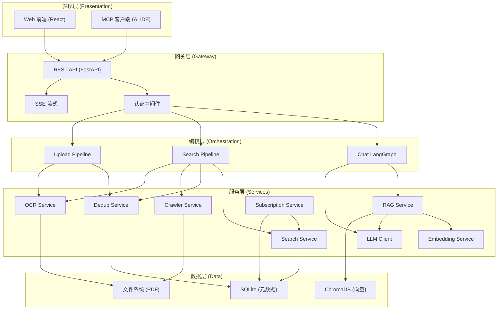

### 1.2 模块间通信与依赖关系

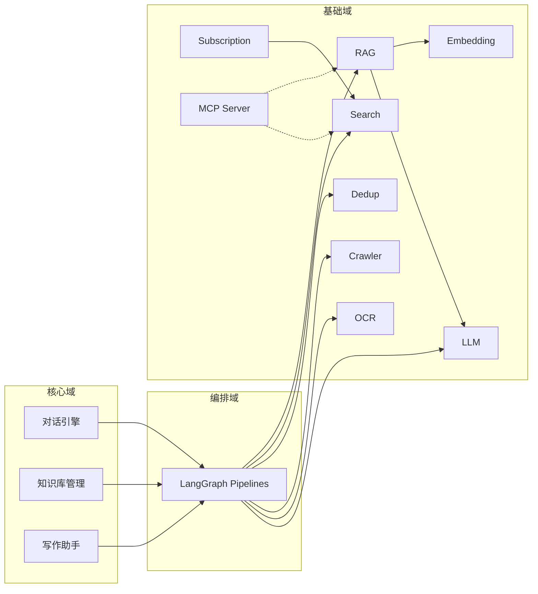

**依赖原则**：
- 编排层依赖服务层，服务层不依赖编排层
- 基础域内部：RAG 依赖 Embed/LLM，Sub 依赖 Search
- MCP 通过 HTTP 调用后端 API，与前端共享同一套服务

### 1.3 数据流图：用户输入到最终输出

#### 1.3.1 Chat 对话流

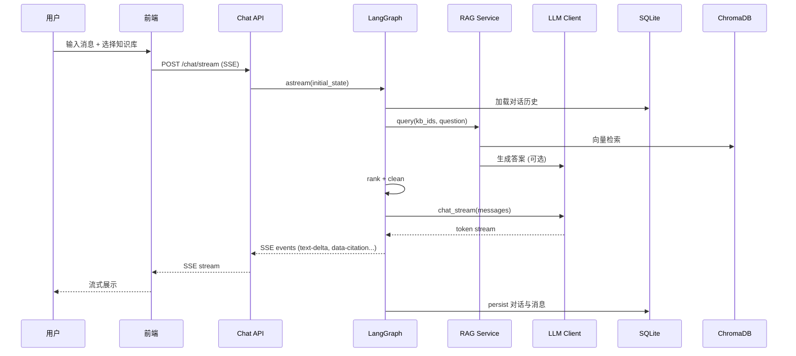

#### 1.3.2 Search Pipeline 流

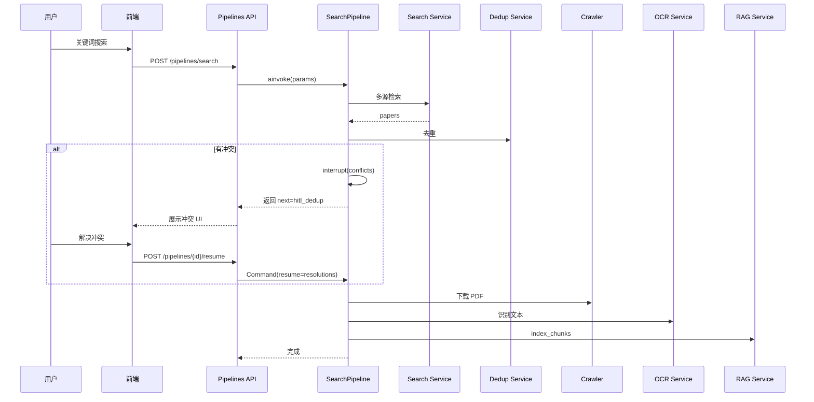

---

## 二、后端架构优化

### 2.1 Pipeline 状态持久化方案

**现状**：`MemorySaver` 单例，进程重启后状态丢失，HITL 中断无法跨重启恢复。

| 方案 | 优点 | 缺点 | 适用场景 |
|------|------|------|----------|
| **SQLite Checkpointer** | 无额外依赖、与现有 DB 统一、支持多进程只读 | 写入并发需注意、大状态序列化开销 | **推荐**：单机/小团队部署 |
| **Redis** | 高性能、支持分布式、TTL 过期 | 需额外运维、数据持久化配置复杂 | 多实例、高并发 |
| **PostgreSQL** | 强一致性、成熟 | 需迁移 DB、相对重 | 已有 PG 的团队 |

**推荐方案：SQLite Checkpointer**

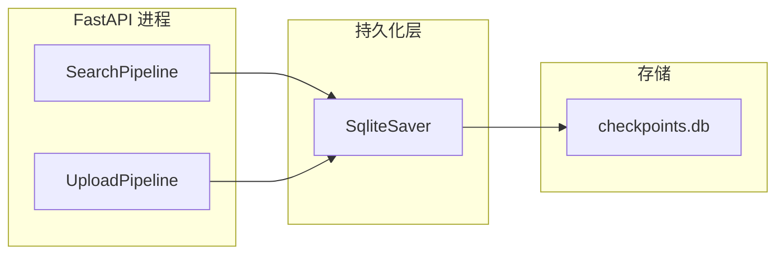

**实现要点**：
- 使用 `langgraph-checkpoint-sqlite` 的 `SqliteSaver`
- 配置 `checkpoint_dir` 指向 `{data_dir}/langgraph_checkpoints`
- 每个 pipeline 实例传入同一 checkpointer（可共享）
- **留空**：多实例部署时需评估 SQLite 锁竞争，可后续切 Redis

```python
# 伪代码
from langgraph.checkpoint.sqlite import SqliteSaver

def get_checkpointer():
    path = Path(settings.data_dir) / "langgraph_checkpoints"
    path.mkdir(parents=True, exist_ok=True)
    return SqliteSaver.from_conn_string(f"sqlite:///{path}/checkpoints.db")

search_pipeline = create_search_pipeline(checkpointer=get_checkpointer())
upload_pipeline = create_upload_pipeline(checkpointer=get_checkpointer())
```

### 2.2 LLM 模型分级策略

**目标**：轻量模型负责意图识别/分流，重量模型负责生成/深度推理，降低成本与延迟。

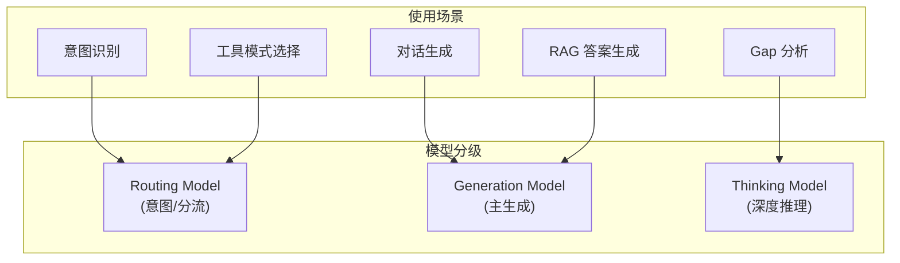

| 级别 | 典型模型 | 用途 | 延迟要求 |
|------|----------|------|----------|
| **Routing** | gpt-5-mini, gemini-3.1-flash, claude-haiku-4-5, Doubao-Seed-2.0-mini, Qwen3.5-Flash | 意图识别、工具选择、简单分类 | <500ms |
| **Generation** | gpt-5.4, gemini-3.1-pro, claude-sonnet-4-6, doubao-seed-2-0-pro, Qwen3.5-397B, moonshotai/Kimi-K2.5, zai-org/GLM-5, MiniMaxAI/MiniMax-M2.5, DeepSeek-V3.2, Qwen3.5-Plus, Qwen3-Max | 对话、RAG 答案、写作 | 可接受 2–5s |
| **Thinking** | gpt-5.4, gemini-3.1-pro, claude-opus-4-6, doubao-seed-2-0-pro, deepseek-r1, Qwen3-Max | 复杂推理、Gap 分析 | 可接受 10s+ |

这些配置既可以使用官方baseurl，也可以使用自定义baseurl。可以自定baseurl及其遵循openai还是anthropic的api规范。至少要支持上述国内外主流模型. 特别是对国内模型提供商, 如火山引擎, 阿里云百炼, 硅基流动，智谱, 月之暗面, MiniMax, DeepSeek, OpenRouter, 需要支持其api规范. 规划如何做一个好的路由系统，也方便其他人做后续开发。

**配置结构（留空实现）**：
```yaml
# 后续在 Settings 中实现
llm_tiers:
  routing: { provider: "openai", model: "gpt-4o-mini" }
  generation: { provider: "anthropic", model: "claude-sonnet-4" }
  thinking: { provider: "openai", model: "o3-mini" }
```

### 2.3 记忆系统架构：mem0 vs 自建

| 维度 | mem0 | 自建（SQLite + 向量） |
|------|------|------------------------|
| **短期记忆** | Session Memory | 现有 Conversation + Message 已覆盖 |
| **长期记忆** | User/Org Memory，两阶段提取+更新 | 需自建：从对话中抽取事实 → 向量存储 |
| **集成成本** | 引入 mem0 Python SDK，需配置存储 | 复用 ChromaDB + 新表 `user_memories` |
| **可控性** | 黑盒，提取逻辑不可定制 | 完全可控，可针对科研场景优化 |
| **性能** | 26% 准确率提升（LOCOMO） | 取决于实现质量 |

**推荐**：**Phase 1 不引入 mem0**，优先完成对话历史 + 知识库上下文。**Phase 2+ 评估**：
- 若需「用户偏好记忆」「跨会话事实」：可试点 mem0 或自建轻量版(可在对话中出现小按钮表明该对话是否基于用户偏好记忆来实现. 若用户开启, 则对话记忆进入mem0, 否则不使用跨对话的用户偏好记忆.)
- 自建方案：新表 `user_memories(user_id, memory_type, content, embedding, created_at)`，用现有 Embedding 服务

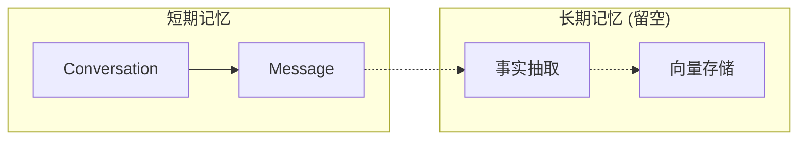

### 2.4 统一 LLM 配置管理

**现状问题**：Chat 从 `UserSettingsService.get_merged_llm_config()` 取配置，RAG/Writing/Keyword 等从 `LLMClient(provider=None)` 即 env 直读，两套来源不一致。

**方案**：所有 LLM 调用统一经 `LLMConfigResolver`：

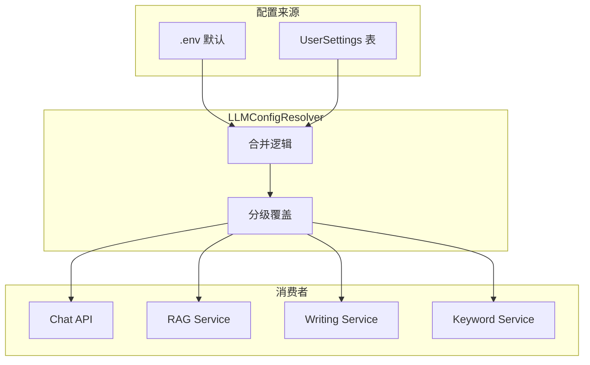

**实现**：
- 新增 `app/services/llm_config_resolver.py`：`async def resolve_llm_config(task_type: str) -> LLMConfig`
- `task_type` 映射到 tier：`intent`→routing，`chat`/`rag_answer`→generation，`gap_analysis`→thinking
- Chat API、RAG、Writing 等统一调用 `resolve_llm_config`，不再直接读 env

### 2.5 认证系统方案

目前只做单用户即可，目标是一个科研工作者或者部署到实验室服务器上供一个团队使用，无需考虑多用户情况。

### 2.6 后台任务调度（订阅定时更新等）

**现状**：Subscription 仅有 `check_rss_feed`、`check_api_updates` 方法，无定时触发。

| 方案 | 优点 | 缺点 |
|------|------|------|
| **APScheduler** | 纯 Python、无额外进程 | 多实例需防重复执行 |
| **Celery + Redis** | 成熟、分布式 | 引入重、需 Redis |
| **独立 cron + API** | 简单、可复用现有 API | 需外部 cron 配置 |

**推荐**：**APScheduler 单实例**，后续可替换为 Celery。

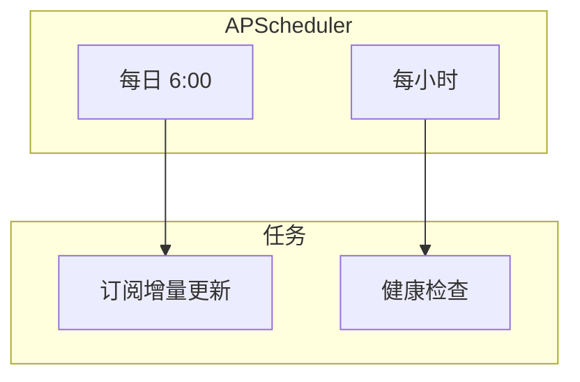

**实现要点**：
- 在 `lifespan` 中启动 `AsyncIOScheduler`
- 新增 `app/jobs/subscription_job.py`：遍历 `Subscription` 表，调用 `SubscriptionService.check_rss_feed` / `check_api_updates`
- 结果写入 `Paper` + 触发 pipeline 或仅记录待处理队列
- **留空**：多实例时需分布式锁（如 Redis）防重复

---

## 三、RAG 增强方案

> **重要**：代码审计发现了多个影响 RAG 质量的关键 BUG，详见 [07-code-audit-and-fixes.md](./07-code-audit-and-fixes.md)。以下方案基于修复后的代码路径设计。

### 3.0 前置修复（Phase 0 必须完成）

| 修复项 | 说明 | 影响 |
|--------|------|------|
| **相邻 chunk 拼接逻辑** | `_get_adjacent_chunks` 返回 prev+next 混合体，`query()` 又重复贴在主 chunk 两侧 | RAG 上下文质量严重受损 |
| **OCR 分块策略统一** | Pipeline `ocr_node` 按页分块，`paper_processor` 用语义分块（1024字/100重叠），粒度差异大 | 同一论文不同入口索引效果不同 |
| **索引元数据补全** | `index_node` 未传递 `chunk_type` 和 `section`，ChromaDB 中信息丢失 | 引用无法按章节定位 |
| **retrieve_node top_k 硬编码** | 固定 `top_k=5`，不可配置，`use_reranker` 也未传递 | 检索召回不足 |
| **RAG query 内部 LLM 冗余** | `rag_service.query()` 内部调用 `_generate_answer()`，但 Chat Pipeline 的 `generate_node` 会再调一次 | 双重 LLM 调用浪费 |

修复后的 RAG 检索路径：

```mermaid
flowchart TB
    subgraph 索引["统一索引路径"]
        OCR["OCR 处理"] --> Chunk["统一语义分块\n1024字/100重叠"]
        Chunk --> PC["PaperChunk\n含 chunk_type + section"]
        PC --> Index["RAGService.index_chunks\n完整 metadata"]
        Index --> Chroma["ChromaDB\npaper_id + paper_title +\nchunk_type + section +\npage_number + chunk_index"]
    end

    subgraph 检索["修复后的检索路径"]
        Query["用户提问"] --> Retrieve["retrieve_node\ntop_k=可配置"]
        Retrieve --> RAG["RAGService.retrieve_only\n仅检索，不生成"]
        RAG --> Vector["向量检索 top_k=N"]
        Vector --> Adjacent["相邻 chunk 扩展\n正确：前-主-后"]
        Adjacent --> Reranker["Reranker（可选）"]
        Reranker --> Filter["相关性过滤\nscore >= 0.3"]
        Filter --> CrossKBDedup["跨 KB 去重\n按 paper_id + chunk_index"]
        CrossKBDedup --> Rank["rank_node\n批量查 Paper 元数据"]
        Rank --> Clean["clean_node\nLLM 清洗 excerpt"]
        Clean --> Generate["generate_node\n流式生成"]
    end
```

### 3.1 混合检索（BM25 + 向量）

**现状**：仅向量检索（ChromaDB cosine），对精确词、缩写、数字召回不足。

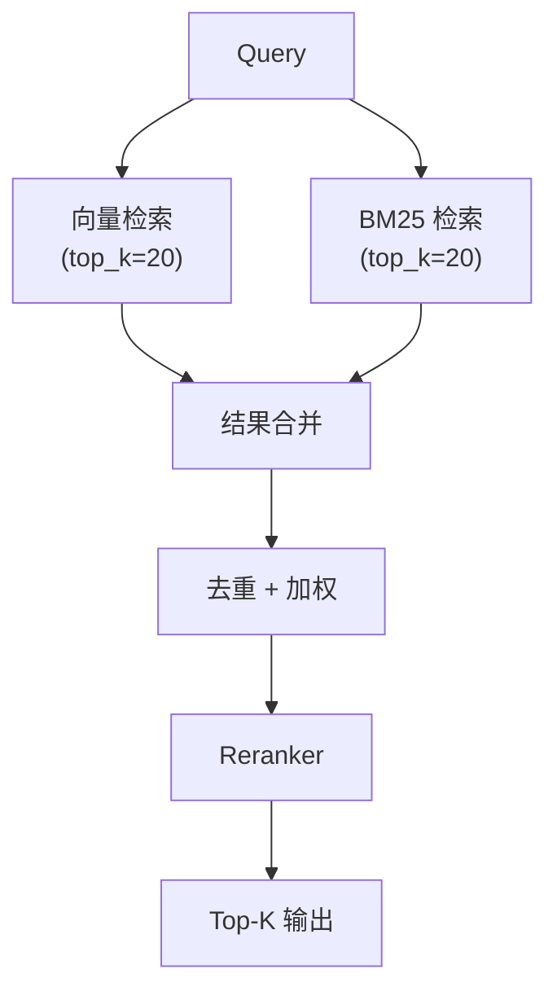

| 方案 | 优点 | 缺点 |
|------|------|------|
| **LlamaIndex BM25Retriever + VectorIndexRetriever** | 与现有 LlamaIndex 集成好 | 需维护两份索引 |
| **ChromaDB + 自建 BM25** | Chroma 已有，BM25 用 `rank_bm25` | 需同步 chunk 文本到 BM25 索引 |
| **Elasticsearch/Meilisearch** | 全文+向量一体 | 引入新组件 |

**推荐**：LlamaIndex `EnsembleRetriever`，向量用现有 Chroma，BM25 用 `BM25Retriever`（基于 `rank_bm25`，索引存 SQLite 或内存）。

**留空**：BM25 索引的持久化策略（内存重启丢失 vs 持久化）。

### 3.2 Reranker 引入

**现状**：`rag_service.query` 有 `use_reranker` 参数但未实现，直接按相似度排序。

| 方案 | 优点 | 缺点 |
|------|------|------|
| **BGE Reranker (本地)** | 无 API 成本、低延迟 | 需 GPU、模型加载 |
| **Cohere Rerank API** | 效果好、省心 | 需 API Key、网络 |
| **Cross-Encoder (sentence-transformers)** | 开源、可本地 | 需额外依赖 |

**推荐**：优先 **BGE Reranker**（`config.reranker_model` 已预留），与 embedding 同源。Cohere 作为可选 fallback。

```python
# 伪代码
from llama_index.postprocessor import SentenceTransformerRerank

reranker = SentenceTransformerRerank(
    model=settings.reranker_model,
    top_n=5,
)
retriever = index.as_retriever(similarity_top_k=20)
nodes = retriever.retrieve(query)
nodes = reranker.postprocess_nodes(nodes, query)
```

### 3.3 引用质量优化

**已发现问题及修复**：

| 问题 | 根因 | 修复 |
|------|------|------|
| 引用 excerpt 内容错乱 | 相邻 chunk 拼接 BUG（前后文重复翻倍） | 分离 prev/next，按正确顺序拼接 |
| 多 KB 重复引用同一段落 | 检索结果未跨 KB 去重 | `rank_node` 中按 `paper_id+chunk_index` 去重 |
| 低质量引用干扰上下文 | 无 relevance score 过滤 | `rank_node` 增加 `MIN_RELEVANCE = 0.3` 阈值 |
| 引用无章节信息 | `section` 元数据丢失 | 索引路径补全 section |
| excerpt 截断句子 | 粗暴按 800 字符截断 | 在最近句号/换行处智能截断 |

**增强方向**：

- **段落级引用**：已有 `chunk_index`、`page_number`，补全 `section` 后可增加「高亮句」定位
- **引用格式**：统一 `[1]`、`[2]` 与 `CitationCard` 的映射，前端已支持
- **幻觉抑制**：在 system prompt 中强化「仅基于 context 回答，无则明确说明」
- **新增 `retrieve_only` 方法**：Chat Pipeline 仅需检索结果，不需要 RAG 内部再调 LLM 生成答案，避免双重 LLM 调用

### 3.4 知识图谱（后续考虑）

**留空**：知识图谱可提升「概念关系」「作者-机构」等查询，但实现成本高。建议在 RAG 混合检索 + Reranker 稳定后，再评估 Neo4j/NetworkX 等方案。

---

## 四、前端架构

### 4.1 状态管理优化

**现状**：React Query + 局部 useState，无全局 store。

| 方案 | 优点 | 缺点 |
|------|------|------|
| **保持 React Query + Context** | 轻量、符合现有习惯 | 跨页面共享需设计 |
| **Zustand** | 简单、无 boilerplate | 引入新依赖 |
| **Jotai** | 原子化、细粒度更新 | 学习成本 |

**推荐**：**保持 React Query 为主**，对「当前知识库选择」「Tool Mode」等跨组件状态用 **Context + useReducer** 或 **Zustand** 轻量 store。避免 Redux 等重方案。

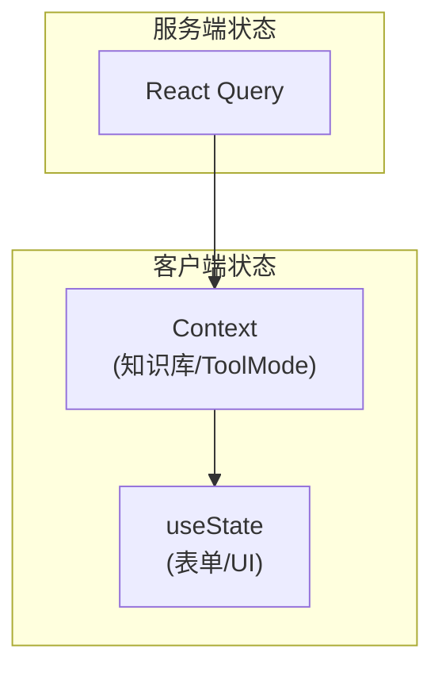

### 4.2 实时通信：SSE vs WebSocket

| 场景 | 推荐 | 理由 |
|------|------|------|
| Chat 流式 | **SSE** | 单向、实现简单、与 Vercel AI SDK 协议兼容 |
| 智能补全 | **SSE 或 HTTP 轮询** | 请求-响应模式，无需长连接 |
| Pipeline 进度 | **SSE** | 已有 `/pipelines/{id}/status`，可改为 SSE 推送 |
| 多端同步 | WebSocket | 双向、低延迟，当前非刚需 |

**结论**：继续以 **SSE** 为主，WebSocket 留作后续「实时协作」等能力。

### 4.3 路由与代码分割

**现状**：`lazy()` 已用于部分页面，路由结构清晰。

**优化建议**：
- 按路由拆分 chunk：`KnowledgeBasesPage`、`ProjectDetail` 子路由（Papers、Discovery、Writing）独立 chunk
- 预加载：`<Link>` 悬停时 `preload` 对应 chunk
- **留空**：若引入 PWA，可考虑 `workbox` 缓存策略

---

## 五、协议与接口规范

### 5.1 REST API 规范

**统一响应**：`ApiResponse[T]` 已存在，保持 `{ data, error?, message? }` 结构。

**路由清理**：`projects` 与 `knowledge-bases` 当前重复挂载同一 router：

```python
# 现状
api_router.include_router(projects.router, prefix="/projects")
api_router.include_router(projects.router, prefix="/knowledge-bases", tags=["knowledge-bases"])
```

**建议**：**统一为 `/projects`**，`/knowledge-bases` 作为 alias 重定向或 301，避免重复注册与维护两套路径。

| 资源 | 推荐路径 | 说明 |
|------|----------|------|
| 项目/知识库 | `/api/v1/projects` | 统一入口 |
| 论文 | `/api/v1/projects/{id}/papers` | 嵌套 |
| 对话 | `/api/v1/conversations` | 顶层 |
| Chat | `/api/v1/chat/stream` | 流式 |

### 5.2 SSE Data Stream Protocol 扩展

**现状**：已支持 `text-delta`、`data-citation`、`data-thinking`、`data-conversation` 等。

**工具调用反馈事件（留空）**：若未来 Chat 支持 tool calling，可扩展：

```json
{ "type": "tool-call", "id": "tc-1", "data": { "name": "search_papers", "args": {...} } }
{ "type": "tool-result", "id": "tc-1", "data": { "result": {...} } }
```

与 Vercel AI SDK 5.0 的 `tool-invocation` 等对齐，具体格式待实现时确定。

### 5.3 MCP 扩展

**现状**：MCP Server 已挂载 `/mcp`，提供 tools/resources。

**扩展建议**：
- 暴露「知识库检索」「论文搜索」等为 MCP tools
- 新增 `prompts` 资源，供 AI IDE 快速插入常用 prompt
- **留空**：MCP 与后端认证打通（当前可能无鉴权）

---

## 六、设置与多模型管理

参考 OpenClaw 等项目的分级与路由思路，设计多 LLM Provider 支持。

### 6.1 Provider CRUD

**现状**：`AVAILABLE_PROVIDERS` 硬编码，无用户自定义 Provider。

**设计**：

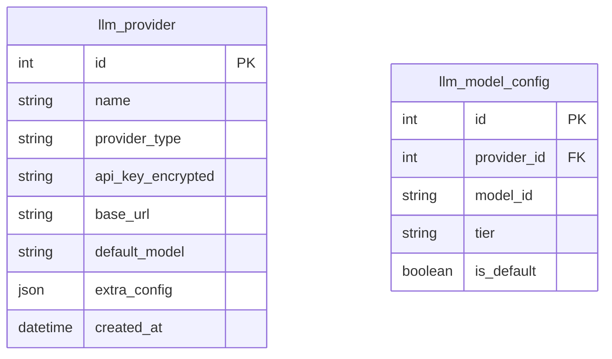

| 操作 | API | 说明 |
|------|-----|------|
| 列表 | `GET /api/v1/settings/providers` | 内置 + 用户自定义 |
| 创建 | `POST /api/v1/settings/providers` | 自定义 OpenAI 兼容端点 |
| 更新 | `PATCH /api/v1/settings/providers/{id}` | 更新 key/url/model |
| 删除 | `DELETE /api/v1/settings/providers/{id}` | 软删或硬删 |

### 6.2 模型分级（routing / generation / embedding）

| 层级 | 用途 | 可配置项 |
|------|------|----------|
| **routing** | 意图识别、分流 | provider_id, model_id |
| **generation** | 对话、RAG、写作 | provider_id, model_id |
| **embedding** | 向量化 | provider_id, model_id（或沿用现有 embedding_service） |

**配置结构**：
```json
{
  "routing": { "provider_id": 1, "model_id": "gpt-4o-mini" },
  "generation": { "provider_id": 2, "model_id": "claude-sonnet-4" },
  "embedding": { "provider_id": 0, "model_id": "BAAI/bge-m3" }
}
```

### 6.3 用户自定义配置

- 支持「自定义 Provider」：任意 OpenAI 兼容 API，填写 base_url + api_key
- 支持「模型 fallback」：主模型不可用时自动切换（参考 OpenClaw）
- **留空**：按 token 计费、用量统计

---

## 七、实施优先级与留空点汇总

### 7.1 优先级矩阵

| 项目 | 优先级 | 预估 | 依赖 |
|------|--------|------|------|
| Pipeline SQLite Checkpointer | P0 | 1d | 无 |
| API 路由去重 (projects/knowledge-bases) | P0 | 0.5d | 无 |
| 统一 LLM 配置管理 | P1 | 2d | 无 |
| 订阅定时任务 (APScheduler) | P1 | 2d | 无 |
| RAG Reranker | P1 | 1d | 无 |
| RAG 混合检索 | P2 | 3d | Reranker |
| 模型分级 (routing/generation) | P2 | 2d | 统一 LLM 配置 |
| Provider CRUD | P2 | 3d | 模型分级 |
| 认证 JWT | P2 | 3d | 无 |
| 记忆系统 (mem0/自建) | P3 | 待评估 | 无 |

### 7.2 留空点清单

- [ ] 多实例部署时 Pipeline checkpointer 的 Redis 迁移
- [ ] 记忆系统：mem0 vs 自建
- [ ] 知识图谱
- [ ] BM25 索引持久化
- [ ] Chat 工具调用 SSE 事件格式
- [ ] MCP 认证打通
- [ ] 按 token 计费与用量统计

---

*本文档为 V3 架构设计初稿，后续可根据实施反馈迭代。*
