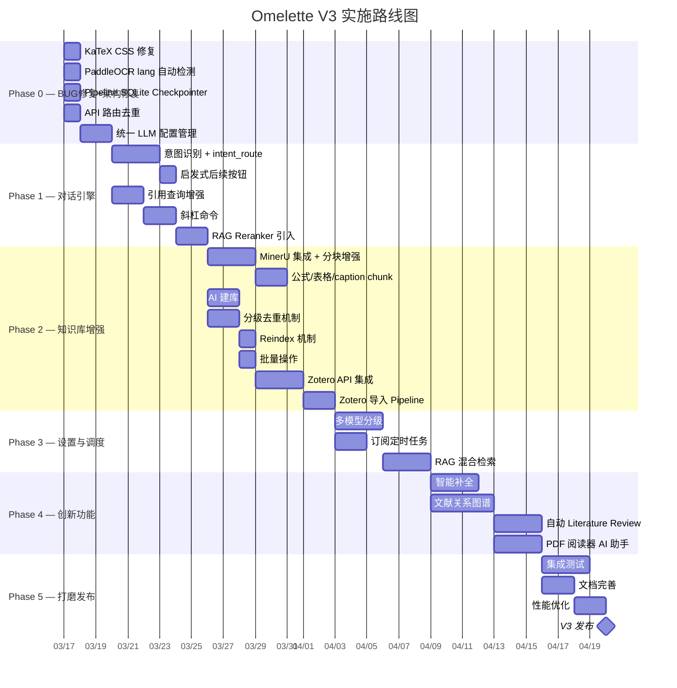
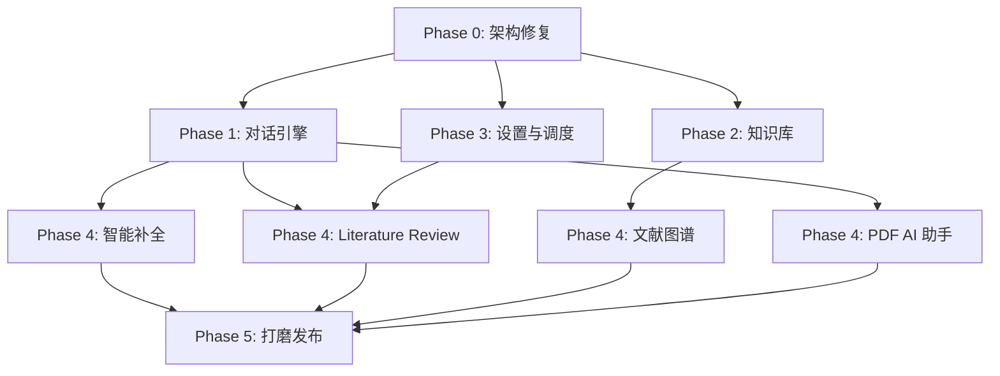

# Omelette V3 — 实施路线图与开发规划

> 版本：V3.0 Draft | 日期：2026-03-15 | 状态：规划中

## 1. 实施原则

1. **从简到繁**：先修复架构问题（P0），再增强核心功能（P1），最后添加创新功能（P2+）
2. **可独立交付**：每个 Phase 产出可运行、可测试的增量版本
3. **模块解耦**：不同 Phase 的工作可分配给不同开发者，减少冲突
4. **渐进增强**：基础功能先行，高级功能预留接口

---

## 2. Phase 概览

---

## 3. 各 Phase 详细任务

### Phase 0 — BUG 修复 + 架构修复 + 前端修复（5 天）

> 目标：修复代码审计发现的 P0 BUG，解决架构问题，修复前端渲染缺陷，为后续开发打好基础。
> 详细修复清单见 [07-code-audit-and-fixes.md](./07-code-audit-and-fixes.md)
> 技术决策依据见 [08-technical-deep-dive.md](./08-technical-deep-dive.md)

| 任务 | 负责模块 | 工作量 | 交付物 |
|------|----------|--------|--------|
| **KaTeX CSS 修复** | frontend | 0.5h | `main.tsx` 导入 `katex/dist/katex.min.css`，公式正确渲染 |
| **PaddleOCR 语言自动检测** | backend/services/ocr | 0.5h | PaddleOCR `lang` 参数改为可配置（中英文自动检测或用户指定） |
| **BUG: 相邻 chunk 拼接逻辑修复** | backend/services/rag | 0.5d | `_get_adjacent_chunks` 返回分离的 prev/next，`query()` 按 `[前]\n[主]\n[后]` 拼接 |
| **BUG: apply_resolution skip 逻辑** | backend/pipelines | 0.5h | `skip` 不再添加 `new_paper` |
| **OCR 分块策略统一** | backend/pipelines | 1d | Pipeline `ocr_node` 改用 `ocr.chunk_text()` 语义分块 |
| **索引元数据补全** | backend/pipelines, services | 0.5d | `index_node` 传递 `chunk_type` + `section`，`RAGService` 索引 `section` |
| **去重阈值统一 + 复用 DedupService** | backend/pipelines, services, config | 0.5d | 阈值集中到 `config.py`，Pipeline 调用 `DedupService` |
| **index_node N+1 修复** | backend/pipelines | 0.5h | 批量查询 PaperChunk |
| **retrieve_node 参数可配置** | backend/pipelines/chat | 0.5h | `top_k`/`use_reranker` 从 state 读取 |
| **新增 `RAGService.retrieve_only()`** | backend/services/rag | 0.5d | Chat Pipeline 仅检索不生成，避免双重 LLM 调用 |
| Pipeline SQLite Checkpointer | backend/pipelines | 1d | `SqliteSaver` 替换 `MemorySaver` |
| API 路由去重 | backend/api | 0.5d | 移除 `/knowledge-bases` 重复注册 |
| 统一 LLM 配置管理 | backend/services | 1d | `LLMConfigResolver` |

**验收标准**：
- [ ] 聊天对话框中数学公式（`$...$` / `$$...$$`）正确渲染，含分数、积分等复杂公式
- [ ] PaddleOCR 可识别中文扫描件
- [ ] 相邻 chunk 上下文顺序正确：`[前]\n[主]\n[后]`，无重复
- [ ] skip 操作不导入新文献
- [ ] 所有入口的 OCR 使用统一的语义分块策略（1024字/100重叠）
- [ ] ChromaDB 中索引包含 `section` 和正确的 `chunk_type`
- [ ] 去重阈值统一：L1=DOI精确，L2=0.90标题，L3=0.80~0.90 LLM
- [ ] Chat Pipeline retrieve 的 `top_k` 可配置
- [ ] 重启后端后 Pipeline 可恢复
- [ ] Chat/RAG/Writing 的 LLM 配置来源一致

---

### Phase 1 — 对话引擎重构（2 周）

> 目标：对话引擎具备意图感知、启发式交互、引用增强、斜杠命令能力。

| 任务 | 负责模块 | 工作量 | 依赖 |
|------|----------|--------|------|
| 意图识别 + `intent_route` 节点 | backend/pipelines/chat | 3d | Phase 0 LLM 配置 |
| `suggest` 节点 + SSE 事件 | backend/pipelines/chat | 含上 | — |
| `predict_followups` 节点 | backend/pipelines/chat | 1d | — |
| 前端 `IntentSuggestionBanner` | frontend/components | 1d | 后端意图 API |
| 前端 `SuggestedFollowupButtons` | frontend/components | 1d | 后端 followup API |
| 引用查询增强：按 `paper_id` 取色 | frontend/components | 1d | — |
| 引用查询：强化 prompt 不修改原文 | backend/pipelines/chat | 0.5d | — |
| 斜杠命令 `SlashCommandMenu` | frontend/components | 2d | — |
| RAG Reranker | backend/services/rag | 2d | — |

**验收标准**：
- [ ] 未选 KB 时提问，系统可建议知识库或功能
- [ ] 对话完成后展示 2-4 个启发式按钮
- [ ] 引用查询模式下同一文献同色
- [ ] 输入 `/` 可调出命令菜单
- [ ] RAG 检索结果经过 Reranker 排序

---

### Phase 2 — 知识库增强 + PDF 解析升级（2.5 周）

> 目标：知识库管理具备 AI 建库、分级去重、Zotero 联动能力；PDF 解析引擎升级为 MinerU。
> 技术选型依据见 [08-technical-deep-dive.md](./08-technical-deep-dive.md)

| 任务 | 负责模块 | 工作量 | 依赖 |
|------|----------|--------|------|
| **MinerU 独立服务部署**：conda 环境 + `mineru-api` 启动 | infra | 0.5d | GPU ≥6GB VRAM |
| **MinerU 客户端集成**：OCRService 改造，HTTP 调用 MinerU API | backend/services/ocr | 2d | MinerU 服务 |
| **分块策略增强**：解析 MinerU Markdown 输出，识别公式/表格/图片并分类分块 | backend/services/ocr | 2d | MinerU 客户端 |
| **PaperChunk 模型扩展**：新增 `has_formula`、`figure_path` | backend/models | 0.5d | — |
| **配置更新**：`.env` 新增 `MINERU_API_URL`，`pyproject.toml` 添加 `httpx` | backend | 0.5h | — |
| AI 建库预览 API | backend/api, services | 2d | — |
| AI 建库前端 | frontend/components | 1d | 后端 API |
| 分级去重机制（L1/L2/L3） | backend/services/dedup | 2d | — |
| Reindex API + 前端按钮 | backend/api, frontend | 1d | — |
| 批量删除/处理 API | backend/api | 1d | — |
| Zotero API 集成（连接、测试） | backend/services | 2d | — |
| Zotero 集合获取 API | backend/api | 1d | Zotero 连接 |
| ZoteroImportPipeline | backend/pipelines | 2d | Zotero API |
| Zotero 导入前端 UI | frontend/components | 2d | 后端 Pipeline |

**验收标准**：
- [ ] MinerU 独立服务启动并可访问（`http://localhost:8010/docs`）
- [ ] OCRService 通过 HTTP 调用 MinerU API，正确解析含公式的中英文学术 PDF
- [ ] MinerU 正确识别并提取 PDF 中的表格（含图像表格、跨页表格）
- [ ] 分块结果包含 `text`、`table`、`figure_caption` 三种 chunk_type
- [ ] 含公式的 text chunk 标记 `has_formula=True`
- [ ] 输入主题描述可 AI 生成知识库名称和推荐关键词
- [ ] 去重分三级（DOI精确/标题0.90/LLM校验）
- [ ] 可一键重建索引
- [ ] 可批量删除/重新处理文献
- [ ] 可连接 Zotero 并导入 Collection

---

### Phase 3 — 设置与调度（1.5 周）

> 目标：多模型分级、订阅定时任务、RAG 混合检索。

| 任务 | 负责模块 | 工作量 | 依赖 |
|------|----------|--------|------|
| 模型分级配置 UI | frontend/pages/settings | 2d | — |
| 模型分级后端（routing/generation/thinking） | backend/services | 1d | Phase 0 LLM 配置 |
| 订阅定时任务（APScheduler） | backend/jobs | 2d | — |
| 通知系统（应用内） | backend/api, frontend | 2d | — |
| RAG 混合检索（BM25 + 向量） | backend/services/rag | 3d | Phase 1 Reranker |

**验收标准**：
- [ ] 不同任务可使用不同级别的模型
- [ ] 订阅可按设定频率自动运行
- [ ] 新文献入库时有应用内通知
- [ ] RAG 支持混合检索

---

### Phase 4 — 创新功能（2 周）

> 目标：差异化竞争力功能上线。

| 任务 | 负责模块 | 工作量 | 依赖 |
|------|----------|--------|------|
| 智能补全 API + 前端 | backend/api, frontend | 3d | — |
| 文献关系图谱（S2 引用数据 + D3 可视化） | backend/services, frontend | 4d | — |
| 自动 Literature Review（组合 outline + RAG） | backend/pipelines | 3d | Phase 1 Reranker |
| PDF 阅读器内 AI 助手（侧边栏 + 选区问答） | frontend/components | 3d | Phase 1 引用增强 |

**验收标准**：
- [ ] 输入时展示灰色补全建议，Tab 接受
- [ ] 可查看文献引用关系图谱
- [ ] 可基于知识库自动生成综述草稿
- [ ] PDF 阅读器内可选中文本向 AI 提问

---

### Phase 5 — 打磨发布（1 周）

> 目标：全面测试、文档、性能优化。

| 任务 | 负责模块 | 工作量 |
|------|----------|--------|
| 端到端集成测试 | tests | 3d |
| API 文档更新 | docs/api | 1d |
| 用户指南更新 | docs/guide | 1d |
| 性能优化（SSE 节流、批量查询） | backend, frontend | 2d |
| 安全审查（认证、路径、注入） | backend | 1d |

---

## 4. 模块间依赖图

**关键路径**：Phase 0 → Phase 1 → Phase 4 → Phase 5

**可并行**：
- Phase 1 的引用增强/斜杠命令 与 Phase 2 的 AI 建库/Zotero 可并行
- Phase 3 的订阅定时任务与 Phase 2 可并行
- Phase 4 的文献图谱与智能补全可并行

---

## 5. 团队分工建议

| 角色 | 负责模块 | 主要 Phase |
|------|----------|-----------|
| 后端开发 A | Chat Pipeline、意图识别、LLM 配置 | Phase 0, 1 |
| 后端开发 B | 知识库管理、Zotero、订阅 | Phase 2, 3 |
| 前端开发 A | 对话 UI、引用增强、斜杠命令 | Phase 1, 4 |
| 前端开发 B | 知识库 UI、设置页、文献图谱 | Phase 2, 3, 4 |
| 全栈 / AI | RAG 增强、Reranker、混合检索 | Phase 1, 3 |

---

## 6. 风险与缓解

| 风险 | 影响 | 缓解措施 |
|------|------|----------|
| LangGraph checkpoint SQLite 锁竞争 | 多并发时 Pipeline 卡顿 | 限制并发数，后续可切 Redis |
| Zotero API 速率限制 | 大量导入时超限 | 客户端限流 + 指数退避 |
| Reranker 模型 GPU 占用 | 与 Embedding 竞争 GPU | 分时调度，或 CPU fallback |
| 智能补全延迟 | 用户体验差 | debounce + 缓存 + 可选关闭 |
| 文献图谱数据量大 | 前端渲染卡顿 | 分页加载 + 虚拟化 + WebWorker |

---

## 7. 留空点 — 后续迭代方向

| 方向 | 说明 | 预估 Phase |
|------|------|-----------|
| 记忆系统 mem0 集成 | 基于 ChromaDB 独立 collection，短/长期记忆管理 | V3.1 |
| VLM 图表描述 | 提取论文图表 → 调用 GPT-4V/Gemini 生成描述 → 文本嵌入检索 | V3.2 |
| 数据库迁移 PostgreSQL | 若需多用户高并发，迁移至 PostgreSQL + pgvector（mem0 也支持） | V3.2 |
| 知识图谱 | 概念关系、作者网络 | V3.2 |
| 认证系统（JWT + OAuth） | 多用户支持 | V3.1 |
| 协同标注 | 多人笔记与讨论 | V4 |
| 移动端适配 | 响应式/PWA | V3.2 |
| Zotero 双向同步 | 回写笔记和标签 | V3.2 |
| ColPali 多模态 RAG | 直接对论文图片做向量检索（技术成熟时） | V4 |
| Audio Overview | 播客式知识消化 | V4 |

---

*本文档为实施路线图，具体任务分解与验收标准见各模块 PRD 文档。*
