# Omelette V3 — 代码审计与修复清单

> 版本：V3.0 | 日期：2026-03-15 | 状态：审计完成

本文档记录了对现有代码的深度审查结果，标注了所有需要修复的 BUG、不一致和优化空间，按严重程度分级。

---

## 一、严重 BUG（P0 — 功能错误）

### BUG-1：相邻 chunk 上下文拼接逻辑错误

**位置**：`backend/app/services/rag_service.py` 第 167-236 行

**现状**：

```python
# _get_adjacent_chunks 返回的是 prev + next 混合拼接
target_ids = [
    f"paper_{paper_id}_chunk_{chunk_index + offset}"
    for offset in range(-window, window + 1) if offset != 0
]
# 当 window=1 时，target_ids = [chunk_index-1, chunk_index+1]
docs = result.get("documents") or []
return "\n".join(d for d in docs if d)  # 返回 "prev_text\nnext_text"

# 然后在 query() 中：
full_context = f"{adjacent_text}\n{text}\n{adjacent_text}".strip()
# 实际输出：[prev+next]\n[主chunk]\n[prev+next]
```

**问题**：
1. 前后 chunk 文本混在一起，无法区分顺序
2. `adjacent_text` 被重复放在主 chunk 两侧，内容翻倍
3. 实际顺序错乱：期望 `[前]\n[主]\n[后]`，实际 `[前+后]\n[主]\n[前+后]`

**修复方案**：

```python
def _get_adjacent_chunks(self, collection, paper_id, chunk_index, window=1):
    prev_ids = [f"paper_{paper_id}_chunk_{chunk_index + offset}"
                for offset in range(-window, 0)]
    next_ids = [f"paper_{paper_id}_chunk_{chunk_index + offset}"
                for offset in range(1, window + 1)]

    prev_text = self._fetch_chunk_texts(collection, prev_ids)
    next_text = self._fetch_chunk_texts(collection, next_ids)
    return prev_text, next_text

# 在 query() 中：
prev_text, next_text = await asyncio.to_thread(
    self._get_adjacent_chunks, collection, paper_id, chunk_idx
)
parts = [p for p in [prev_text, text, next_text] if p]
full_context = "\n".join(parts)
```

**影响**：RAG 检索上下文质量严重受损，所有引用的 excerpt 内容错乱。

---

### BUG-2：Pipeline apply_resolution 逻辑错误

**位置**：`backend/app/pipelines/nodes.py` 第 148-159 行

**现状**：

```python
for res in resolved:
    action = res.get("action", "skip")
    new_paper = res.get("new_paper", {})
    if action in ("keep_new", "skip") and new_paper:
        clean_papers.append(new_paper)
```

**问题**：`skip` 表示「跳过此冲突，不导入」，但代码中 `skip` 和 `keep_new` 一样会将 `new_paper` 加入 `clean_papers`。

**修复方案**：

```python
if action == "keep_new" and new_paper:
    clean_papers.append(new_paper)
elif action == "merge" and new_paper:
    # 合并逻辑（留空）
    clean_papers.append(new_paper)
# skip 和 keep_old 不添加 new_paper
```

**影响**：用户选择「跳过」时，重复文献仍会被导入。

---

## 二、中等问题（P1 — 数据质量/一致性）

### ISSUE-3：OCR 分块策略不一致

**位置**：

| 入口 | 分块策略 | 文件 |
|------|----------|------|
| `paper_processor` | 语义分块：1024字符、100重叠、段落切分 | `paper_processor.py:66-77` |
| Pipeline `ocr_node` | 按页分块：一页 = 一个 chunk | `pipelines/nodes.py:268-280` |
| `pipeline_service._ocr` | 按页分块 | `pipeline_service.py:86-101` |

**问题**：通过不同入口处理的同一篇论文，生成的 chunk 粒度完全不同。按页分块可能导致：
- chunk 过长（一页可能数千字符），超出 embedding 模型最优输入长度
- 段落被截断在页面边界
- RAG 检索精度下降

**修复方案**：Pipeline `ocr_node` 统一使用 `ocr.chunk_text()` 进行语义分块。

```python
# ocr_node 修改
result = await asyncio.to_thread(ocr.process_pdf, paper.pdf_path)
chunks = ocr.chunk_text(result.get("pages", []))
for chunk_data in chunks:
    db.add(PaperChunk(
        paper_id=paper.id,
        content=chunk_data["content"],
        chunk_type=chunk_data.get("chunk_type", "text"),
        page_number=chunk_data.get("page_number", 0),
        chunk_index=chunk_data.get("chunk_index", 0),
        token_count=chunk_data.get("token_count"),
    ))
```

---

### ISSUE-4：索引路径元数据不完整

**位置**：`pipelines/nodes.py` `index_node` 第 324-333 行

**现状**：

```python
chunk_dicts = [
    {
        "paper_id": paper.id,
        "paper_title": paper.title,
        "content": c.content,
        "page_number": c.page_number,
        "chunk_index": c.chunk_index,
        # 缺失：chunk_type, section
    }
    for c in chunks
]
```

**问题**：
- `chunk_type` 未传递 → ChromaDB 中全部退化为 `"text"`
- `section` 未传递 → 无法按章节定位引用

**修复方案**：

```python
chunk_dicts = [
    {
        "paper_id": paper.id,
        "paper_title": paper.title,
        "content": c.content,
        "page_number": c.page_number,
        "chunk_index": c.chunk_index,
        "chunk_type": c.chunk_type or "text",
        "section": c.section or "",
    }
    for c in chunks
]
```

同时 `RAGService.index_chunks` 也需要将 `section` 加入 metadata：

```python
metadata={
    "paper_id": chunk["paper_id"],
    "paper_title": chunk.get("paper_title", ""),
    "chunk_type": chunk.get("chunk_type", "text"),
    "page_number": chunk.get("page_number", 0),
    "chunk_index": chunk.get("chunk_index", 0),
    "section": chunk.get("section", ""),  # 新增
},
```

---

### ISSUE-5：去重阈值分散且不一致

**位置**：

| 位置 | 阈值 | 说明 |
|------|------|------|
| `pipelines/nodes.py` `dedup_node` | 0.85 | Pipeline 去重 |
| `api/v1/upload.py` | 0.85 | 上传 API 去重 |
| `services/dedup_service.py` Stage 2 | 0.90 | DedupService 硬去重 |
| `services/dedup_service.py` Stage 3 | 0.80 | DedupService LLM 候选 |

**问题**：同一套数据通过不同入口去重，阈值不同，结果不一致。Pipeline 的 `dedup_node` 完全不调用 `DedupService`，重复实现了去重逻辑。

**修复方案**：
1. 将阈值集中到 `app/config.py`
2. Pipeline `dedup_node` 改为调用 `DedupService`
3. PRD 中的分级去重与代码统一

```python
# config.py
DEDUP_TITLE_HARD_THRESHOLD: float = 0.90
DEDUP_TITLE_LLM_THRESHOLD: float = 0.80
```

---

### ISSUE-6：index_node 存在 N+1 查询

**位置**：`pipelines/nodes.py` 第 316-319 行

```python
for paper in papers:
    chunks = (await db.execute(
        select(PaperChunk).where(PaperChunk.paper_id == paper.id)
    )).scalars().all()
```

**问题**：每篇 Paper 一次查询，N 篇 = N 次 SQL。

**修复方案**：

```python
paper_ids = [p.id for p in papers]
all_chunks = (await db.execute(
    select(PaperChunk).where(PaperChunk.paper_id.in_(paper_ids))
)).scalars().all()
chunks_by_paper = defaultdict(list)
for c in all_chunks:
    chunks_by_paper[c.paper_id].append(c)

for paper in papers:
    chunks = chunks_by_paper.get(paper.id, [])
    ...
```

---

### ISSUE-7：Chat Pipeline retrieve_node 参数硬编码

**位置**：`pipelines/chat/nodes.py` 第 160 行

```python
tasks = [rag.query(project_id=kb_id, question=state["message"],
         top_k=5, include_sources=True) for kb_id in kb_ids]
```

**问题**：
- `top_k=5` 硬编码，多知识库时每个 KB 只取 5 条可能不够
- `use_reranker` 始终不传，即使后端已实现也不会启用
- 无法根据 `tool_mode` 调整检索策略

**修复方案**：

```python
rag_top_k = state.get("rag_top_k", 10)
use_reranker = state.get("use_reranker", False)

tasks = [rag.query(
    project_id=kb_id,
    question=state["message"],
    top_k=rag_top_k,
    use_reranker=use_reranker,
    include_sources=True,
) for kb_id in kb_ids]
```

---

### ISSUE-8：Pipeline 取消机制无效

**位置**：`api/v1/pipelines.py`

**现状**：取消仅设置 `task["status"] = "cancelled"`，但未将 `cancelled=True` 写入 Pipeline 的 `state`。节点中的 `if state.get("cancelled"): break` 永远读到 `False`。

**修复方案**：需要通过 LangGraph 的 `Command` 机制注入 `cancelled` 到 state，或在节点执行前轮询外部取消标记。

---

## 三、优化空间（P2 — 性能/体验）

### OPT-1：RAG 查询结果无相关性过滤

**现状**：`retrieve_node` 返回所有检索结果，无论 relevance_score 高低。低相关性结果会稀释 context 质量。

**优化**：在 `rank_node` 中过滤低于阈值的引用：

```python
MIN_RELEVANCE = 0.3
citations = [c for c in citations if c["relevance_score"] >= MIN_RELEVANCE]
```

---

### OPT-2：RAG query 中 LLM 生成可能冗余

**现状**：`rag_service.query()` 内部会调用 `_generate_answer()` 生成答案，但 Chat Pipeline 中 `generate_node` 又会调用 LLM 生成。`retrieve_node` 调用 `rag.query()` 时，内部的 LLM 生成是浪费的。

**优化**：`retrieve_node` 调用 RAG 时仅做检索，不生成答案。方案：
- 新增 `RAGService.retrieve_only()` 方法，或
- 在 `query()` 中增加 `skip_generation=True` 参数

---

### OPT-3：多知识库检索结果未做跨 KB 去重

**现状**：`retrieve_node` 并行查询多个 KB 后直接 `extend`，同一篇论文可能在多个 KB 中被索引，导致重复引用。

**优化**：按 `paper_id + chunk_index` 去重，保留 score 最高的。

---

### OPT-4：excerpt 截断粗暴

**现状**：`rag_service.py:248`

```python
"excerpt": full_context[:800] + "..." if len(full_context) > 800 else full_context,
```

直接按字符截断可能截断句子。

**优化**：在最近的句号/换行处截断。

---

## 四、RAG 完整路径审计总结

### 当前路径（有问题的）

```mermaid
flowchart TB
    subgraph 索引路径
        A[PDF 上传] --> B{入口?}
        B -->|paper_processor| C[语义分块\n1024字/100重叠]
        B -->|Pipeline ocr_node| D[按页分块\n❌ 粒度过粗]
        C --> E[PaperChunk\n含 chunk_type, section]
        D --> F[PaperChunk\n❌ 缺 chunk_type, section]
        E --> G[RAGService.index_chunks]
        F --> H[index_node\n❌ 缺 chunk_type]
        G --> I[ChromaDB\n含完整 metadata]
        H --> J[ChromaDB\n❌ 缺 section]
    end

    subgraph 检索路径
        K[用户提问] --> L[retrieve_node\n❌ top_k=5 硬编码]
        L --> M[RAGService.query\ntop_k=5]
        M --> N[ChromaDB 向量检索]
        N --> O[相邻 chunk 扩展\n❌ 拼接逻辑错误]
        O --> P[sources 列表]
        P --> Q[rank_node\n批量查 Paper 表]
        Q --> R[citation 列表\n❌ 无相关性过滤]
        R --> S[clean_node\nLLM 清洗 excerpt]
        S --> T[generate_node\n流式生成]
    end
```



### 修复后路径（目标）

```mermaid
flowchart TB
    subgraph 索引路径
        A[PDF 上传] --> B{入口}
        B -->|任何入口| C[统一语义分块\n1024字/100重叠]
        C --> D[PaperChunk\n含 chunk_type, section]
        D --> E[index_chunks\n含完整 metadata]
        E --> F[ChromaDB\n完整 metadata]
    end

    subgraph 检索路径
        G[用户提问] --> H[retrieve_node\ntop_k=可配置]
        H --> I[RAGService.retrieve_only\n仅检索不生成]
        I --> J[ChromaDB 向量检索]
        J --> K[相邻 chunk 扩展\n正确顺序 前-主-后]
        K --> L["Reranker (可选)"]
        L --> M[sources 列表]
        M --> N[rank_node\n批量查 Paper\n+ 相关性过滤]
        N --> O[跨 KB 去重]
        O --> P[clean_node]
        P --> Q[generate_node]
    end
```



---

## 五、修复优先级矩阵

| ID | 问题 | 优先级 | 影响 | 工作量 |
|----|------|--------|------|--------|
| BUG-1 | 相邻 chunk 拼接逻辑 | **P0** | RAG 上下文质量 | 0.5d |
| BUG-2 | apply_resolution skip 逻辑 | **P0** | 去重功能 | 0.5h |
| ISSUE-3 | OCR 分块策略统一 | **P1** | RAG 检索精度 | 1d |
| ISSUE-4 | 索引元数据补全 | **P1** | 引用定位 | 0.5d |
| ISSUE-5 | 去重阈值统一 | **P1** | 去重一致性 | 0.5d |
| ISSUE-6 | index_node N+1 | **P1** | 索引性能 | 0.5h |
| ISSUE-7 | retrieve top_k 可配置 | **P1** | 检索质量 | 0.5h |
| ISSUE-8 | Pipeline 取消机制 | **P1** | 用户体验 | 1d |
| OPT-1 | 相关性过滤 | **P2** | 引用精度 | 0.5h |
| OPT-2 | retrieve_only | **P2** | 性能/成本 | 0.5d |
| OPT-3 | 跨 KB 去重 | **P2** | 引用去重 | 0.5h |
| OPT-4 | excerpt 智能截断 | **P2** | 引用可读性 | 0.5h |

---

*本文档作为 V3 开发前的代码健康度基线，所有 P0/P1 问题应在 Phase 0 或 Phase 1 前完成修复。*
