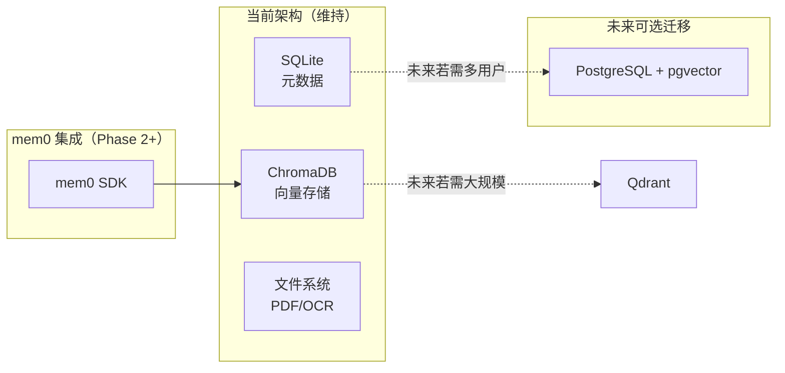
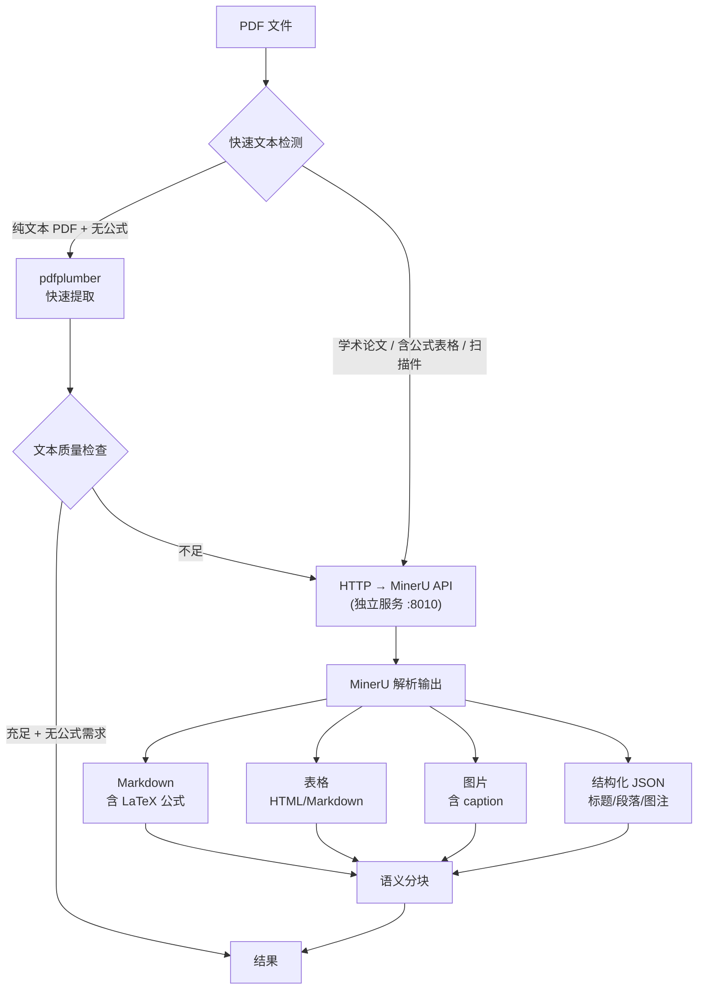
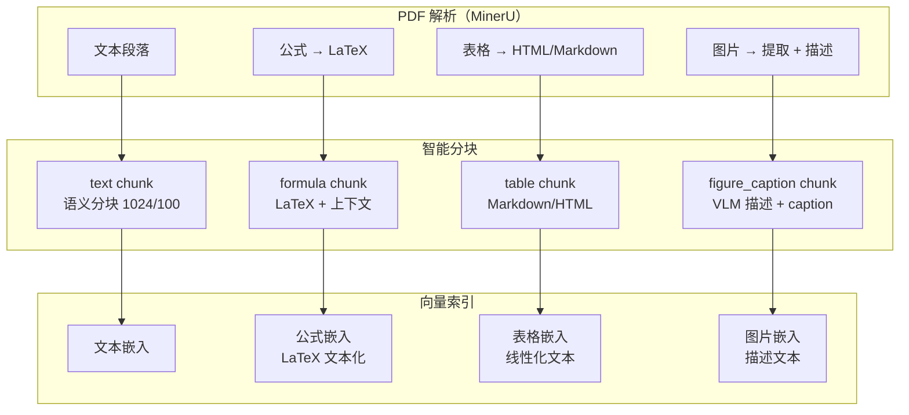

# Omelette V3 — 技术深度研究与决策

> 版本：V3.0 | 日期：2026-03-15 | 状态：研究完成

---

## 一、数据库选型与 mem0 兼容性

### 1.1 现状

| 层 | 技术 | 存储内容 |
|----|------|----------|
| 元数据 | SQLite + SQLAlchemy async | Paper, Conversation, Message, Keyword, Subscription 等 |
| 向量存储 | ChromaDB | PaperChunk 嵌入向量 |
| 文件 | 本地文件系统 | PDF, OCR JSON |

### 1.2 mem0 对数据库的要求

通过调研 mem0 官方文档（https://docs.mem0.ai/components/vectordbs/overview）：

| 维度 | 结论 |
|------|------|
| **向量库** | mem0 支持 **17+ 种向量数据库**，包括 ChromaDB、Qdrant、pgvector、Milvus、Pinecone、FAISS 等 |
| **默认** | 未配置时默认使用 Qdrant |
| **ChromaDB** | **支持**，Python SDK 完整支持 |
| **元数据库** | mem0 自身管理，不要求特定关系型数据库 |
| **SQLite** | mem0 不直接使用 SQLite，不冲突 |

### 1.3 决策：维持 SQLite + ChromaDB



**理由**：

1. **mem0 支持 ChromaDB**：无需迁移向量库即可接入 mem0
2. **SQLite 够用**：单用户/小团队场景，SQLite 性能足够，无运维成本
3. **渐进式**：若未来需多用户或高并发，可迁移到 PostgreSQL + pgvector（一次搞定关系+向量）
4. **不过度设计**：当前阶段引入 PostgreSQL 或 Qdrant 增加运维复杂度，收益不大

### 1.4 mem0 集成方案（Phase 2+）

```python
from mem0 import Memory

m = Memory.from_config({
    "vector_store": {
        "provider": "chroma",
        "config": {
            "collection_name": "omelette_memories",
            "path": str(settings.chroma_db_dir),
        }
    }
})

# 添加记忆
m.add("用户倾向于关注 LLM 在医疗领域的应用", user_id="default")

# 检索相关记忆
memories = m.search("医疗 AI", user_id="default")
```

**与现有架构的集成点**：
- mem0 使用独立的 ChromaDB collection（`omelette_memories`），不与 RAG 的 `project_N` collection 冲突
- 在 Chat Pipeline 的 `understand` 节点中注入 mem0 检索结果到 system prompt
- 每次对话结束后，在 `persist` 节点中可选地将关键信息写入 mem0

---

## 二、PDF 解析引擎选型

### 2.1 现状分析

当前的 OCR 三级策略：

| 级别 | 引擎 | 问题 |
|------|------|------|
| 1 | pdfplumber | 仅能提取原生文本型 PDF；表格提取尚可，但无公式/图片识别 |
| 2 | marker-pdf | 未声明在 `pyproject.toml` 依赖中，需手动安装 |
| 3 | PaddleOCR | **硬编码 `lang="en"`**，中文扫描件识别效果差 |

**关键缺陷**：
- 无公式识别（`formula` chunk_type 定义了但从未产出）
- 无图片/图表描述
- 中文支持不完整
- marker-pdf 的 Markdown 表格未被识别为 `table` chunk

### 2.2 MinerU 深度调研

#### 2.2.1 基本信息

| 维度 | 详情 |
|------|------|
| **项目** | [opendatalab/MinerU](https://github.com/opendatalab/MinerU) |
| **Stars** | 56K+（截至 2026-03） |
| **许可证** | **AGPL-3.0**（开源，copyleft） |
| **最新版本** | **mineru 2.7.6**（2026-02-06） |
| **包名** | v1.x: `magic-pdf` → v2.x: **`mineru`**（2025-06 起更名） |
| **Python** | 3.10 - 3.12（与本项目 3.12 兼容） |
| **GPU 需求** | 最低 **6GB VRAM**，推荐 8GB；支持 CPU 模式 |
| **CUDA** | 11.8 / 12.4 / 12.6 |

#### 2.2.2 开源性与许可证分析

MinerU 采用 **AGPL-3.0** 许可证：

| 场景 | 影响 |
|------|------|
| **学术/个人研究项目** | ✅ 完全可用，无限制 |
| **内部部署（不对外提供服务）** | ✅ 可用 |
| **对外提供网络服务** | ⚠️ AGPL 要求公开源码（但 Omelette 本身也开源，无冲突） |
| **修改 MinerU 代码** | ⚠️ 修改部分需开源（建议不修改，通过 API 调用） |

**结论**：Omelette 为开源科研工具，AGPL-3.0 无实际约束。推荐以 **独立服务** 方式集成（HTTP API），避免代码耦合。

#### 2.2.3 三种后端模式

MinerU v2.7+ 提供三种后端：

| 后端 | 原理 | 适用场景 | 精度 | 速度 |
|------|------|----------|------|------|
| **pipeline** | 传统规则 + 小模型 | 文本 PDF、低 GPU 场景 | 中 | 快 |
| **vlm** | MinerU2.5 VLM（1.2B 参数） | 复杂论文、扫描件 | **高** | 中 |
| **hybrid**（推荐） | vlm + pipeline 融合 | **通用最佳** | **最高** | 中 |

v2.5 的 VLM 模型在 OmniDocBench 上**超过 Gemini 2.5 Pro、GPT-4o、Qwen2.5-VL-72B**，公式和表格识别优秀。

**推荐使用 `hybrid` 后端**：
- 文本 PDF 直接提取文本，减少 VLM 幻觉
- 扫描 PDF 用 VLM 识别，支持 109 种语言
- 行内公式可独立控制开关

#### 2.2.4 核心能力详情

| 能力 | 实现 | 输出格式 |
|------|------|----------|
| **公式识别** | 行内 + 行间，v2.5 优化中英混合公式 | `$...$`、`$$...$$` LaTeX |
| **表格识别** | 旋转表格、无边框表格、**跨页表格合并**（v2.7.2+） | HTML 或 Markdown |
| **图片提取** | 自动提取，存储到 images 目录 | `` |
| **布局分析** | 标题、段落、列表、图注、脚注、页眉页脚过滤 | 结构化 JSON + Markdown |
| **OCR 识别** | 自动检测是否需要 OCR，支持 **109 种语言** | 按阅读顺序排列 |
| **结构化输出** | `model.json`（布局坐标）、`content_list.json`（按阅读序） | JSON + Markdown |

#### 2.2.5 集成方式对比

| 方式 | 优点 | 缺点 | 推荐度 |
|------|------|------|--------|
| **A. `mineru-api` 独立服务** | GPU 隔离、独立升级、许可证解耦、自带 FastAPI | 多一个服务运维 | ⭐⭐⭐⭐⭐ |
| B. Python API 嵌入 | 无网络开销 | 依赖耦合、GPU 竞争 | ⭐⭐⭐ |
| C. CLI 子进程调用 | 简单 | 无法异步、性能差 | ⭐⭐ |

### 2.3 推荐方案：MinerU 独立服务 + pdfplumber 兜底



**为什么选 MinerU**：

1. **公式识别最强**：VLM 模型超越 GPT-4o，自动输出 LaTeX，前端 KaTeX 直接渲染
2. **表格识别强**：支持旋转表格、无边框表格、跨页表格合并
3. **109 种语言**：中英文自动检测，不需分语言处理
4. **图片提取含描述**：可用于多模态 RAG
5. **GPU 友好**：v2.x 优化后最低 6GB VRAM
6. **活跃维护**：56K+ stars，每周更新，已适配 10 种国产算力平台

**独立服务的优势**：
- `mineru-api --host 0.0.0.0 --port 8010` 一行启动
- 自带 Swagger 文档（`/docs`）
- GPU 资源与 Omelette 后端隔离
- 可独立升级 MinerU 版本
- AGPL 许可证通过 HTTP 调用最大化解耦

**保留 pdfplumber 的原因**：
- 纯文本 PDF 提取速度快（<1s vs MinerU 数秒），无需 GPU
- CPU-only 环境的兜底方案
- MinerU 服务不可用时的降级路径

### 2.4 中英文处理策略

**不再需要分语言处理**：MinerU v2.7 `hybrid` 后端支持 109 种语言自动检测。

| 现状 | 修改后 |
|------|--------|
| PaddleOCR `lang="en"` 硬编码 | MinerU 自动语言检测 |
| 中文扫描件效果差 | MinerU VLM 中文识别优秀 |
| 需手动区分引擎 | 统一引擎，自动处理 |
| 三级 fallback 链路复杂 | 二级：pdfplumber → MinerU API |

### 2.5 实现方案

#### 部署 MinerU 服务

```bash
# 独立 conda 环境（避免与 Omelette 依赖冲突）
conda create -n mineru python=3.12 -y
conda activate mineru
pip install mineru

# 下载模型（首次）
mineru-models-download

# 启动 API 服务（后台运行）
mineru-api --host 0.0.0.0 --port 8010
# 访问 http://localhost:8010/docs 查看 API 文档
```

#### Omelette OCRService 改造

```python
import httpx

class OCRService:
    def __init__(self, mineru_url: str = "http://localhost:8010"):
        self.mineru_url = mineru_url
        self._mineru_available = None

    async def process_pdf(self, pdf_path: str, force_deep: bool = False) -> dict:
        # 1. 快速尝试 pdfplumber
        if not force_deep:
            native_result = self._extract_with_pdfplumber(pdf_path)
            if self._quality_check(native_result) and not self._likely_has_formulas(native_result):
                return native_result

        # 2. MinerU API 深度解析
        if await self._is_mineru_available():
            try:
                return await self._extract_with_mineru_api(pdf_path)
            except Exception as e:
                logger.warning(f"MinerU API failed: {e}")

        # 3. 兜底
        return native_result or {"pages": [], "method": "failed"}

    async def _extract_with_mineru_api(self, pdf_path: str) -> dict:
        async with httpx.AsyncClient(timeout=300) as client:
            with open(pdf_path, "rb") as f:
                resp = await client.post(
                    f"{self.mineru_url}/file/upload",
                    files={"file": f},
                    data={"backend": "hybrid"},
                )
            result = resp.json()
            return self._parse_mineru_response(result)
```

#### 配置新增

```env
# PDF 解析
PDF_PARSER=auto                        # auto | mineru | pdfplumber
MINERU_API_URL=http://localhost:8010    # MinerU 独立服务地址
MINERU_BACKEND=hybrid                  # hybrid | vlm | pipeline
```

#### docker-compose 集成（可选）

```yaml
services:
  omelette-backend:
    # ... 现有配置

  mineru:
    image: mineru:latest
    command: mineru-api --host 0.0.0.0 --port 8010
    ports:
      - "8010:8010"
    deploy:
      resources:
        reservations:
          devices:
            - capabilities: [gpu]
              count: 1
    volumes:
      - ./data/mineru-models:/root/.cache/mineru
```

---

## 三、图片、表格、公式的 RAG 策略

### 3.1 总体策略



### 3.2 公式处理

#### 提取

MinerU 自动将公式转为 LaTeX 格式，输出在 Markdown 中：
- 行内公式：`$E = mc^2$`
- 行间公式：`$$\int_0^\infty e^{-x^2} dx = \frac{\sqrt{\pi}}{2}$$`

#### 分块策略

```python
# 公式不单独成 chunk，而是随上下文一起分块
# 但在 chunk metadata 中标记包含公式
chunk = {
    "content": "根据 Maxwell 方程组 $$\\nabla \\cdot \\mathbf{E} = \\frac{\\rho}{\\epsilon_0}$$，电场散度...",
    "chunk_type": "text",  # 含公式的文本
    "has_formula": True,
    "page_number": 5,
}
```

**关键决策**：公式不单独做 chunk，而是保留在其上下文段落中。原因：
1. 孤立的公式（如 `$E=mc^2$`）无法被有效检索
2. 公式的含义依赖上下文
3. LaTeX 文本本身可以被 embedding 模型理解（bge-m3 支持多语言含数学）

#### RAG 检索

- 用户问「Maxwell 方程」→ embedding 匹配包含相关公式的段落 → 返回含 LaTeX 的 excerpt
- 前端 KaTeX 自动渲染 `$...$` 和 `$$...$$`

#### 前端渲染

已有 `rehype-katex` + `remark-math` 插件，**但缺少 KaTeX CSS**：

```
现状：import rehypeKatex from "rehype-katex"  ← 插件已引入
问题：katex/dist/katex.min.css 未导入 ← 公式样式缺失
```

**修复**：在 `frontend/src/main.tsx` 或 `index.css` 中添加：

```tsx
import 'katex/dist/katex.min.css';
```

### 3.3 表格处理

#### 提取

| 来源 | 格式 | 当前处理 |
|------|------|----------|
| pdfplumber `extract_tables()` | Python list[list] | ✅ 转为 `table` chunk |
| marker-pdf Markdown 表格 | GFM Markdown | ❌ 被当作普通文本 |
| MinerU 表格 | HTML 或 LaTeX | 需适配 |

#### 分块策略

```python
# 表格单独成 chunk，保留表格标题作为上下文
chunk = {
    "content": "表3：不同模型在 MMLU 上的准确率\n| Model | Acc |\n|---|---|\n| GPT-4 | 86.4 |...",
    "chunk_type": "table",
    "page_number": 8,
    "section": "4.2 实验结果",
}
```

**线性化策略**（用于 embedding）：
- 小表格（< 500 字符）：直接用 Markdown 文本嵌入
- 大表格：提取表头 + 前 N 行，附加表格标题
- embedding 模型对结构化文本的理解有限，线性化是必要的

#### RAG 检索

- 用户问「GPT-4 在 MMLU 上的表现」→ 检索到表格 chunk → 返回 Markdown 表格
- 前端 `remark-gfm` 自动渲染 Markdown 表格 ✅

### 3.4 图片/图表处理

#### 提取

MinerU 可提取图片并输出到独立文件，但不自动生成描述。

#### RAG 策略（渐进式）

| 阶段 | 方案 | 可行性 |
|------|------|--------|
| **Phase 1** | 提取图片 caption（MinerU 可识别）→ 以 `figure_caption` chunk 索引 | 高，无需 VLM |
| **Phase 2** | 提取图片 → 调用 VLM（GPT-4V/Gemini）生成描述 → 描述文本索引 | 中，需 VLM API |
| **Phase 3** | ColPali 等多模态嵌入，直接对图片做向量检索 | 低，技术尚不成熟 |

**Phase 1 实现**：

```python
# MinerU 输出中包含图片 caption
chunk = {
    "content": "Figure 3: Comparison of attention mechanisms. "
               "The self-attention mechanism shows quadratic complexity...",
    "chunk_type": "figure_caption",
    "page_number": 6,
    "figure_path": "figures/fig3.png",  # 可选：存储图片路径
}
```

**Phase 2 实现**（留空）：

```python
# 对提取的图片调用 VLM 生成描述
async def describe_figure(image_path: str) -> str:
    # 使用 generation 级别模型（支持多模态）
    response = await llm.chat([
        {"role": "user", "content": [
            {"type": "text", "text": "请详细描述这张科学论文中的图表内容"},
            {"type": "image_url", "image_url": {"url": f"file://{image_path}"}},
        ]}
    ])
    return response.content
```

### 3.5 前端渲染能力汇总

| 内容类型 | 渲染方式 | 当前支持 | 需要修复 |
|----------|----------|:--------:|:--------:|
| **Markdown 文本** | `react-markdown` | ✅ | — |
| **GFM 表格** | `remark-gfm` | ✅ | — |
| **代码高亮** | `rehype-highlight` | ✅ | — |
| **数学公式** | `remark-math` + `rehype-katex` | ⚠️ 插件有，CSS 缺失 | 需导入 `katex.min.css` |
| **引用标注** | `remark-citation` | ✅ | — |
| **图片** | Markdown `` | ✅ 但未使用 | 需设计图片展示 |
| **Mermaid 图** | 需额外插件 | ❌ | 留空 |

---

## 四、RAG 方案深度评估

### 4.1 现有方案是否需要大改？

**结论：不需要大改，增量优化即可。**

| 组件 | 现状 | 评估 | 行动 |
|------|------|------|------|
| LlamaIndex | RAG 框架 | 成熟稳定，生态好 | 维持 |
| ChromaDB | 向量存储 | 轻量够用，mem0 兼容 | 维持 |
| bge-m3 | 嵌入模型 | 多语言、高质量 | 维持 |
| Reranker | 未实现 | **必须引入** | BGE Reranker |
| 混合检索 | 未实现 | 建议引入 | BM25 + 向量 |
| 分块策略 | 不一致 | **必须统一** | MinerU 输出 + 语义分块 |

### 4.2 Deep Research 类项目的 RAG 架构参考

调研了 GPT-Researcher、STORM 等项目：

| 项目 | RAG 特点 | 可借鉴 |
|------|----------|--------|
| **GPT-Researcher** | 多 Agent 树状探索，每层检索→总结→再检索 | 研究问题拆解的迭代式检索 |
| **STORM** | 预写作阶段多视角提问+检索 | 综述写作的多轮 RAG |
| **LangChain RAG** | 标准 retrieve→rerank→generate | Reranker + 混合检索 |

**借鉴方向**：
- **迭代式检索**：对复杂问题，先检索→生成子问题→再检索，提高召回率
- **多视角检索**：综述写作时，从不同角度提问检索同一主题
- 但这些都是**编排层**的优化，不需要更换底层 RAG 组件

### 4.3 优化路径（优先级排序）

```mermaid
flowchart LR
    subgraph P0["P0: 修复 BUG"]
        A1["相邻 chunk 拼接修复"]
        A2["分块策略统一"]
        A3["元数据补全"]
    end

    subgraph P1["P1: 核心增强"]
        B1["BGE Reranker"]
        B2["retrieve_only 方法"]
        B3["相关性过滤 + 跨KB去重"]
        B4["KaTeX CSS 修复"]
    end

    subgraph P2["P2: 进阶增强"]
        C1["BM25 混合检索"]
        C2["MinerU 集成"]
        C3["公式/表格 chunk 优化"]
    end

    subgraph P3["P3: 创新"]
        D1["图片 caption RAG"]
        D2["VLM 图表描述"]
        D3["迭代式检索"]
    end

    P0 --> P1 --> P2 --> P3
```



---

## 五、MinerU 集成详细方案

### 5.1 部署方案：独立服务

推荐以独立服务方式部署，与 Omelette 后端解耦。

#### 环境准备

```bash
# 1. 创建独立 conda 环境（避免与 Omelette 依赖冲突）
conda create -n mineru python=3.12 -y
conda activate mineru

# 2. 安装 mineru（v2.x 包名已从 magic-pdf 改为 mineru）
pip install mineru

# 3. 首次下载模型（约 2GB，支持离线部署）
mineru-models-download
# 或者使用 modelscope 源（国内加速）：
# export MINERU_MODEL_SOURCE=modelscope && mineru-models-download

# 4. 启动 API 服务
mineru-api --host 0.0.0.0 --port 8010
# 自带 Swagger 文档：http://localhost:8010/docs
```

#### 配置文件（`~/mineru.json`）

```json
{
    "latex-delimiter-config": {
        "left": "$",
        "right": "$",
        "display_left": "$$",
        "display_right": "$$"
    }
}
```

> LaTeX 分隔符默认使用 `$`，与前端 KaTeX 的 `remark-math` 插件直接兼容。

### 5.2 Omelette 集成代码

```python
import httpx
from pathlib import Path

class MinerUClient:
    """MinerU API 客户端，用于 PDF 深度解析"""

    def __init__(self, base_url: str = "http://localhost:8010"):
        self.base_url = base_url

    async def health_check(self) -> bool:
        try:
            async with httpx.AsyncClient(timeout=5) as c:
                r = await c.get(f"{self.base_url}/docs")
                return r.status_code == 200
        except Exception:
            return False

    async def parse_pdf(self, pdf_path: str | Path, backend: str = "hybrid") -> dict:
        """
        调用 MinerU API 解析 PDF。

        Args:
            pdf_path: PDF 文件路径
            backend: hybrid | vlm | pipeline

        Returns:
            {
                "markdown": "...",           # 完整 Markdown（含 LaTeX 公式）
                "images": [...],             # 提取的图片路径列表
                "content_list": [...],       # 按阅读序的结构化内容
            }
        """
        async with httpx.AsyncClient(timeout=300) as client:
            with open(pdf_path, "rb") as f:
                resp = await client.post(
                    f"{self.base_url}/file/upload",
                    files={"file": (Path(pdf_path).name, f, "application/pdf")},
                    data={"backend": backend},
                )
            resp.raise_for_status()
            return resp.json()
```

### 5.3 改造后的 OCRService 流程

```python
class OCRService:
    def __init__(self, mineru_url: str | None = None):
        self.mineru = MinerUClient(mineru_url) if mineru_url else None

    async def process_pdf(self, pdf_path: str, force_deep: bool = False) -> dict:
        # Phase 1: pdfplumber 快速尝试
        if not force_deep:
            native = self._extract_with_pdfplumber(pdf_path)
            if self._is_good_native(native):
                return {"pages": native, "method": "pdfplumber"}

        # Phase 2: MinerU 深度解析
        if self.mineru and await self.mineru.health_check():
            result = await self.mineru.parse_pdf(pdf_path, backend="hybrid")
            return self._transform_mineru_result(result)

        # Phase 3: 降级到 pdfplumber
        return {"pages": native or [], "method": "pdfplumber_fallback"}

    def _transform_mineru_result(self, result: dict) -> dict:
        """将 MinerU 输出转为 Omelette 内部格式"""
        md_content = result.get("markdown", "")
        images = result.get("images", [])

        pages = self._parse_markdown_to_pages(md_content, images)
        return {"pages": pages, "method": "mineru", "images": images}
```

### 5.4 智能分块增强

MinerU 输出的 Markdown 包含结构化的公式、表格、图片标记，分块时需区分处理：

```python
import re

def chunk_mineru_markdown(self, md_content: str, chunk_size=1024, overlap=100) -> list[dict]:
    """解析 MinerU Markdown 并智能分块"""
    blocks = self._split_markdown_to_blocks(md_content)
    chunks = []
    current_text = ""
    chunk_idx = 0

    for block in blocks:
        if block["type"] == "table":
            if current_text.strip():
                chunks.append(self._make_chunk(current_text, "text", chunk_idx,
                                              has_formula="$" in current_text))
                chunk_idx += 1
                current_text = ""
            chunks.append(self._make_chunk(block["content"], "table", chunk_idx))
            chunk_idx += 1

        elif block["type"] == "figure":
            if block.get("caption"):
                chunks.append(self._make_chunk(
                    block["caption"], "figure_caption", chunk_idx,
                    figure_path=block.get("path"),
                ))
                chunk_idx += 1

        else:
            if len(current_text) + len(block["content"]) > chunk_size and current_text:
                chunks.append(self._make_chunk(current_text, "text", chunk_idx,
                                              has_formula="$" in current_text))
                chunk_idx += 1
                words = current_text.split()
                current_text = " ".join(words[-overlap:]) + " " + block["content"]
            else:
                current_text += ("\n\n" + block["content"]) if current_text else block["content"]

    if current_text.strip():
        chunks.append(self._make_chunk(current_text, "text", chunk_idx,
                                      has_formula="$" in current_text))

    return chunks

def _split_markdown_to_blocks(self, md: str) -> list[dict]:
    """将 Markdown 拆分为文本/表格/图片块"""
    blocks = []
    table_pattern = re.compile(r'(\|.+\|\n)+', re.MULTILINE)
    figure_pattern = re.compile(r'!\[([^\]]*)\]\(([^)]+)\)')

    # 先提取表格和图片，剩余为文本
    # ...实现细节留空
    return blocks

---

## 六、聊天对话框渲染能力

### 6.1 当前能力

对话框使用 `react-markdown` 渲染 assistant 消息：

```tsx
// MessageBubbleV2.tsx
<ReactMarkdown
  remarkPlugins={[remarkGfm, remarkMath, remarkCitation]}
  rehypePlugins={[rehypeKatex, rehypeHighlight]}
  components={markdownComponents}
>
  {content}
</ReactMarkdown>
```

**已支持**：
- ✅ Markdown 基础语法（标题、列表、加粗、斜体等）
- ✅ GFM 表格渲染
- ✅ 代码块语法高亮
- ✅ 引用标注 `[1]` `[2]`
- ⚠️ 数学公式（插件有，但 **KaTeX CSS 未导入**）

### 6.2 需要修复

**P0：导入 KaTeX CSS**

```tsx
// frontend/src/main.tsx 添加
import 'katex/dist/katex.min.css';
```

这一行缺失会导致 KaTeX 渲染的公式没有样式（字体、对齐、分数线等全部错乱）。

### 6.3 公式渲染效果

修复 CSS 后，对话中可正确渲染：

- 行内公式：`$E = mc^2$` → 渲染为 \(E = mc^2\)
- 行间公式：
  ```
  $$\int_0^\infty e^{-x^2} dx = \frac{\sqrt{\pi}}{2}$$
  ```
  → 渲染为居中的积分公式

**前提**：RAG 返回的 excerpt 中包含 LaTeX 公式（需要 MinerU 或 marker 解析产出）。

### 6.4 表格渲染

GFM 表格已支持，RAG 返回的 Markdown 表格会自动渲染为 HTML 表格。

### 6.5 图片渲染（留空）

- Markdown `` 语法前端已支持
- 但当前 RAG 不返回图片
- 若需展示论文图表：需设计图片存储路径 + API 端点 + 前端展示

---

## 七、决策汇总与实施计划

### 7.1 决策表

| 决策项 | 结论 | 理由 |
|--------|------|------|
| 数据库 | **维持 SQLite + ChromaDB** | mem0 兼容，够用，不过度设计 |
| PDF 解析 | **引入 MinerU 为主引擎** | 公式+表格+图片+多语言，综合最优 |
| 中英文 OCR | **MinerU 统一处理** | 84 语言自动检测，不需分引擎 |
| RAG 框架 | **维持 LlamaIndex + ChromaDB** | 增量优化而非替换 |
| Reranker | **引入 BGE Reranker** | 提升检索精度，成本低 |
| 混合检索 | **引入 BM25** | 提升精确匹配召回 |
| 公式处理 | **MinerU 输出 LaTeX + KaTeX 渲染** | 端到端打通 |
| 表格处理 | **单独 chunk + GFM 渲染** | 已有前端支持 |
| 图片处理 | **Phase 1 caption，Phase 2 VLM** | 渐进式 |
| 前端公式 | **修复 KaTeX CSS** | P0 修复 |

### 7.2 纳入实施路线图

| Phase | 新增任务 | 工作量 |
|-------|----------|--------|
| **Phase 0** | KaTeX CSS 修复 | 0.5h |
| **Phase 0** | PaddleOCR lang 改为自动检测 | 0.5h |
| **Phase 2** | MinerU 集成 + 分块策略增强 | 3d |
| **Phase 2** | 公式/表格/caption chunk 产出 | 2d |
| **Phase 3** | BM25 混合检索 | 2d |
| **Phase 4** | 图片 VLM 描述（可选） | 2d |
| **Phase 后续** | mem0 集成 | 2d |

### 7.3 数据模型变更

`PaperChunk` 需扩展：

```python
class PaperChunk(Base):
    # 现有字段保持不变
    chunk_type: Mapped[str]     # text | table | formula | figure_caption
    has_formula: Mapped[bool]   # 新增：文本 chunk 中是否包含公式
    figure_path: Mapped[str]    # 新增：图片文件路径（figure_caption 类型时）
```

`RAGService.index_chunks` 的 metadata 扩展：

```python
metadata={
    "paper_id": ...,
    "paper_title": ...,
    "chunk_type": ...,
    "section": ...,
    "page_number": ...,
    "chunk_index": ...,
    "has_formula": ...,     # 新增
    "figure_path": ...,     # 新增（可选）
}
```

---

*本文档为技术深度研究报告，所有决策已同步到对应的 PRD 子文档和实施路线图中。*
