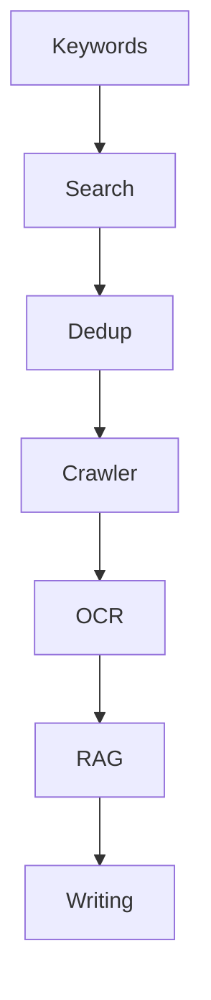

# VitePress 文档站点与 API 文档最佳实践研究 (2026)

**研究日期**: 2026-03-16
**项目背景**: Omelette 使用 VitePress 构建中英双语文档站点，位于 `docs/` 目录下。已有 API 文档和用户指南结构。

---

## 1. VitePress 中英双语文档的推荐目录结构和配置

### 1.1 官方推荐的两种结构

**方案 A：根级默认语言 + 非默认语言子目录**（Omelette 当前采用）

```
docs/
├── index.md           # 英文首页 (root)
├── guide/
│   ├── getting-started.md
│   └── ...
├── api/
│   └── ...
├── zh/                # 中文子目录
│   ├── index.md
│   ├── guide/
│   │   └── ...
│   └── api/
│       └── ...
```

- **优点**：英文为默认，`/` 直接访问英文，无需重定向；结构清晰。
- **适用**：英文为主、中文为辅的项目（如 Omelette）。

**方案 B：每种语言独立根目录**

```
docs/
├── en/
│   ├── foo.md
├── zh/
│   ├── foo.md
```

- **缺点**：VitePress 不会自动将 `/` 重定向到 `/en/`，需配置服务器重定向（如 Netlify `_redirects`）。
- **适用**：多语言平等、需按 Cookie 或 Accept-Language 路由的场景。

### 1.2 配置示例（与 Omelette 现状一致）

```typescript
// docs/.vitepress/config.ts
import { defineConfig } from 'vitepress'

export default defineConfig({
  title: 'Omelette',
  locales: {
    root: {
      label: 'English',
      lang: 'en',
      themeConfig: {
        nav: [
          { text: 'Guide', link: '/guide/getting-started' },
          { text: 'API Reference', link: '/api/' },
        ],
        sidebar: { /* ... */ },
      },
    },
    zh: {
      label: '中文',
      lang: 'zh-CN',
      link: '/zh/',
      themeConfig: {
        nav: [
          { text: '指南', link: '/zh/guide/getting-started' },
          { text: 'API 参考', link: '/zh/api/' },
        ],
        sidebar: { /* ... */ },
      },
    },
  },
})
```

### 1.3 最佳实践建议

| 建议 | 说明 |
|------|------|
| 使用 `config/index.ts` 分文件 | 可将各 locale 的 `themeConfig` 拆到 `config/en.ts`、`config/zh.ts`，在 `index.ts` 中合并导出 |
| 保持 nav/sidebar 结构对称 | 中英文 nav、sidebar 的 link 路径一一对应，便于维护 |
| 搜索 i18n | 使用 `search.provider: 'local'` 时，VitePress 会为各 locale 分别建索引，无需额外配置 |

---

## 2. API 文档的推荐格式和模板（Stripe/GitHub 风格）

### 2.1 Stripe/GitHub 风格特点

- **按资源分组**：以资源（Projects、Papers、Keywords 等）为单位组织，而非按 HTTP 方法
- **请求/响应示例**：每个 endpoint 有 cURL、JSON 示例
- **状态码说明**：200、201、400、404、500 等含义
- **分页、错误格式**：统一说明 `PaginatedData`、`ApiResponse` 结构
- **代码块带语言标识**：`bash`、`json`、`python` 等

### 2.2 Omelette 当前 API 文档模板（可复用）

```markdown
# [Resource Name] API

Base path: `/api/v1/[resource]`

## Endpoints

| Method | Endpoint | Description |
|--------|----------|-------------|
| GET | `/[resource]` | List (paginated) |
| POST | `/[resource]` | Create |
| GET | `/[resource]/{id}` | Get by ID |
| PUT | `/[resource]/{id}` | Update |
| DELETE | `/[resource]/{id}` | Delete |

## Query Parameters (List)

- `page` — Page number (default: 1)
- `page_size` — Items per page (default: 20)

## Request Body (Create/Update)

```json
{
  "field1": "value",
  "field2": 123
}
```

## Response

[Describe response structure, including nested objects]
```

### 2.3 增强模板（更接近 Stripe 风格）

```markdown
---
title: Projects API
description: Create and manage research projects
---

# Projects

Projects are the top-level container for papers, keywords, and RAG indexes.

## List projects

Retrieves a paginated list of projects.

**Endpoint:** `GET /api/v1/projects`

**Query parameters:**

| Parameter | Type | Default | Description |
|-----------|------|---------|-------------|
| page | integer | 1 | Page number |
| page_size | integer | 20 | Items per page |

**Example request:**

```bash
curl -X GET "http://localhost:8000/api/v1/projects?page=1&page_size=10" \
  -H "X-API-Key: your-api-key"
```

**Example response (200):**

```json
{
  "code": 200,
  "message": "success",
  "data": {
    "items": [...],
    "total": 42,
    "page": 1,
    "page_size": 10,
    "total_pages": 5
  }
}
```

## Create project

Creates a new research project.

**Endpoint:** `POST /api/v1/projects`

**Request body:**

| Field | Type | Required | Description |
|-------|------|----------|-------------|
| name | string | Yes | Project name |
| description | string | No | Optional description |
| domain | string | No | Research domain |

...
```

### 2.4 与 vitepress-openapi 的配合

若采用 **vitepress-openapi** 自动生成 API 文档，可保留上述模板用于「概览」「通用说明」（如 Base URL、Response Format、Pagination），具体 endpoint 由 `<OASpec>` 组件渲染。

---

## 3. VitePress 死链检测配置

### 3.1 内置 `ignoreDeadLinks`

VitePress 在 build 时会检查内部链接，死链会导致构建失败。通过 `ignoreDeadLinks` 可忽略特定链接：

```typescript
// docs/.vitepress/config.ts
export default defineConfig({
  ignoreDeadLinks: [
    // 精确 URL
    '/playground',
    // 正则：忽略所有 localhost
    /^https?:\/\/localhost/,
    /^https?:\/\/127\.0\.0\.1/,
    // 正则：忽略包含某路径的链接
    /\/repl\//,
    // 自定义函数
    (url) => url.toLowerCase().includes('ignore'),
  ],
})
```

### 3.2 快捷选项

```typescript
ignoreDeadLinks: true           // 忽略所有死链，不报错
ignoreDeadLinks: 'localhostLinks'  // 仅忽略 localhost 链接，其他死链仍报错
```

### 3.3 Omelette 当前配置（合理）

```typescript
ignoreDeadLinks: [
  'http://localhost:3000',
  'http://127.0.0.1:3000',
  'http://localhost:11434',
  'http://localhost:8000',
  /^http:\/\/localhost/,
  /^http:\/\/127\.0\.0\.1/,
]
```

### 3.4 链接写法最佳实践（来自 docs/solutions）

- **使用文件相对路径**：从 `docs/plans/xxx.md` 链接到 `docs/brainstorms/yyy.md` 应写 `../brainstorms/yyy`，不要写 `docs/brainstorms/yyy`
- **外部链接**：VitePress 不校验外部链接，可配合 [Lychee](https://lychee.cli.rs/) 等工具做外部死链检测

---

## 4. VitePress 中嵌入 Mermaid 流程图

### 4.1 推荐插件：vitepress-plugin-mermaid

```bash
npm i vitepress-plugin-mermaid mermaid -D
```

### 4.2 配置

```typescript
// docs/.vitepress/config.ts
import { defineConfig } from 'vitepress'
import { withMermaid } from 'vitepress-plugin-mermaid'

export default withMermaid({
  // 原有配置...
  mermaid: {
    // 可选：mermaid 主题等
    theme: 'default',
  },
})
```

### 4.3 语法

在 Markdown 中使用 `mermaid` 或 `mmd` 代码块：




### 4.4 页面级主题

```yaml
---
mermaidTheme: forest
title: Pipeline Flow
---
```

### 4.5 替代方案

- **vitepress-mermaid-renderer**：支持交互式控制，更新较新（2026-03）
- **vitepress-mermaid-preview**：预览类插件

---

## 5. 从 FastAPI OpenAPI Schema 自动生成 VitePress API 文档

### 5.1 方案：vitepress-openapi

FastAPI 默认导出 `/openapi.json`，vitepress-openapi 可直接消费该 JSON。

**安装：**

```bash
npm i vitepress-openapi
```

**获取 OpenAPI JSON：**

```bash
# 启动后端后
curl http://localhost:8000/openapi.json > docs/public/openapi.json
```

**或使用脚本：**

```bash
# scripts/export-openapi.sh
cd backend && python -c "
from app.main import app
import json
with open('../docs/public/openapi.json', 'w') as f:
    json.dump(app.openapi(), f, indent=2)
"
```

### 5.2 主题集成

```typescript
// docs/.vitepress/theme/index.ts
import DefaultTheme from 'vitepress/theme'
import type { Theme } from 'vitepress'
import { theme, useOpenapi } from 'vitepress-openapi/client'
import 'vitepress-openapi/dist/style.css'

import spec from '../../public/openapi.json' with { type: 'json' }

export default {
  extends: DefaultTheme,
  async enhanceApp({ app }) {
    useOpenapi({
      spec,
      config: {
        spec: {
          groupByTags: true,
          defaultTag: 'Default',
        },
      },
    })
    theme.enhanceApp({ app })
  }
} satisfies Theme
```

### 5.3 在 Markdown 中使用

```markdown
---
aside: false
outline: false
title: API Documentation
---

<script setup>
import spec from '../public/openapi.json'
</script>

<!-- 渲染完整 spec -->
<OASpec :spec="spec" />

<!-- 或从 URL 加载 -->
<OASpec spec-url="https://api.example.com/openapi.json" />

<!-- 按 tag 过滤 -->
<OASpec :spec="spec" :tags="['Projects', 'Papers']" />
```

### 5.4 混合策略

- **保留**：`api/index.md` 作为概览（Base URL、Response Format、Pagination、Async Tasks）
- **自动生成**：各 endpoint 的详细说明由 `<OASpec>` 或按 tag 分页渲染
- **CI 流程**：build 前执行 `export-openapi.sh` 更新 `openapi.json`

---

## 6. 部署指南文档的推荐结构

参考 Omelette 的 `deployment/mineru-setup.md` 和常见运维文档风格：

```
docs/
├── guide/
│   └── getting-started.md    # 快速开始
├── deployment/
│   ├── index.md             # 部署概览、目录
│   ├── requirements.md      # 环境要求（CPU/GPU/内存/磁盘）
│   ├── installation.md     # 安装步骤
│   ├── configuration.md    # 配置说明（.env、可选服务）
│   ├── mineru-setup.md      # 可选组件（如 MinerU）
│   ├── production.md       # 生产部署（systemd、nginx、Docker）
│   └── troubleshooting.md  # 故障排除
```

### 6.1 部署文档模板

```markdown
# [组件名称] 部署指南

## 系统要求

| 项目 | 要求 |
|------|------|
| Python | 3.10 - 3.13 |
| GPU | 6GB+ VRAM（可选） |
| 内存 | 16GB+ |
| 磁盘 | 20GB+ SSD |

## 安装步骤

### 1. 创建环境
...

### 2. 安装依赖
...

### 3. 配置
...

## API 参考

### `POST /endpoint`

| 参数 | 类型 | 默认值 | 说明 |
|------|------|--------|------|
| ... | ... | ... | ... |

## 故障排除

| 问题 | 原因 | 解决 |
|------|------|------|
| ... | ... | ... |
```

---

## 7. 文档版本管理策略

### 7.1 按版本号 vs 按日期

| 策略 | 适用场景 | 优点 | 缺点 |
|------|----------|------|------|
| **按版本号** | 产品有明确版本号（v1.0、v2.0） | 与发布节奏一致，用户易理解 | 需维护多版本内容 |
| **按日期** | 持续迭代、无版本号 | 简单，无需版本切换 | 难以回溯「某版本」文档 |
| **混合** | 大版本 + 小版本 | 灵活 | 配置复杂 |

### 7.2 推荐：Omelette 采用「单版本 + 按日期」

- 当前为快速迭代阶段，无严格版本号
- 文档与代码同步更新，`lastUpdated` 显示时间即可
- 若未来需要版本切换，可引入 **vitepress-versioning-plugin** 或 **@viteplus/versions**

### 7.3 若需版本切换（vitepress-versioning-plugin）

```bash
npm i vitepress-versioning-plugin
```

```typescript
// .vitepress/config.mts
import { defineVersionedConfig } from 'vitepress-versioning-plugin'

export default defineVersionedConfig({
  // 原有配置...
  versioning: {
    latestVersion: '1.0.0',
  },
}, __dirname)
```

**注意**：版本切换要求**所有链接使用相对路径**，否则跨版本链接会失效。

---

## 8. 实施清单（建议优先级）

| 优先级 | 项目 | 说明 |
|--------|------|------|
| P0 | 死链配置 | 已配置，保持 `ignoreDeadLinks` 并统一链接写法 |
| P1 | Mermaid 集成 | 安装 `vitepress-plugin-mermaid`，在架构/流水线文档中加流程图 |
| P2 | API 文档模板 | 统一 `api/*.md` 格式，补充 cURL 示例、状态码说明 |
| P3 | OpenAPI 自动生成 | 引入 vitepress-openapi，导出 `openapi.json`，部分页面用 `<OASpec>` |
| P4 | 部署指南结构 | 拆分 `deployment/` 为 requirements、installation、configuration、troubleshooting |
| P5 | 版本管理 | 现阶段保持单版本；若未来需多版本，再引入 vitepress-versioning-plugin |

---

## 9. 参考来源

| 来源 | 类型 |
|------|------|
| [VitePress i18n](https://vitepress.dev/guide/i18n) | 官方文档 |
| [VitePress Site Config](https://vitepress.dev/reference/site-config) | 官方文档 |
| [vitepress-plugin-mermaid](https://github.com/emersonbottero/vitepress-plugin-mermaid) | 社区插件 |
| [vitepress-openapi](https://github.com/enzonotario/vitepress-openapi) | 社区插件 |
| [vitepress-versioning-plugin](https://vvp.imb11.dev/guide/basic-setup) | 社区插件 |
| [docs/solutions/build-errors/ci-crawler-tests-and-docs-deadlink.md](../../solutions/build-errors/ci-crawler-tests-and-docs-deadlink.md) | 项目内解决方案 |
| [deployment/mineru-setup.md](../../deployment/mineru-setup.md) | 项目内部署示例 |
