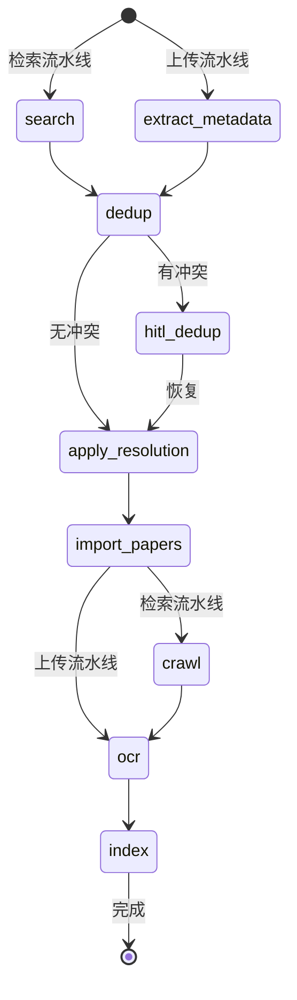

# LangGraph 流水线

Omelette 使用 [LangGraph](https://langchain-ai.github.io/langgraph/) 编排多步论文处理工作流，支持检查点持久化和 HITL（人机协作）中断/恢复。

## 流水线类型

### 检索流水线 (SearchPipeline)

```
检索 → 去重 → [HITL 冲突解决] → 入库 → 下载 → OCR → 索引
```

由关键词搜索触发。论文从多个学术数据源获取，与现有论文去重比对后，通过完整流水线处理。

### 上传流水线 (UploadPipeline)

```
元数据提取 → 去重 → [HITL 冲突解决] → 入库 → OCR → 索引
```

由 PDF 文件上传触发。本地提取元数据后，执行相同的去重 → OCR → 索引流程（无需下载步骤）。

## HITL 冲突解决

当去重发现冲突（DOI 匹配或标题高度相似）时，流水线会**中断**等待用户处理：

1. 流水线调用 `interrupt()` 返回冲突列表
2. 前端展示 Git 风格的冲突解决 UI
3. 用户选择：保留旧的 / 保留新的 / 合并 / 跳过
4. 前端调用 `POST /api/v1/pipelines/{id}/resume` 提交解决结果
5. 流水线从中断节点继续执行

## 检查点

流水线状态通过 LangGraph 检查点持久化（开发环境使用 MemorySaver，生产环境使用 SqliteSaver），支持：

- **中断后恢复**：HITL 暂停和恢复
- **状态查询**：随时查询流水线进度
- **调试**：检查每个节点的状态

## API 端点

| 方法 | 路径 | 说明 |
|------|------|------|
| POST | `/api/v1/pipelines/search` | 启动检索流水线 |
| POST | `/api/v1/pipelines/upload` | 启动上传流水线 |
| GET | `/api/v1/pipelines/{id}/status` | 获取流水线状态 |
| POST | `/api/v1/pipelines/{id}/resume` | 恢复中断的流水线 |
| POST | `/api/v1/pipelines/{id}/cancel` | 取消运行中的流水线 |

## 状态机


